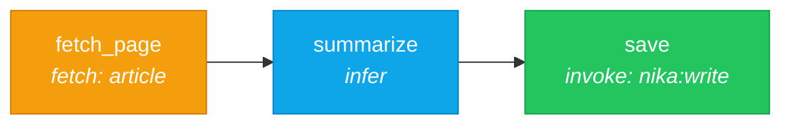

# 03 — Web Scraper

> Fetch a web page, extract article content, summarize it with AI, and save the result.

## DAG



## Workflow

```yaml
schema: "nika/workflow@0.12"
workflow: web-scraper
description: "Fetch a web page, extract article content, then summarize"

provider: mock
model: mock-default

inputs:
  url: "https://en.wikipedia.org/wiki/Workflow_engine"

artifacts:
  dir: ./output

tasks:
  - id: fetch_page
    fetch:
      url: "{{inputs.url}}"
      extract: article           # Readability extraction
      timeout: 15

  - id: summarize
    depends_on: [fetch_page]
    with:
      content: $fetch_page.text_content  # article returns JSON — pick the text field
    infer:
      prompt: |
        Summarize the following article in 5 bullet points.
        {{with.content | trim}}
      max_tokens: 500

  - id: save
    depends_on: [summarize]
    with:
      summary: $summarize
    invoke:
      tool: nika:write
      params:
        file_path: "output/summary.md"
        content: "# Summary\n\n{{with.summary}}"
        overwrite: true
```

### What's happening

| Concept | Example | Purpose |
|---------|---------|---------|
| `fetch:` verb | `fetch: { url: ..., extract: article }` | HTTP GET + article extraction |
| `extract: article` | Readability algorithm | Strips nav, ads, boilerplate — returns JSON object |
| Path access | `$fetch_page.text_content` | Access a specific field from the JSON result |
| `\| trim` | `{{with.content \| trim}}` | Pipe transform to trim whitespace |
| `invoke: nika:write` | Builtin file tool | Write output to disk |

### Extract modes (9 available)

| Mode | Description |
|------|-------------|
| `markdown` | Clean Markdown from HTML |
| `article` | Main article content (Readability) |
| `text` | Visible text, optionally filtered by CSS selector |
| `selector` | Raw HTML matching a CSS selector |
| `metadata` | OG, Twitter Cards, JSON-LD, SEO tags |
| `links` | Link classification (internal/external) |
| `jsonpath` | JSONPath query on JSON responses |
| `feed` | RSS/Atom/JSON Feed parsing |
| `llm_txt` | AI content discovery (/llms.txt) |

## Try it

```bash
# Dry run (validates without network calls)
nika run examples/03-web-scraper/scraper.nika.yaml --dry-run

# With a real provider (needs API key + network)
nika run examples/03-web-scraper/scraper.nika.yaml --provider anthropic

# Override the URL
nika run examples/03-web-scraper/scraper.nika.yaml --input url="https://example.com"
```

## Key concepts

- `fetch:` is the HTTP verb — supports GET, POST, PUT, DELETE
- `extract: article` uses Readability to isolate main content (returns `{ title, content, text_content, excerpt, byline }`)
- Access nested fields with `$task_id.field_name` path syntax
- Pipe transforms like `| trim` process data inline
- `invoke: nika:write` writes files — use `overwrite: true` for idempotent writes

## Next

[04 — Structured Output](../04-structured-output/) shows how to get validated JSON from natural prompts.
