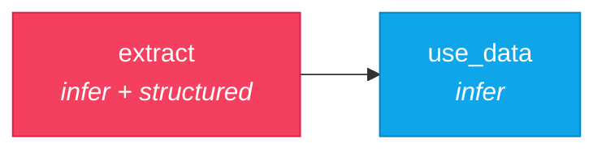
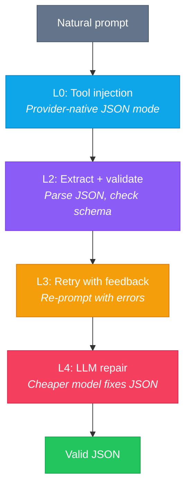

# 04 — Structured Output

> Extract validated JSON from a natural language prompt using Nika's 5-layer defense system.

## DAG



## The 5-Layer Defense



This is Nika's killer feature. The prompt is **always natural language** — never mention JSON or the schema. The 5 layers handle extraction automatically, and it works identically on all 7 providers.

## Workflow

```yaml
schema: "nika/workflow@0.12"
workflow: structured-output

provider: mock
model: mock-default

inputs:
  description: "Alice is a 30-year-old developer from Paris..."

tasks:
  # IMPORTANT: The prompt is natural. Never mention JSON.
  - id: extract
    infer: "Tell me about this person: {{inputs.description}}"
    structured:
      schema:
        type: object
        properties:
          name: { type: string }
          age: { type: number, minimum: 0 }
          city: { type: string }
          skills:
            type: array
            items: { type: string }
            minItems: 1
          experience_years: { type: number, minimum: 0 }
          languages:
            type: array
            items: { type: string }
        required: [name, age, skills]
      enable_repair: true     # LLM auto-repair on validation failure
      max_retries: 3          # Retry schema validation up to 3 times

  - id: use_data
    depends_on: [extract]
    with:
      person: $extract
    infer: |
      Write a bio for {{with.person.name}} who knows {{with.person.skills | join(", ")}}
```

### What's happening

| Concept | Purpose |
|---------|---------|
| `structured:` block | Declares expected JSON schema |
| `enable_repair: true` | Uses a cheaper model to fix malformed JSON |
| `max_retries: 3` | Retry validation failures (separate from task-level `retry:`) |
| Natural prompt | **Never** mention JSON in the prompt — the engine injects schema |
| Path access | `{{with.person.name}}` accesses fields from the validated JSON |
| `\| join(", ")` | Transform an array into a comma-separated string |

### structured: vs output: { format: json }

| Feature | `structured:` | `output: { format: json }` |
|---------|--------------|---------------------------|
| Schema validation | Yes | No |
| Auto-retry | Yes | No |
| LLM repair | Yes | No |
| Type checking | Yes | No |
| **Use when** | You need **reliable** JSON | You just want JSON formatting |

## Try it

```bash
# Mock provider
nika run examples/04-structured-output/extract-data.nika.yaml

# Real provider — watch the 5-layer defense in action
nika run examples/04-structured-output/extract-data.nika.yaml --provider anthropic

# Override the input
nika run examples/04-structured-output/extract-data.nika.yaml \
  --input description="Bob, 45, CTO at TechCo, expert in Go and Kubernetes"
```

## Key concepts

- `structured:` enforces schema-validated JSON with automatic retry and repair
- The prompt must be **natural language** — never mention JSON or the schema
- Same result on all 7 providers (Claude, OpenAI, Mistral, Groq, DeepSeek, Gemini, xAI)
- Access structured fields with path syntax: `$task.field` or `{{with.alias.field}}`
- `max_retries` in `structured:` is for schema validation, not HTTP errors

## Next

[05 — Multi-Provider](../05-multi-provider/) shows how to route tasks to different LLM providers.
