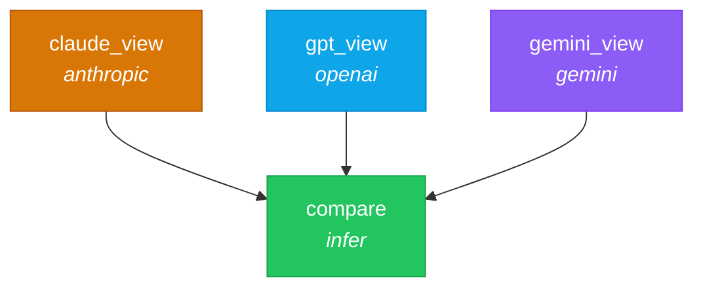

# 05 — Multi-Provider

> Route the same question to three different LLM providers, then compare their answers.

## DAG



All three provider tasks run in **parallel** — Nika makes concurrent API calls and waits for all to complete before the `compare` task runs.

## Workflow

```yaml
schema: "nika/workflow@0.12"
workflow: multi-provider

provider: mock               # Default provider (for compare task)
model: mock-default

inputs:
  question: "What makes a great developer experience?"

tasks:
  - id: claude_view
    provider: anthropic       # Task-level override
    model: claude-haiku-4-5
    infer:
      prompt: "{{inputs.question}} Answer in 3 concise bullet points."

  - id: gpt_view
    provider: openai
    model: gpt-4o-mini
    infer:
      prompt: "{{inputs.question}} Answer in 3 concise bullet points."

  - id: gemini_view
    provider: gemini
    model: gemini-2.5-flash
    infer:
      prompt: "{{inputs.question}} Answer in 3 concise bullet points."

  - id: compare
    depends_on: [claude_view, gpt_view, gemini_view]
    with:
      claude: $claude_view
      gpt: $gpt_view
      gemini: $gemini_view
    infer:
      prompt: |
        Compare these three AI perspectives:
        CLAUDE: {{with.claude}}
        GPT: {{with.gpt}}
        GEMINI: {{with.gemini}}
```

### Supported providers

| Provider | Alias | Env var | Example models |
|----------|-------|---------|----------------|
| `anthropic` | `claude` | `ANTHROPIC_API_KEY` | claude-sonnet-4-20250514, claude-haiku-4-5 |
| `openai` | `gpt` | `OPENAI_API_KEY` | gpt-4o, gpt-4o-mini, o3 |
| `gemini` | `google` | `GEMINI_API_KEY` | gemini-2.5-pro, gemini-2.5-flash |
| `xai` | `grok` | `XAI_API_KEY` | grok-3 |
| `mistral` | | `MISTRAL_API_KEY` | mistral-large-latest |
| `groq` | | `GROQ_API_KEY` | llama-3.3-70b-versatile |
| `deepseek` | | `DEEPSEEK_API_KEY` | deepseek-chat |
| `native` | `local` | (none) | Local GGUF models |
| `mock` | | (none) | Deterministic test responses |

### Provider hierarchy

1. **Task-level** `provider:` / `model:` overrides everything
2. **Workflow-level** `provider:` / `model:` is the default
3. **CLI flag** `--provider` overrides both

## Try it

```bash
# Mock mode (no API keys)
nika run examples/05-multi-provider/multi-provider.nika.yaml

# Real multi-provider (needs 3 API keys)
nika run examples/05-multi-provider/multi-provider.nika.yaml --provider anthropic

# Check which providers are configured
nika provider list
```

## Key concepts

- `provider:` and `model:` can be set at workflow level (default) or task level (override)
- Tasks with different providers run in parallel when there's no dependency
- Provider aliases work: `claude` = `anthropic`, `gpt` = `openai`, `google` = `gemini`
- `provider: mock` returns deterministic responses, no API key needed

## Next

[06 — Media Pipeline](../06-media-pipeline/) demonstrates Nika's builtin media tools.
