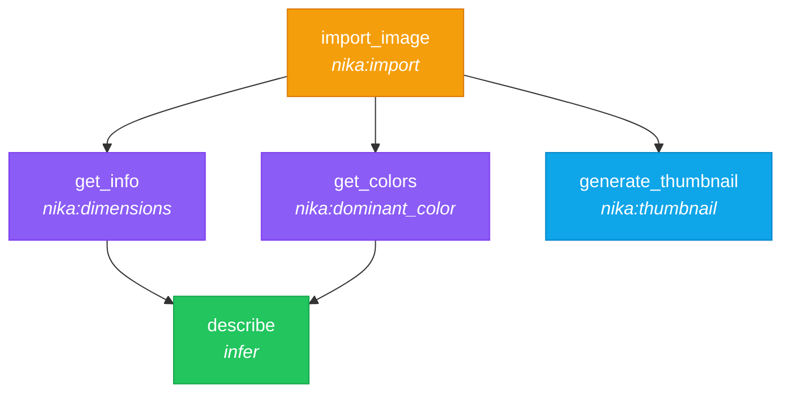

# 06 — Media Pipeline

> Import an image, extract metadata and colors, generate a thumbnail, and describe it with AI.

## DAG



## Workflow

```yaml
schema: "nika/workflow@0.12"
workflow: media-pipeline

provider: mock
model: mock-default

inputs:
  image_path: "photo.jpg"

artifacts:
  dir: ./output

tasks:
  - id: import_image
    invoke:                          # invoke: verb calls builtin tools
      tool: nika:import
      params:
        path: "{{inputs.image_path}}"

  - id: get_info
    depends_on: [import_image]
    with:
      hash: $import_image            # CAS hash from import
    invoke:
      tool: nika:dimensions
      params:
        hash: "{{with.hash}}"

  - id: get_colors
    depends_on: [import_image]
    with:
      hash: $import_image
    invoke:
      tool: nika:dominant_color
      params:
        hash: "{{with.hash}}"

  - id: generate_thumbnail
    depends_on: [import_image]
    with:
      hash: $import_image
    invoke:
      tool: nika:thumbnail
      params:
        hash: "{{with.hash}}"
        width: 300
        height: 200
    artifact:
      path: thumb.webp
      format: binary                 # Write raw bytes to file

  - id: describe
    depends_on: [get_info, get_colors]
    with:
      dims: $get_info
      colors: $get_colors
    infer: |
      An image has dimensions {{with.dims | to_json}} and colors {{with.colors | to_json}}.
      Suggest 3 creative captions based on its visual properties.
```

### Builtin media tools (30+)

| Tier | Tool | Description |
|------|------|-------------|
| Always-on | `nika:import` | Import any file into CAS (content-addressable storage) |
| Always-on | `nika:dimensions` | Image dimensions from headers (~0.1ms) |
| Always-on | `nika:thumbhash` | 25-byte image placeholder |
| Always-on | `nika:dominant_color` | Color palette extraction |
| Always-on | `nika:pipeline` | Chain operations in-memory |
| Core | `nika:thumbnail` | SIMD-accelerated resize (Lanczos3) |
| Core | `nika:convert` | Format conversion (PNG/JPEG/WebP) |
| Core | `nika:optimize` | Lossless PNG optimization |
| Core | `nika:svg_render` | SVG to PNG rasterization |
| Opt-in | `nika:chart` | Bar/line/pie charts from JSON |
| Opt-in | `nika:pdf_extract` | PDF text extraction |
| Opt-in | `nika:provenance` | C2PA content credentials |

### CAS (Content-Addressable Storage)

All media flows through CAS. `nika:import` stores the file and returns a **blake3 hash**. All subsequent tools operate on hashes, never file paths. This means:

- Zero duplicate storage
- Immutable references
- Safe for concurrent workflows

## Try it

```bash
# Dry run (validates the DAG without processing)
nika run examples/06-media-pipeline/thumbnails.nika.yaml --dry-run

# With a real image
nika run examples/06-media-pipeline/thumbnails.nika.yaml --input image_path="./my-photo.jpg"

# Check available media tools
nika features
```

## Key concepts

- `invoke:` is the verb for calling builtin tools and MCP servers
- `nika:*` tools are always available (30+ builtins)
- Media tools operate on CAS hashes, not file paths
- `artifact: { format: binary }` writes raw bytes (images, audio, etc.)
- `| to_json` transform serializes objects for prompt injection

## Next

[07 — Agent Loop](../07-agent-loop/) introduces the `agent:` verb for multi-turn reasoning.
