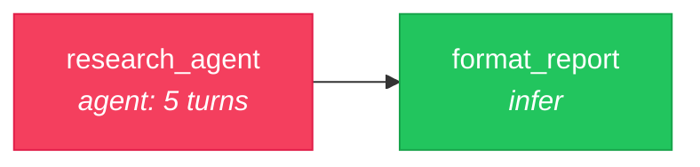
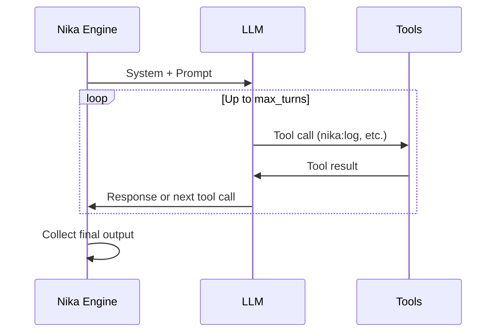

# 07 — Agent Loop

> A multi-turn agent that reasons through a question step by step, with tool access.

## DAG



### Agent turn loop



## Workflow

```yaml
schema: "nika/workflow@0.12"
workflow: agent-researcher

provider: mock
model: mock-default

inputs:
  question: "What are the key differences between workflow engines and orchestration platforms?"

tasks:
  - id: research_agent
    agent:
      system: "You are a thorough research assistant."
      prompt: "Research this question: {{inputs.question}}"
      tools: [nika:log]         # Builtin tools the agent can call
      max_turns: 5              # Max reasoning turns
      temperature: 0.5
      completion:
        mode: natural           # Stop when agent stops calling tools

  - id: format_report
    depends_on: [research_agent]
    with:
      research: $research_agent
    infer:
      prompt: |
        Format this research into a clean report:
        {{with.research}}
```

### Agent configuration

| Field | Description | Default |
|-------|-------------|---------|
| `system:` | System prompt for the agent | (none) |
| `prompt:` | Initial user message | Required |
| `tools:` | Available tools (builtin + MCP) | `[]` |
| `max_turns:` | Maximum reasoning turns | 10 |
| `temperature:` | Creativity (0.0-2.0) | Provider default |
| `completion.mode:` | When to stop | `explicit` |

### Completion modes

| Mode | How it works |
|------|-------------|
| `explicit` | Agent must call `nika:complete` to stop (default) |
| `natural` | Stops when agent makes no more tool calls |
| `pattern` | Stops when output matches a regex pattern |

### Guardrails (optional)

```yaml
agent:
  guardrails:
    - type: length
      max_words: 2000
      on_failure: retry
    - type: schema
      json_schema: { type: object, required: [findings] }
      on_failure: fail
    - type: llm
      judge_prompt: "Is this factually accurate? Reply PASS or FAIL."
      on_failure: retry
```

## Try it

```bash
# Mock mode
nika run examples/07-agent-loop/researcher.nika.yaml

# Real provider
nika run examples/07-agent-loop/researcher.nika.yaml --provider anthropic

# Override the question
nika run examples/07-agent-loop/researcher.nika.yaml \
  --input question="How does Rust's ownership model compare to garbage collection?"
```

## Key concepts

- `agent:` is the multi-turn verb — the LLM reasons iteratively with tool access
- `tools:` lists available tools (builtin `nika:*` or MCP `server::tool`)
- `max_turns:` prevents infinite loops (exceeding is graceful, not an error)
- `completion.mode: natural` stops when the agent is done reasoning
- Guardrails validate agent output (length, schema, regex, LLM-as-judge)

## Next

[08 — Serve API](../08-serve-api/) shows how to expose any workflow as an HTTP API.
