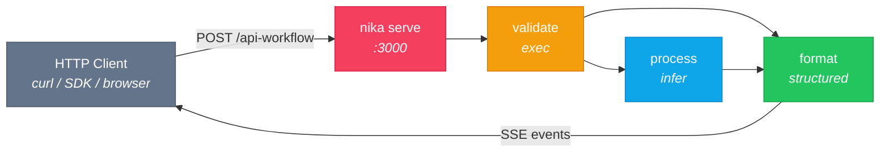

# 08 — Serve API

> Expose any Nika workflow as an HTTP API endpoint with `nika serve`.

## Architecture



## Workflow

```yaml
schema: "nika/workflow@0.12"
workflow: api-workflow
description: "A translation endpoint — designed for nika serve"

provider: mock
model: mock-default

inputs:
  text: "Hello, world!"
  target_lang: "French"

tasks:
  - id: validate
    exec:
      command: "echo '{\"char_count\": ...}'"
      shell: true

  - id: process
    depends_on: [validate]
    infer:
      prompt: |
        Translate the following text to {{inputs.target_lang}}.
        Return ONLY the translation, nothing else.
      temperature: 0.3

  - id: format
    depends_on: [process, validate]
    with:
      translation: $process
      meta: $validate
    structured:
      schema:
        type: object
        properties:
          original: { type: string }
          translation: { type: string }
          target_language: { type: string }
        required: [original, translation, target_language]
    infer: "Package the translation result..."
```

## How nika serve works

```bash
# Start the server (scans for *.nika.yaml files recursively)
nika serve --workflows examples/08-serve-api/ --bind 127.0.0.1:3000
```

Every `*.nika.yaml` file becomes an endpoint:

| File | Endpoint |
|------|----------|
| `api-workflow.nika.yaml` | `POST /api-workflow` |
| `sub/translate.nika.yaml` | `POST /sub/translate` |

### Calling the API

```bash
# Submit a job
curl -X POST http://localhost:3000/api-workflow \
  -H 'Content-Type: application/json' \
  -d '{"inputs": {"text": "Hello, Nika!", "target_lang": "French"}}'

# Response: SSE stream with typed events
# event: workflow_started
# event: task_completed
# data: {"task_id": "validate", "result": ...}
# event: task_completed
# data: {"task_id": "process", "result": ...}
# event: workflow_completed
# data: {"result": {"original": "Hello, Nika!", "translation": "Bonjour, Nika !"}}
```

### Server configuration (nika.toml)

```toml
[serve]
bind = "127.0.0.1:3000"
workflows = "."
max_concurrent = 6
```

### Features

| Feature | Description |
|---------|-------------|
| SSE streaming | Real-time task events as Server-Sent Events |
| Job isolation | Each request gets `NIKA_JOB_ID` + `NIKA_JOB_DIR` |
| Concurrent execution | Up to `max_concurrent` parallel workflows |
| Request tracking | `X-Request-Id` header on every response |
| Auto-discovery | Recursive `*.nika.yaml` scan from workflows dir |

## Try it

```bash
# Start serving
nika serve --workflows examples/08-serve-api/

# In another terminal
curl -X POST http://localhost:3000/api-workflow \
  -H 'Content-Type: application/json' \
  -d '{"inputs": {"text": "Rust is amazing", "target_lang": "Japanese"}}'

# Check available endpoints
curl http://localhost:3000/
```

## Key concepts

- `nika serve` turns any workflow directory into an HTTP API
- Workflow `inputs:` become the request JSON body
- Responses stream as SSE (Server-Sent Events) with typed events
- Each job runs in isolation with unique `NIKA_JOB_ID` and `NIKA_JOB_DIR`
- Configure via `nika.toml` `[serve]` section or CLI flags

## Full circle

You have now seen all 5 Nika verbs in action:

| Verb | Example |
|------|---------|
| `infer:` | [01 Hello World](../01-hello-world/), [02 Research](../02-research-pipeline/) |
| `fetch:` | [03 Web Scraper](../03-web-scraper/) |
| `invoke:` | [06 Media Pipeline](../06-media-pipeline/) |
| `agent:` | [07 Agent Loop](../07-agent-loop/) |
| `exec:` | This example (validate task) |
