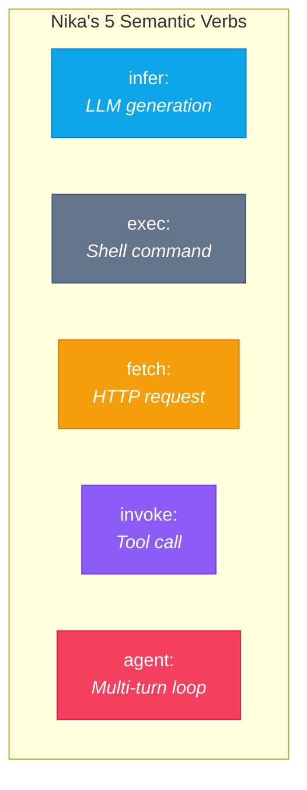

# Nika Examples

> One file. Any AI. These 8 examples take you from zero to production.

## Learning Path

```mermaid
graph LR
    A["01<br/>Hello World<br/><i>infer</i>"] --> B["02<br/>Research Pipeline<br/><i>fan-out + DAG</i>"]
    B --> C["03<br/>Web Scraper<br/><i>fetch + extract</i>"]
    C --> D["04<br/>Structured Output<br/><i>5-layer defense</i>"]
    D --> E["05<br/>Multi-Provider<br/><i>3 providers</i>"]
    E --> F["06<br/>Media Pipeline<br/><i>builtin tools</i>"]
    F --> G["07<br/>Agent Loop<br/><i>multi-turn</i>"]
    G --> H["08<br/>Serve API<br/><i>HTTP endpoints</i>"]

    style A fill:#22c55e,stroke:#16a34a,color:#fff
    style B fill:#0ea5e9,stroke:#0284c7,color:#fff
    style C fill:#f59e0b,stroke:#d97706,color:#fff
    style D fill:#f43f5e,stroke:#e11d48,color:#fff
    style E fill:#8b5cf6,stroke:#7c3aed,color:#fff
    style F fill:#0ea5e9,stroke:#0284c7,color:#fff
    style G fill:#f43f5e,stroke:#e11d48,color:#fff
    style H fill:#22c55e,stroke:#16a34a,color:#fff
```



## Quick Reference

| # | Example | Verb | Concepts | Difficulty |
|---|---------|------|----------|------------|
| 01 | [Hello World](./01-hello-world/) | `infer:` | Basics, inputs, templates | Beginner |
| 02 | [Research Pipeline](./02-research-pipeline/) | `infer:` | DAG, fan-out/fan-in, `with:` bindings | Beginner |
| 03 | [Web Scraper](./03-web-scraper/) | `fetch:` | HTTP, extract modes, pipe transforms | Intermediate |
| 04 | [Structured Output](./04-structured-output/) | `infer:` + `structured:` | JSON schema, 5-layer defense, repair | Intermediate |
| 05 | [Multi-Provider](./05-multi-provider/) | `infer:` | Provider routing, model selection | Intermediate |
| 06 | [Media Pipeline](./06-media-pipeline/) | `invoke:` | Builtin tools, CAS, binary artifacts | Advanced |
| 07 | [Agent Loop](./07-agent-loop/) | `agent:` | Multi-turn, tools, guardrails | Advanced |
| 08 | [Serve API](./08-serve-api/) | All 5 | HTTP API, SSE, job isolation | Advanced |

## The 5 Verbs

Every Nika workflow is built from exactly 5 verbs:



## Prerequisites

### Install Nika

```bash
# macOS (Homebrew)
brew install supernovae-studio/tap/nika

# Or download from GitHub Releases
# https://github.com/SuperNovae-studio/nika/releases
```

### API keys (optional)

All examples use `provider: mock` by default, so **no API keys are needed** to try them.

To use real providers:

```bash
# Interactive setup
nika setup

# Or set env vars directly
export ANTHROPIC_API_KEY="sk-ant-..."
export OPENAI_API_KEY="sk-..."
export GEMINI_API_KEY="AI..."

# Verify configuration
nika provider list
```

## Running Examples

```bash
# Run any example
nika run examples/01-hello-world/hello.nika.yaml

# Override inputs from CLI
nika run examples/02-research-pipeline/research.nika.yaml --input topic="Rust vs Go"

# Validate without executing
nika run examples/01-hello-world/hello.nika.yaml --dry-run

# Use a real provider
nika run examples/01-hello-world/hello.nika.yaml --provider anthropic

# Visualize the DAG
nika workflow graph examples/02-research-pipeline/research.nika.yaml
```

## Beyond Examples

### Interactive learning

```bash
nika init --course    # 12-level course with 44 exercises
nika course next      # Start the next exercise
```

### Showcase library

```bash
nika showcase list           # Browse 115 ready-to-use workflows
nika showcase extract seo    # Extract a showcase to your project
```

### Documentation

```bash
nika help              # Full command reference
nika help verbs        # Deep dive into the 5 verbs
nika doctor            # System health check
```

## Project Layout

```
examples/
├── README.md                      <- You are here
├── 01-hello-world/
│   ├── README.md                  <- Explanation + Mermaid DAG
│   └── hello.nika.yaml            <- Workflow
├── 02-research-pipeline/
│   ├── README.md
│   └── research.nika.yaml
├── 03-web-scraper/
│   ├── README.md
│   └── scraper.nika.yaml
├── 04-structured-output/
│   ├── README.md
│   └── extract-data.nika.yaml
├── 05-multi-provider/
│   ├── README.md
│   └── multi-provider.nika.yaml
├── 06-media-pipeline/
│   ├── README.md
│   └── thumbnails.nika.yaml
├── 07-agent-loop/
│   ├── README.md
│   └── researcher.nika.yaml
└── 08-serve-api/
    ├── README.md
    └── api-workflow.nika.yaml
```

---

Made with Nika by [SuperNovae Studio](https://supernovae.studio)
