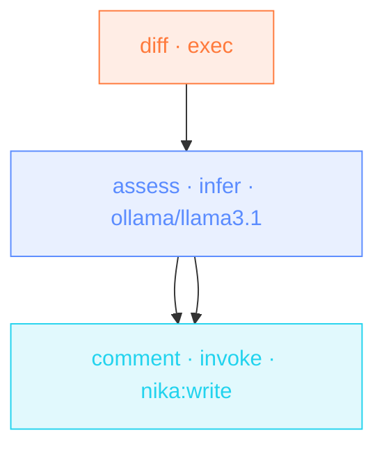

✅ **nika check** — clean · `flows/pr-risk-review.nika` · 3 task(s) · 3 wave(s)

💰 **cost floor ≥ $0.00** · ⚠ 1 unpriced/unbounded task(s) — never rendered as $0
- `assess` · ollama/llama3.1 · unpriced (NoPrice)

🔐 **requires** — models: `ollama/llama3.1` · all resolve in this engine · secrets: none

🌊 **schedule** — 3 wave(s), max width 1

🗺 DAG

---
nika 0.121.0 · report_version 1 · floor semantics: spend ≥ floor · [what this checks](https://docs.nika.sh/reference/machine-surfaces)
<!-- nika-action:v1:flows/pr-risk-review.nika -->