# Nika Technical Reference

```
 ███╗   ██╗██╗██╗  ██╗ █████╗
 ████╗  ██║██║██║ ██╔╝██╔══██╗
 ██╔██╗ ██║██║█████╔╝ ███████║
 ██║╚██╗██║██║██╔═██╗ ██╔══██║
 ██║ ╚████║██║██║  ██╗██║  ██║
 ╚═╝  ╚═══╝╚═╝╚═╝  ╚═╝╚═╝  ╚═╝
 Semantic YAML Workflow Engine
```

| | |
|---|---|
| **Version** | 0.5.3 |
| **Updated** | 2026-02-21 |
| **Status** | Production-ready |
| **Tests** | 1200+ passing |
| **Provider** | rig-core v0.31 |
| **MCP** | rmcp v0.16 |

---

## Table of Contents

| Section | Topic | Key Concepts |
|---------|-------|--------------|
| [1](#1-overview) | Overview | Philosophy, Features, Brain+Body |
| [2](#2-architecture) | Architecture | Modules, Pipeline, Key Types |
| [3](#3-yaml-workflow-schema) | YAML Schema | Structure, Versions, Validation |
| [4](#4-the-5-semantic-verbs) | 5 Semantic Verbs | infer, exec, fetch, invoke, agent |
| [5](#5-provider-system) | Provider System | rig-core, NikaMcpTool |
| [6](#6-mcp-integration) | MCP Integration | Zero Cypher Rule, Client |
| [7](#7-data-binding-system) | Data Binding | use: block, Templates, JSONPath |
| [8](#8-dag-execution) | DAG Execution | Flows, Topological Sort, Cycles |
| [9](#9-event-system) | Event System | 16 EventKinds, EventLog |
| [10](#10-observability-and-traces) | Observability | NDJSON Traces, TraceWriter |
| [11](#11-for_each-parallelism) | for_each Parallelism | Concurrency, JoinSet |
| [12](#12-terminal-ui-tui) | Terminal UI | 4-Panel Layout, Keybindings |
| [13](#13-cli-commands) | CLI Commands | run, validate, tui, trace |
| [14](#14-error-handling) | Error Handling | Error Codes, FixSuggestion |
| [15](#15-architecture-decision-records) | ADRs | ADR-001/002/003 |
| [16](#16-development-guide) | Development | Setup, TDD, Code Style |
| [17](#17-troubleshooting) | Troubleshooting | Common Issues, Debug Tips |
| [18](#18-examples) | Examples | UC1, UC2, UC3 |
| [Appendix](#appendix-complete-yaml-schema) | YAML Schema | Complete Reference |

---

## Quick Reference Card

```
┌─────────────────────────────────────────────────────────────────────────────┐
│  NIKA CHEAT SHEET                                                           │
├─────────────────────────────────────────────────────────────────────────────┤
│                                                                             │
│  5 SEMANTIC VERBS                                                           │
│  ┌─────────────────────────────────────────────────────────────────────┐   │
│  │  infer:  LLM text generation     │  invoke:  MCP tool call         │   │
│  │  exec:   Shell command           │  agent:   Multi-turn loop       │   │
│  │  fetch:  HTTP request            │                                  │   │
│  └─────────────────────────────────────────────────────────────────────┘   │
│                                                                             │
│  WORKFLOW STRUCTURE                                                         │
│  ┌─────────────────────────────────────────────────────────────────────┐   │
│  │  schema: "nika/workflow@0.4"     # Required                         │   │
│  │  provider: claude                # Default provider                 │   │
│  │  mcp:                            # MCP server configs               │   │
│  │    novanet: { command: ..., args: [...] }                           │   │
│  │  tasks:                          # Task list                        │   │
│  │    - id: task_name               # Unique ID                        │   │
│  │      use: { alias: other_task }  # Data binding                     │   │
│  │      infer: "prompt"             # One verb                         │   │
│  │  flows:                          # DAG edges                        │   │
│  │    - source: a, target: b        # Dependencies                     │   │
│  └─────────────────────────────────────────────────────────────────────┘   │
│                                                                             │
│  DATA BINDING                                                               │
│  ┌─────────────────────────────────────────────────────────────────────┐   │
│  │  use:                                                                │   │
│  │    data: task_id                 # Entire output                    │   │
│  │    field: task_id.path.to.field  # Nested path                      │   │
│  │    safe: task_id.field ?? "def"  # With default                     │   │
│  │                                                                      │   │
│  │  infer: "Process {{use.data}}"   # Template resolution              │   │
│  └─────────────────────────────────────────────────────────────────────┘   │
│                                                                             │
│  CLI COMMANDS                                                               │
│  ┌─────────────────────────────────────────────────────────────────────┐   │
│  │  nika run <file>                 # Execute workflow                 │   │
│  │  nika validate <file>            # Parse + validate                 │   │
│  │  nika tui <file>                 # Interactive 4-panel TUI          │   │
│  │  nika trace list                 # List execution traces            │   │
│  └─────────────────────────────────────────────────────────────────────┘   │
│                                                                             │
│  for_each PARALLELISM                                                       │
│  ┌─────────────────────────────────────────────────────────────────────┐   │
│  │  for_each: ["a", "b", "c"]       # Array to iterate                 │   │
│  │  as: item                        # Loop variable                    │   │
│  │  concurrency: 5                  # Max parallel (default: 1)        │   │
│  │  fail_fast: true                 # Stop on error (default: true)    │   │
│  └─────────────────────────────────────────────────────────────────────┘   │
│                                                                             │
│  MCP TOOLS (NovaNet)                                                        │
│  ┌─────────────────────────────────────────────────────────────────────┐   │
│  │  novanet_generate   Generate native content with forms              │   │
│  │  novanet_describe   Schema info (nodes, arcs)                       │   │
│  │  novanet_traverse   Graph traversal                                 │   │
│  │  novanet_assemble   Build context                                   │   │
│  │  novanet_search     Entity search                                   │   │
│  └─────────────────────────────────────────────────────────────────────┘   │
│                                                                             │
└─────────────────────────────────────────────────────────────────────────────┘
```

---

## 1. Overview

### What is Nika?

Nika is a **semantic YAML workflow engine** for multi-step AI workflows. It serves as the "body" of the supernovae-agi architecture, executing workflows that leverage NovaNet's knowledge graph "brain" via the Model Context Protocol (MCP).

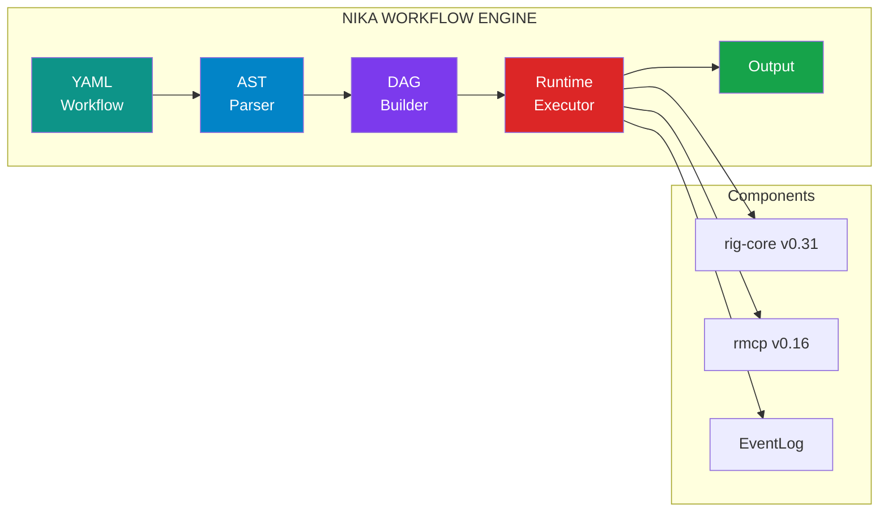

```
┌─────────────────────────────────────────────────────────────────────────────┐
│  NIKA WORKFLOW ENGINE                                                       │
├─────────────────────────────────────────────────────────────────────────────┤
│                                                                             │
│    YAML Workflow          AST            DAG           Runtime              │
│  ┌──────────────┐   ┌──────────┐   ┌──────────┐   ┌──────────────┐         │
│  │ schema: ...  │   │ Workflow │   │ Topo-    │   │ TaskExecutor │         │
│  │ tasks:       │──▶│ Task     │──▶│ logical  │──▶│ + Providers  │──▶ Out  │
│  │   - id: a    │   │ Action   │   │ Sort     │   │ + MCP Client │         │
│  │     infer:   │   │ Binding  │   │ + Deps   │   │ + EventLog   │         │
│  └──────────────┘   └──────────┘   └──────────┘   └──────────────┘         │
│                                                                             │
│  Provider: rig-core v0.31        MCP: rmcp v0.16        Tests: 621+        │
└─────────────────────────────────────────────────────────────────────────────┘
```

### Brain + Body Architecture

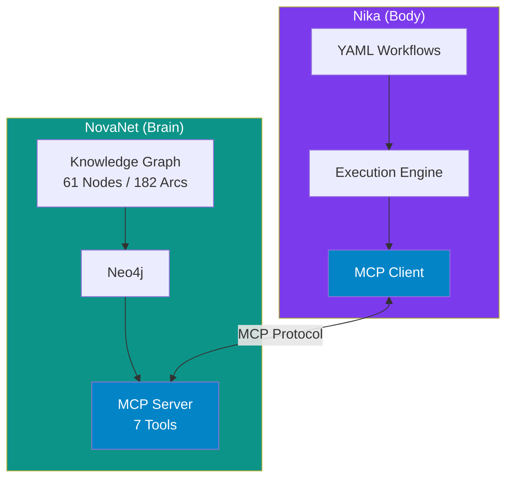

```
┌─────────────────────────────────────────────────────────────────────────────┐
│  SUPERNOVAE-AGI ARCHITECTURE                                                │
├─────────────────────────────────────────────────────────────────────────────┤
│                                                                             │
│   ┌─────────────────────┐         MCP Protocol        ┌─────────────────┐   │
│   │     NOVANET         │◄──────────────────────────►│      NIKA       │   │
│   │     (Brain)         │                             │     (Body)      │   │
│   ├─────────────────────┤                             ├─────────────────┤   │
│   │ - Knowledge Graph   │    novanet_generate         │ - YAML Workflows│   │
│   │ - Entity Memory     │    novanet_describe         │ - LLM Providers │   │
│   │ - Locale Context    │    novanet_traverse         │ - DAG Execution │   │
│   │ - SEO/GEO Intel     │◄────────────────────────────│ - Tool Calling  │   │
│   │ - 61 Nodes, 182 Arcs│                             │ - State Machine │   │
│   └─────────────────────┘                             └─────────────────┘   │
│                                                                             │
└─────────────────────────────────────────────────────────────────────────────┘
```

### Core Philosophy

```
┌─────────────────────────────────────────────────────────────────────────────┐
│  NIKA PRINCIPLES                                                            │
├─────────────────────────────────────────────────────────────────────────────┤
│                                                                             │
│  1. YAML-FIRST         Workflows are declarative YAML files, not code      │
│  2. 5 SEMANTIC VERBS   infer | exec | fetch | invoke | agent               │
│  3. MCP-ONLY           NovaNet access exclusively via MCP protocol         │
│  4. FULL OBSERVABILITY Every operation emits structured events             │
│  5. PARALLEL EXECUTION First-class for_each with concurrency control       │
│                                                                             │
└─────────────────────────────────────────────────────────────────────────────┘
```

1. **YAML-First**: Workflows are declarative YAML files, not code
2. **5 Semantic Verbs**: `infer:`, `exec:`, `fetch:`, `invoke:`, `agent:`
3. **MCP-Only Integration**: NovaNet access exclusively via MCP protocol
4. **Full Observability**: Every operation emits structured events
5. **Parallel Execution**: First-class `for_each` with concurrency control

### Key Features

| Feature | Description |
|---------|-------------|
| **5 Verbs** | Complete coverage of AI workflow patterns |
| **DAG Execution** | Automatic dependency resolution and topological sort |
| **MCP Integration** | Native connection to NovaNet knowledge graph |
| **rig-core Provider** | 20+ LLM providers via rig-core v0.31 |
| **for_each Parallelism** | Concurrent iteration with configurable limits |
| **Event Sourcing** | 16+ event types for full audit trail |
| **NDJSON Traces** | Persistent execution logs for debugging |
| **Interactive TUI** | Real-time workflow observation |
| **Extended Thinking** | Claude reasoning capture (v0.4+) |

### Version History

| Version | Key Changes |
|---------|-------------|
| **v0.4.1** | Token tracking fix for streaming mode, extended thinking capture |
| **v0.4.0** | rig-core migration, RigAgentLoop, deleted legacy providers (~2,350 lines removed) |
| **v0.3.0** | for_each parallelism, rig-core preparation |
| **v0.2.0** | invoke: and agent: verbs, MCP client |
| **v0.1.0** | Initial release: infer, exec, fetch |

### v0.4.1 Highlights

**Token Tracking Fix:** In v0.4.0, `input_tokens` and `output_tokens` were always 0 when using extended thinking (streaming mode). v0.4.1 extracts token usage from `StreamedAssistantContent::Final` via rig's `GetTokenUsage` trait.

```rust
// Before (v0.4.0) - tokens always 0 in streaming mode
AgentTurnMetadata { input_tokens: 0, output_tokens: 0, thinking: Some("...") }

// After (v0.4.1) - tokens correctly tracked
AgentTurnMetadata { input_tokens: 1234, output_tokens: 567, thinking: Some("...") }
```

**Files Changed:**
- `runtime/rig_agent_loop.rs` - Token extraction from streaming response
- `tests/thinking_capture_test.rs` - Integration tests for token capture

---

## 2. Architecture

### High-Level Architecture (v0.4)

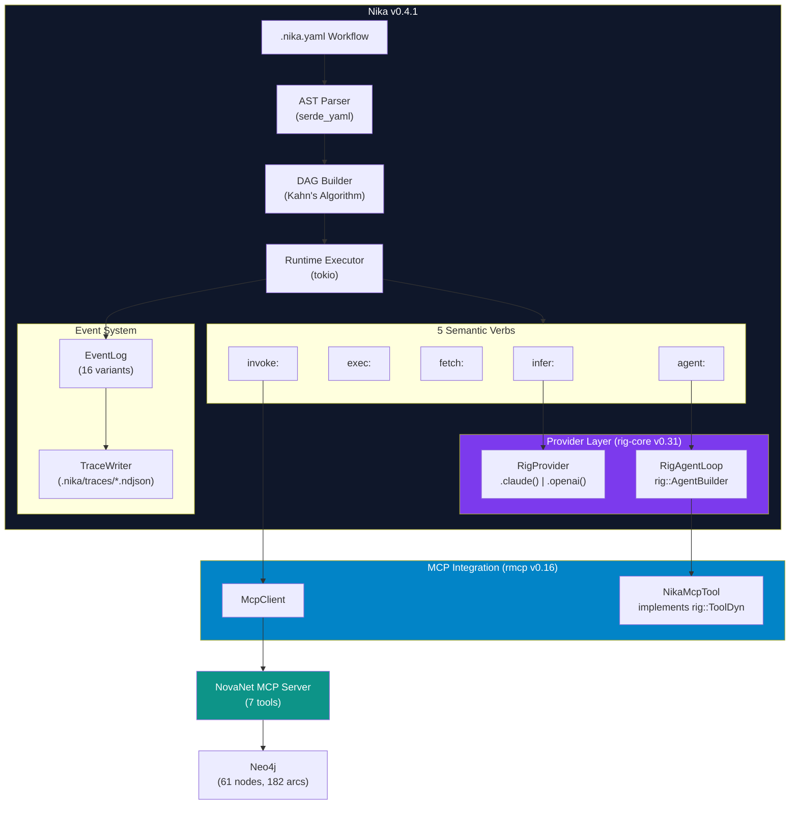

```
┌─────────────────────────────────────────────────────────────────────────────┐
│  NIKA v0.4.1 ARCHITECTURE                                                   │
├─────────────────────────────────────────────────────────────────────────────┤
│                                                                             │
│  ┌──────────────────────────────────────────────────────────────────────┐  │
│  │  WORKFLOW PIPELINE                                                    │  │
│  │                                                                       │  │
│  │    .nika.yaml ──▶ AST Parser ──▶ DAG Builder ──▶ Runtime Executor    │  │
│  │                                                                       │  │
│  └──────────────────────────────────────────────────────────────────────┘  │
│                                    │                                        │
│                                    ▼                                        │
│  ┌──────────────────────────────────────────────────────────────────────┐  │
│  │  5 SEMANTIC VERBS                                                     │  │
│  │                                                                       │  │
│  │    infer: ──┐                                                         │  │
│  │             ├──▶ RigProvider (rig-core v0.31)                        │  │
│  │    agent: ──┘    ├── RigProvider::claude()                           │  │
│  │                  └── RigAgentLoop (rig::AgentBuilder)                │  │
│  │                                                                       │  │
│  │    exec:  ──▶ tokio::process::Command                                │  │
│  │    fetch: ──▶ reqwest::Client                                        │  │
│  │    invoke: ──▶ McpClient (rmcp v0.16)                                │  │
│  │                                                                       │  │
│  └──────────────────────────────────────────────────────────────────────┘  │
│                                    │                                        │
│                                    ▼                                        │
│  ┌──────────────────────────────────────────────────────────────────────┐  │
│  │  MCP INTEGRATION                                                      │  │
│  │                                                                       │  │
│  │    McpClient ──▶ NikaMcpTool (rig::ToolDyn) ──▶ NovaNet MCP Server   │  │
│  │                                                                       │  │
│  └──────────────────────────────────────────────────────────────────────┘  │
│                                                                             │
│  STATS: 621+ tests | rig-core v0.31 | rmcp v0.16 | ratatui v0.30          │
│                                                                             │
└─────────────────────────────────────────────────────────────────────────────┘
```

### Module Structure

```
tools/nika/src/
├── main.rs              # CLI entry point (clap)
├── lib.rs               # Public API exports
├── error.rs             # NikaError with 40+ variants and codes
│
├── ast/                 # YAML → Rust structs
│   ├── mod.rs           # Module exports
│   ├── workflow.rs      # Workflow, Task, Flow, McpConfigInline
│   ├── action.rs        # TaskAction enum (5 variants)
│   ├── agent.rs         # AgentParams with extended_thinking
│   ├── invoke.rs        # InvokeParams for MCP calls
│   └── output.rs        # OutputPolicy and format validation
│
├── binding/             # Data flow between tasks
│   ├── mod.rs           # Module exports
│   ├── entry.rs         # UseEntry, WiringSpec, parse_use_entry
│   ├── resolve.rs       # ResolvedBindings, binding resolution
│   ├── template.rs      # template_resolve() for {{use.alias}}
│   └── validate.rs      # DAG-aware binding validation
│
├── dag/                 # Directed Acyclic Graph
│   ├── mod.rs           # Module exports
│   ├── flow.rs          # FlowGraph, topological sort
│   └── validate.rs      # Cycle detection, dependency validation
│
├── runtime/             # Execution engine
│   ├── mod.rs           # Module exports
│   ├── runner.rs        # Workflow orchestration
│   ├── executor.rs      # TaskExecutor (5 verbs + for_each)
│   ├── output.rs        # Output format handling
│   └── rig_agent_loop.rs # RigAgentLoop with rig::AgentBuilder
│
├── mcp/                 # MCP client (rmcp v0.16)
│   ├── mod.rs           # Module exports
│   ├── client.rs        # McpClient (real + mock modes)
│   ├── types.rs         # McpConfig, ToolDefinition, ToolCallResult
│   ├── protocol.rs      # MCP protocol constants
│   └── rmcp_adapter.rs  # rmcp SDK integration layer
│
├── provider/            # LLM providers (rig-core v0.31)
│   ├── mod.rs           # Provider trait + factory
│   └── rig.rs           # RigProvider + NikaMcpTool
│
├── event/               # Event sourcing
│   ├── mod.rs           # Module exports
│   ├── log.rs           # EventLog, EventKind (16+ variants)
│   ├── emitter.rs       # Event emission helpers
│   └── trace.rs         # NDJSON TraceWriter
│
├── store/               # Runtime data storage
│   ├── mod.rs           # Module exports
│   └── datastore.rs     # Task output storage
│
├── util/                # Utilities
│   ├── mod.rs           # Module exports
│   ├── constants.rs     # Timeouts, limits
│   ├── interner.rs      # String interning for task IDs
│   └── jsonpath.rs      # JSONPath subset implementation
│
└── tui/                 # Terminal UI (feature-gated)
    ├── mod.rs           # TUI entry point
    ├── app.rs           # App state machine
    ├── state.rs         # TUI state management
    ├── theme.rs         # Colors and styling
    ├── panels/          # UI panels
    │   ├── mod.rs
    │   ├── progress.rs  # Progress panel
    │   ├── context.rs   # Context panel
    │   ├── graph.rs     # DAG visualization
    │   └── reasoning.rs # Extended thinking panel
    └── widgets/         # Reusable widgets
        ├── mod.rs
        ├── dag.rs       # DAG widget
        ├── gauge.rs     # Progress gauge
        ├── spinner.rs   # Loading spinner
        ├── timeline.rs  # Event timeline
        ├── mcp_log.rs   # MCP call log
        └── agent_turns.rs # Agent turn display
```

### Data Flow Pipeline

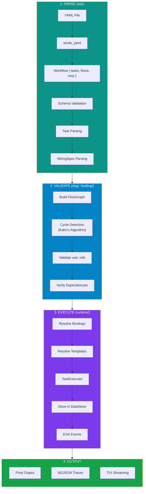

```
┌─────────────────────────────────────────────────────────────────────────────┐
│  NIKA DATA FLOW PIPELINE                                                    │
├─────────────────────────────────────────────────────────────────────────────┤
│                                                                             │
│  1. PARSE (ast/)                                                            │
│  ┌─────────────────────────────────────────────────────────────────────┐   │
│  │  YAML File → serde_yaml → Workflow { tasks, flows, mcp }            │   │
│  │                                                                      │   │
│  │  - Schema validation (nika/workflow@0.1|0.2|0.3)                    │   │
│  │  - Task parsing with TaskAction enum                                 │   │
│  │  - WiringSpec parsing for use: blocks                               │   │
│  └─────────────────────────────────────────────────────────────────────┘   │
│                                     │                                       │
│                                     ▼                                       │
│  2. VALIDATE (dag/, binding/)                                               │
│  ┌─────────────────────────────────────────────────────────────────────┐   │
│  │  - Build FlowGraph from tasks + flows                               │   │
│  │  - Detect cycles (Kahn's algorithm)                                 │   │
│  │  - Validate use: references against DAG                             │   │
│  │  - Ensure all dependencies are upstream                             │   │
│  └─────────────────────────────────────────────────────────────────────┘   │
│                                     │                                       │
│                                     ▼                                       │
│  3. EXECUTE (runtime/)                                                      │
│  ┌─────────────────────────────────────────────────────────────────────┐   │
│  │  Runner orchestrates execution:                                      │   │
│  │                                                                      │   │
│  │  for each task in topological_order:                                │   │
│  │    1. Resolve bindings from DataStore                               │   │
│  │    2. Resolve {{use.alias}} templates                               │   │
│  │    3. Execute via TaskExecutor (infer/exec/fetch/invoke/agent)      │   │
│  │    4. Store output in DataStore                                     │   │
│  │    5. Emit events to EventLog                                       │   │
│  │                                                                      │   │
│  │  Parallelism: for_each uses tokio::spawn + JoinSet                  │   │
│  └─────────────────────────────────────────────────────────────────────┘   │
│                                     │                                       │
│                                     ▼                                       │
│  4. OUTPUT                                                                  │
│  ┌─────────────────────────────────────────────────────────────────────┐   │
│  │  - Final task output returned                                       │   │
│  │  - NDJSON trace written to .nika/traces/                            │   │
│  │  - Events available for TUI streaming                               │   │
│  └─────────────────────────────────────────────────────────────────────┘   │
│                                                                             │
└─────────────────────────────────────────────────────────────────────────────┘
```

### Key Types

```rust
/// Root workflow structure (src/ast/workflow.rs)
pub struct Workflow {
    pub schema: String,           // "nika/workflow@0.4"
    pub provider: String,         // Default provider ("claude", "openai")
    pub model: Option<String>,    // Default model
    pub mcp: Option<FxHashMap<String, McpConfigInline>>,
    pub tasks: Vec<Arc<Task>>,
    pub flows: Vec<Flow>,
}

/// Individual task (src/ast/workflow.rs)
pub struct Task {
    pub id: String,
    pub use_wiring: Option<WiringSpec>,     // use: block
    pub output: Option<OutputPolicy>,       // output: block
    pub for_each: Option<serde_json::Value>, // Iteration array
    pub for_each_as: Option<String>,        // Loop variable name
    pub concurrency: Option<usize>,         // Parallel limit
    pub fail_fast: Option<bool>,            // Stop on error
    pub action: TaskAction,                 // The verb
}

/// The 5 semantic verbs (src/ast/action.rs)
pub enum TaskAction {
    Infer { infer: InferParams },   // LLM inference
    Exec { exec: ExecParams },      // Shell command
    Fetch { fetch: FetchParams },   // HTTP request
    Invoke { invoke: InvokeParams }, // MCP tool/resource
    Agent { agent: AgentParams },   // Multi-turn agent
}
```

---

## 3. YAML Workflow Schema

### Schema Versions

| Version | Added Features | Status |
|---------|---------------|--------|
| `nika/workflow@0.1` | infer, exec, fetch verbs | Supported |
| `nika/workflow@0.2` | invoke, agent verbs, mcp config | Supported |
| `nika/workflow@0.3` | for_each parallelism | Supported |
| `nika/workflow@0.4` | extended_thinking, thinking_budget, rig-core | **Current** |

### Complete Workflow Structure

```yaml
# Schema version (required)
schema: "nika/workflow@0.4"

# Default LLM provider (optional, defaults to "claude")
provider: claude  # "claude" | "openai" | "mock"

# Default model (optional)
model: claude-sonnet-4-20250514

# MCP server configurations (optional, v0.2+)
mcp:
  novanet:
    command: cargo
    args:
      - run
      - --manifest-path
      - ../novanet-dev/tools/novanet-mcp/Cargo.toml
    env:
      NEO4J_URI: bolt://localhost:7687
      NEO4J_USER: neo4j
      NEO4J_PASSWORD: password
    cwd: /path/to/working/dir  # Optional

# Task definitions
tasks:
  - id: task_name          # Required, unique identifier

    # Data binding (optional)
    use:
      alias: other_task.path.to.field
      with_default: other_task.field ?? "fallback"

    # Parallel iteration (optional, v0.3+)
    for_each: ["a", "b", "c"]  # Or binding: $other_task
    as: item                    # Loop variable (default: "item")
    concurrency: 5              # Max parallel (default: 1)
    fail_fast: true             # Stop on error (default: true)

    # Output configuration (optional)
    output:
      format: json  # "json" | "text" | "yaml"
      schema:       # JSON Schema for validation
        type: object
        properties:
          field: { type: string }

    # One of the 5 verbs (required)
    infer:
      prompt: "Your prompt with {{use.alias}}"
      provider: claude    # Override default
      model: claude-opus-4-20250514  # Override default

    # OR
    exec:
      command: "echo {{use.alias}}"

    # OR
    fetch:
      url: "https://api.example.com/{{use.alias}}"
      method: GET  # GET | POST | PUT | DELETE
      headers:
        Authorization: "Bearer {{use.token}}"
      body: '{"key": "value"}'  # For POST/PUT

    # OR
    invoke:
      mcp: novanet  # MCP server name
      tool: novanet_generate  # XOR resource
      params:
        entity: "{{use.entity_key}}"
        locale: "fr-FR"

    # OR
    agent:
      prompt: "Your agent goal"
      system: "System prompt (optional)"
      provider: claude
      model: claude-sonnet-4-20250514
      mcp:
        - novanet  # MCP servers for tools
      max_turns: 10
      token_budget: 100000
      stop_conditions:
        - "GENERATION_COMPLETE"
        - "TASK_DONE"
      extended_thinking: true   # v0.4+
      thinking_budget: 8192     # v0.4+

# Flow definitions (DAG edges)
flows:
  - source: task_a
    target: task_b

  - source: [task_a, task_b]  # Multiple sources
    target: task_c

  - source: task_c
    target: [task_d, task_e]  # Multiple targets
```

### File Naming Convention

All Nika workflow files **MUST** use the `.nika.yaml` extension:

```
workflow.nika.yaml     # Correct
workflow.yaml          # Wrong (ambiguous)
workflow.nika          # Wrong (not YAML)
```

### JSON Schema Validation

Workflows can be validated against `schemas/nika-workflow.schema.json`:

```bash
# VS Code auto-completion via .vscode/settings.json:
{
  "yaml.schemas": {
    "./schemas/nika-workflow.schema.json": "*.nika.yaml"
  }
}
```

---

## 4. The 5 Semantic Verbs

### Overview

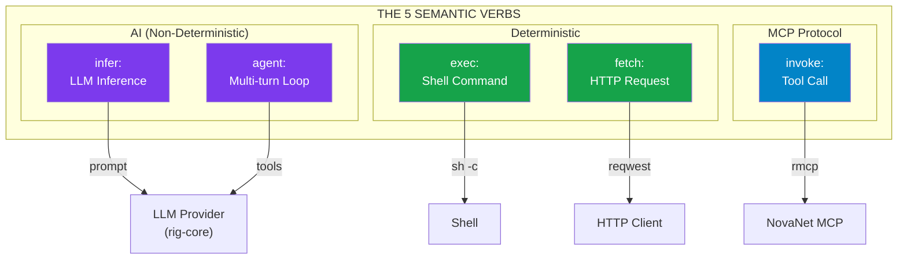

```
┌─────────────────────────────────────────────────────────────────────────────┐
│  THE 5 SEMANTIC VERBS                                                       │
├─────────────────────────────────────────────────────────────────────────────┤
│                                                                             │
│  ┌─────────────┐  ┌─────────────┐  ┌─────────────┐  ┌─────────────┐        │
│  │   infer:    │  │   exec:     │  │   fetch:    │  │  invoke:    │        │
│  │             │  │             │  │             │  │             │        │
│  │  LLM text   │  │   Shell     │  │    HTTP     │  │  MCP tool   │        │
│  │ generation  │  │  command    │  │  request    │  │    call     │        │
│  │             │  │             │  │             │  │             │        │
│  │    [AI]     │  │   [DET]     │  │    [DET]    │  │   [MCP]     │        │
│  └─────────────┘  └─────────────┘  └─────────────┘  └─────────────┘        │
│                                                                             │
│  ┌───────────────────────────────────────────────────────────────┐         │
│  │                         agent:                                 │         │
│  │                                                                │         │
│  │     Multi-turn agentic loop with tool calling [AI + MCP]      │         │
│  │                                                                │         │
│  └───────────────────────────────────────────────────────────────┘         │
│                                                                             │
└─────────────────────────────────────────────────────────────────────────────┘
```

| Verb | Purpose | Deterministic | Use Case |
|------|---------|---------------|----------|
| `infer:` | LLM inference | No | Text generation, analysis |
| `exec:` | Shell command | Yes | Scripts, system calls |
| `fetch:` | HTTP request | Yes | API calls, data retrieval |
| `invoke:` | MCP tool call | Depends | NovaNet knowledge access |
| `agent:` | Multi-turn loop | No | Complex reasoning with tools |

### 4.1 infer: Verb

One-shot LLM call for text generation.

```yaml
- id: summarize
  use:
    content: fetch_article
  infer:
    prompt: |
      Summarize the following article:

      {{use.content}}

      Provide a 3-sentence summary.
    provider: claude  # Optional override
    model: claude-sonnet-4-20250514  # Optional override
```

**InferParams Structure:**

```rust
pub struct InferParams {
    pub prompt: String,             // Required: The prompt (supports templates)
    pub provider: Option<String>,   // Override workflow provider
    pub model: Option<String>,      // Override workflow model
}
```

**Events Emitted:**
- `TemplateResolved` - Template variables resolved
- `ProviderCalled` - LLM call initiated
- `ProviderResponded` - Response received

### 4.2 exec: Verb

Shell command execution.

```yaml
- id: build
  exec:
    command: "npm run build && npm test"
```

```yaml
- id: process
  use:
    input: previous_task.filename
  exec:
    command: "python process.py {{use.input}}"
```

**ExecParams Structure:**

```rust
pub struct ExecParams {
    pub command: String,  // Shell command (runs via sh -c)
}
```

**Behavior:**
- Executed via `sh -c` on Unix systems
- Timeout: 120 seconds (configurable via constants)
- Stdout returned as output
- Non-zero exit code = task failure

### 4.3 fetch: Verb

HTTP request with full method support.

```yaml
- id: get_data
  fetch:
    url: "https://api.example.com/data"
    method: GET

- id: post_data
  use:
    payload: prepare_payload
  fetch:
    url: "https://api.example.com/submit"
    method: POST
    headers:
      Content-Type: application/json
      Authorization: "Bearer {{use.token}}"
    body: "{{use.payload}}"
```

**FetchParams Structure:**

```rust
pub struct FetchParams {
    pub url: String,                        // URL (supports templates)
    pub method: String,                     // GET, POST, PUT, DELETE
    pub headers: FxHashMap<String, String>, // Headers (support templates)
    pub body: Option<String>,               // Request body (supports templates)
}
```

**Behavior:**
- Timeout: 30 seconds
- Connection timeout: 10 seconds
- Redirect limit: 10
- User-Agent: `nika-cli/0.1`

### 4.4 invoke: Verb

MCP tool call or resource read.

```yaml
# Tool call
- id: generate_content
  invoke:
    mcp: novanet
    tool: novanet_generate
    params:
      entity: "qr-code"
      locale: "fr-FR"
      forms: ["text", "title", "abbrev"]

# Resource read
- id: read_entity
  invoke:
    mcp: novanet
    resource: "neo4j://entity/qr-code"
```

**InvokeParams Structure:**

```rust
pub struct InvokeParams {
    pub mcp: String,              // MCP server name (from workflow mcp: config)
    pub tool: Option<String>,     // Tool name (XOR with resource)
    pub params: Option<Value>,    // Tool parameters (JSON)
    pub resource: Option<String>, // Resource URI (XOR with tool)
}
```

**Validation Rules:**
- `tool` and `resource` are mutually exclusive
- One of `tool` or `resource` must be set
- `mcp` must reference a configured server

**Events Emitted:**
- `McpInvoke` - MCP call initiated
- `McpResponse` - Response received (with duration, cached status)

### 4.5 agent: Verb

Multi-turn agentic execution with tool calling.

```yaml
- id: research_agent
  agent:
    prompt: |
      Research the competitive landscape for QR code generators.
      Use the novanet tools to gather entity information.
      When complete, output "RESEARCH_COMPLETE".

    system: "You are a market research analyst."

    provider: claude
    model: claude-sonnet-4-20250514

    mcp:
      - novanet

    max_turns: 10
    token_budget: 100000

    stop_conditions:
      - "RESEARCH_COMPLETE"
      - "TASK_DONE"

    # v0.4+ Extended Thinking
    extended_thinking: true
    thinking_budget: 8192
```

**AgentParams Structure:**

```rust
pub struct AgentParams {
    pub prompt: String,                    // User prompt
    pub system: Option<String>,            // System prompt
    pub provider: Option<String>,          // Provider override
    pub model: Option<String>,             // Model override
    pub mcp: Vec<String>,                  // MCP servers for tools
    pub max_turns: Option<u32>,            // Max iterations (default: 10, max: 100)
    pub token_budget: Option<u32>,         // Token limit
    pub stop_conditions: Vec<String>,      // Early termination strings
    pub scope: Option<String>,             // Scope preset
    pub extended_thinking: Option<bool>,   // Enable reasoning capture (v0.4+)
    pub thinking_budget: Option<u64>,      // Thinking token budget (default: 4096)
}
```

**Agent Loop Execution:**

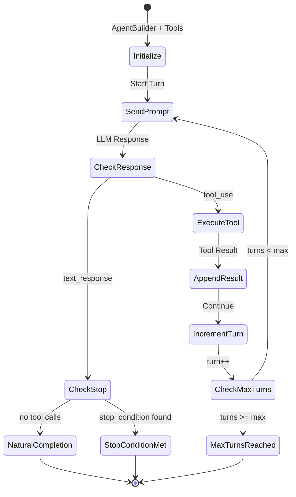

```
┌─────────────────────────────────────────────────────────────────────────────┐
│  AGENT LOOP STATE MACHINE (RigAgentLoop)                                    │
├─────────────────────────────────────────────────────────────────────────────┤
│                                                                             │
│    ┌──────────────┐                                                         │
│    │  Initialize  │ rig::AgentBuilder + prompt + tools                      │
│    └──────┬───────┘                                                         │
│           │                                                                 │
│           ▼                                                                 │
│    ┌──────────────┐         ┌──────────────┐         ┌──────────────┐      │
│    │ Send Prompt  │────────▶│ Check Resp.  │────────▶│ Execute Tool │      │
│    └──────────────┘         └──────┬───────┘         └──────┬───────┘      │
│           ▲                        │                        │               │
│           │                        │                        │               │
│           │              ┌─────────┴─────────┐              │               │
│           │              │                   │              │               │
│           │              ▼                   ▼              │               │
│           │       ┌────────────┐      ┌────────────┐       │               │
│           │       │ Check Stop │      │ No Tools   │       │               │
│           │       └──────┬─────┘      └─────┬──────┘       │               │
│           │              │                  │               │               │
│           │              ▼                  ▼               │               │
│           │       ┌────────────┐      ┌────────────┐       │               │
│           │       │ STOP MET   │      │ NATURAL    │       │               │
│           │       │ COMPLETION │      │ COMPLETION │       │               │
│           │       └────────────┘      └────────────┘       │               │
│           │                                                 │               │
│           └────────────◄────────────────────────────────────┘               │
│                   (if turns < max_turns)                                    │
│                                                                             │
│  EXIT STATES:                                                               │
│  - NaturalCompletion:  No tool calls in response                           │
│  - StopConditionMet:   Stop keyword found in text                          │
│  - MaxTurnsReached:    Turn limit exceeded                                  │
│                                                                             │
└─────────────────────────────────────────────────────────────────────────────┘
```

**Events Emitted:**
- `AgentStart` - Loop initiated
- `AgentTurn` (for each turn) - With optional metadata including thinking
- `AgentComplete` - Loop finished

**Extended Thinking (v0.4+):**

When `extended_thinking: true`, Claude's reasoning process is captured:

```rust
pub struct AgentTurnMetadata {
    pub thinking: Option<String>,  // Claude's reasoning (if streaming)
    pub response_text: String,     // Main response
    pub input_tokens: u32,
    pub output_tokens: u32,
    pub cache_read_tokens: u32,
    pub stop_reason: String,       // "end_turn", "tool_use", "max_tokens"
}
```

---

## 5. Provider System

### rig-core Integration (v0.4)

Nika uses [rig-core](https://github.com/0xPlaygrounds/rig) v0.31 for LLM providers:

```rust
// RigProvider wraps rig-core clients
pub enum RigProvider {
    Claude(anthropic::Client),
    OpenAI(openai::Client),
}

impl RigProvider {
    pub fn claude() -> Self { ... }    // From ANTHROPIC_API_KEY
    pub fn openai() -> Self { ... }    // From OPENAI_API_KEY

    pub async fn infer(&self, prompt: &str, model: Option<&str>) -> Result<String> {
        // Uses rig-core's completion API
    }
}
```

### Provider Configuration

**Environment Variables:**

| Provider | Variable | Description |
|----------|----------|-------------|
| Claude | `ANTHROPIC_API_KEY` | Anthropic API key |
| OpenAI | `OPENAI_API_KEY` | OpenAI API key |

**Workflow Override:**

```yaml
provider: claude          # Workflow default
model: claude-sonnet-4-20250514

tasks:
  - id: premium_task
    infer:
      prompt: "Complex task"
      provider: claude    # Task override
      model: claude-opus-4-20250514  # Use premium model
```

### NikaMcpTool

MCP tools are exposed to rig agents via `NikaMcpTool`:

```rust
/// Wraps MCP tool for rig's ToolDyn trait
pub struct NikaMcpTool {
    def: NikaMcpToolDef,
    client: Arc<McpClient>,
}

impl ToolDyn for NikaMcpTool {
    fn name(&self) -> String { ... }
    fn definition(&self) -> ToolDefinition { ... }
    async fn call(&self, input: Value) -> Result<Value> {
        // Delegates to McpClient.call_tool()
    }
}
```

### v0.4 Migration: Removed Legacy Code

The following files were **permanently deleted** in v0.4 (replaced by rig-core):

| Removed File | Lines | Replacement |
|--------------|-------|-------------|
| `provider/claude.rs` | ~400 | `RigProvider::claude()` |
| `provider/openai.rs` | ~350 | `RigProvider::openai()` |
| `provider/types.rs` | ~200 | rig::completion types in `mod.rs` |
| `runtime/agent_loop.rs` | ~600 | `RigAgentLoop` in `rig_agent_loop.rs` |
| `resilience/` module (4 files) | ~800 | rig-core built-in retry |

**Total removed:** ~2,350 lines of code

**Why rig-core?**
- Native `rmcp` v0.16 integration via `.rmcp_tools()`
- 20+ built-in LLM providers (Anthropic, OpenAI, Cohere, Mistral, etc.)
- Built-in retry, streaming, and agent workflows
- Active maintenance and community support

**Migration for existing code:**

```rust
// Before (v0.3)
use nika::provider::ClaudeProvider;
let provider = ClaudeProvider::new()?;
let result = provider.generate("prompt", None).await?;

// After (v0.4)
use nika::provider::rig::RigProvider;
let provider = RigProvider::claude()?;
let result = provider.infer("prompt", None).await?;
```

---

## 6. MCP Integration

### Zero Cypher Rule (ADR-003)

Nika connects to NovaNet **exclusively via MCP**. No direct Neo4j access.

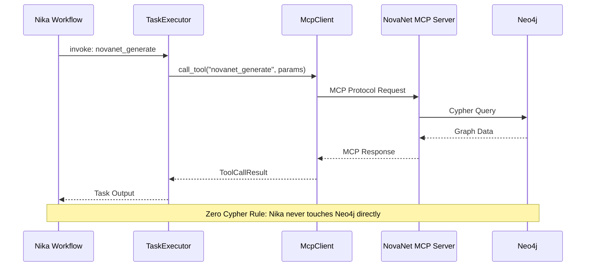

```
┌──────────┐     MCP Protocol     ┌──────────────┐     Cypher     ┌────────┐
│   Nika   │ ──────────────────► │ NovaNet MCP  │ ─────────────► │ Neo4j  │
│ (Client) │                      │   (Server)   │                │   DB   │
└──────────┘                      └──────────────┘                └────────┘
```

```
┌─────────────────────────────────────────────────────────────────────────────┐
│  MCP INTEGRATION FLOW                                                       │
├─────────────────────────────────────────────────────────────────────────────┤
│                                                                             │
│  1. Workflow defines MCP server config                                      │
│  ┌─────────────────────────────────────────────────────────────────────┐   │
│  │  mcp:                                                                │   │
│  │    novanet:                                                          │   │
│  │      command: cargo run -p novanet-mcp                               │   │
│  │      env: { NEO4J_URI: bolt://localhost:7687 }                       │   │
│  └─────────────────────────────────────────────────────────────────────┘   │
│                                                                             │
│  2. McpClient spawns server process on first use                           │
│  ┌─────────────────────────────────────────────────────────────────────┐   │
│  │  McpClient::new(config) → connect() → list_tools()                   │   │
│  └─────────────────────────────────────────────────────────────────────┘   │
│                                                                             │
│  3. invoke: verb calls MCP tools                                            │
│  ┌─────────────────────────────────────────────────────────────────────┐   │
│  │  TaskExecutor → McpClient.call_tool(name, params) → Response         │   │
│  └─────────────────────────────────────────────────────────────────────┘   │
│                                                                             │
│  4. agent: verb exposes tools via NikaMcpTool                              │
│  ┌─────────────────────────────────────────────────────────────────────┐   │
│  │  RigAgentLoop → rig::AgentBuilder.tools([NikaMcpTool]) → Agent       │   │
│  └─────────────────────────────────────────────────────────────────────┘   │
│                                                                             │
└─────────────────────────────────────────────────────────────────────────────┘
```

### McpClient

```rust
pub struct McpClient {
    name: String,
    connected: AtomicBool,
    is_mock: bool,
    adapter: Option<RmcpClientAdapter>,
}

impl McpClient {
    // Create from config
    pub fn new(config: McpConfig) -> Result<Self>;

    // Testing
    pub fn mock(name: &str) -> Self;

    // Operations
    pub async fn connect(&self) -> Result<()>;
    pub async fn call_tool(&self, name: &str, params: Value) -> Result<ToolCallResult>;
    pub async fn read_resource(&self, uri: &str) -> Result<ResourceContent>;
    pub async fn list_tools(&self) -> Result<Vec<ToolDefinition>>;

    // Retry logic with reconnection
    pub async fn reconnect(&self) -> Result<()>;
}
```

### MCP Configuration

```yaml
mcp:
  novanet:
    command: cargo
    args:
      - run
      - --manifest-path
      - ../novanet-dev/tools/novanet-mcp/Cargo.toml
    env:
      NEO4J_URI: bolt://localhost:7687
      NEO4J_USER: neo4j
      NEO4J_PASSWORD: novanetpassword
    cwd: /optional/working/dir
```

### Available NovaNet MCP Tools

| Tool | Purpose |
|------|---------|
| `novanet_describe` | Describe schema (nodes, arcs) |
| `novanet_generate` | Generate native content |
| `novanet_traverse` | Graph traversal |
| `novanet_assemble` | Build context |
| `novanet_atoms` | Knowledge atoms |
| `novanet_search` | Entity search |
| `novanet_query` | Advanced queries |

### Mock Mode

For testing without NovaNet:

```rust
// Create mock client
let client = McpClient::mock("novanet");
assert!(client.is_connected());

// Mock responses
// - novanet_describe: {"nodes": 61, "arcs": 182, ...}
// - novanet_generate: Entity context with locale
// - Other tools: Generic success response
```

---

## 7. Data Binding System

### use: Block Syntax

Data flows between tasks via the `use:` block:

```yaml
tasks:
  - id: fetch_data
    fetch:
      url: "https://api.example.com/data"
    output:
      format: json

  - id: process
    use:
      data: fetch_data                     # Entire output
      name: fetch_data.user.name           # Nested path
      score: fetch_data.score ?? 0         # With default
      tags: 'fetch_data.tags ?? ["default"]'  # Complex default
    infer:
      prompt: |
        Process user {{use.name}} with score {{use.score}}.
        Tags: {{use.tags}}

flows:
  - source: fetch_data
    target: process
```

### UseEntry Parsing

```rust
pub struct UseEntry {
    pub path: String,           // "task.field.subfield"
    pub default: Option<Value>, // Fallback value
}

// Parsing rules:
// "task.path"           -> UseEntry { path: "task.path", default: None }
// "task.path ?? 0"      -> UseEntry { path: "task.path", default: Some(0) }
// 'task.path ?? "str"'  -> UseEntry { path: "task.path", default: Some("str") }
// 'task ?? {"a": 1}'    -> UseEntry { path: "task", default: Some({"a": 1}) }
```

### Template Resolution

Templates `{{use.alias}}` are resolved at execution time:

```rust
pub fn template_resolve(
    template: &str,
    bindings: &ResolvedBindings,
) -> Result<Cow<str>, NikaError>;

// Example:
// Template: "Hello {{use.name}}, score: {{use.score}}"
// Bindings: { "name": "Alice", "score": 95 }
// Result: "Hello Alice, score: 95"
```

### JSONPath Support

Limited JSONPath subset for nested access:

```yaml
use:
  title: fetch_data.response.items[0].title
  count: fetch_data.$.data.count  # $ prefix optional
```

Supported patterns:
- `task` - Entire output
- `task.field` - Object field
- `task.field.nested` - Nested field
- `task.array[0]` - Array index
- `task.array[0].field` - Combined

---

## 8. DAG Execution

### DAG Overview

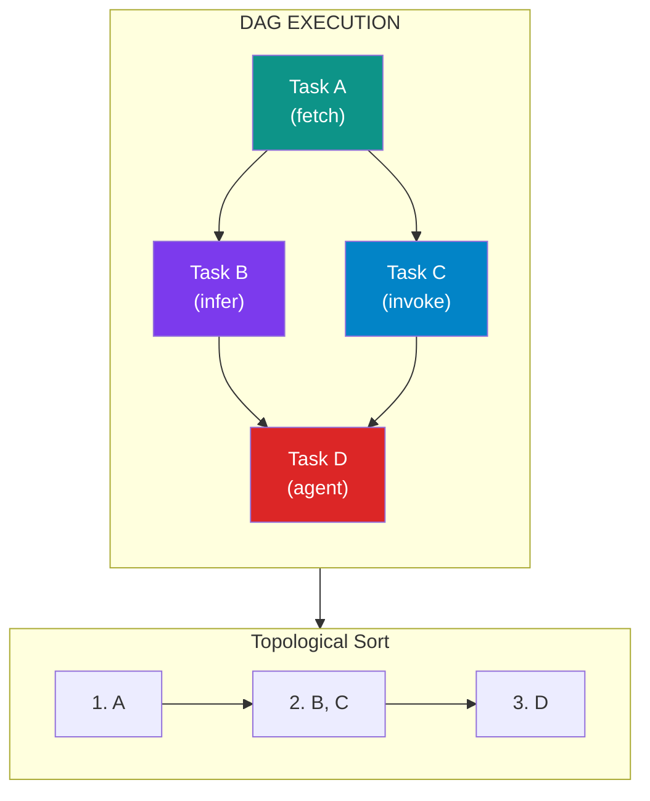

```
┌─────────────────────────────────────────────────────────────────────────────┐
│  DAG EXECUTION MODEL                                                        │
├─────────────────────────────────────────────────────────────────────────────┤
│                                                                             │
│  WORKFLOW DEFINITION:                                                       │
│  ┌─────────────────────────────────────────────────────────────────────┐   │
│  │  flows:                                                              │   │
│  │    - source: task_a                                                  │   │
│  │      target: [task_b, task_c]    # Fan-out                          │   │
│  │    - source: [task_b, task_c]                                        │   │
│  │      target: task_d              # Fan-in                            │   │
│  └─────────────────────────────────────────────────────────────────────┘   │
│                                                                             │
│  VISUAL REPRESENTATION:                                                     │
│                                                                             │
│               task_a                                                        │
│              /      \                                                       │
│             ▼        ▼                                                      │
│         task_b    task_c                                                    │
│             \      /                                                        │
│              ▼    ▼                                                         │
│               task_d                                                        │
│                                                                             │
│  TOPOLOGICAL ORDER: [task_a, task_b, task_c, task_d]                       │
│  (task_b and task_c can execute in parallel after task_a)                  │
│                                                                             │
│  CYCLE DETECTION: Kahn's Algorithm (O(V + E))                              │
│  - Remove nodes with no incoming edges                                      │
│  - Repeat until graph is empty (success) or stuck (cycle)                  │
│                                                                             │
└─────────────────────────────────────────────────────────────────────────────┘
```

### Flow Definition

```yaml
flows:
  # Simple edge
  - source: task_a
    target: task_b

  # Fan-out
  - source: task_a
    target: [task_b, task_c, task_d]

  # Fan-in
  - source: [task_b, task_c, task_d]
    target: task_e
```

### Topological Sort

Tasks are executed in topological order:

```
Given: A → B → C
       A → D → C

Execution order: A, B, D, C (or A, D, B, C)
```

### Cycle Detection

Cycles are detected during validation:

```yaml
# ERROR: Cycle detected
flows:
  - source: task_a
    target: task_b
  - source: task_b
    target: task_c
  - source: task_c
    target: task_a  # Creates cycle!
```

Error: `[NIKA-020] Cycle detected in DAG: task_a -> task_b -> task_c -> task_a`

### Dependency Validation

Use block references are validated against the DAG:

```yaml
tasks:
  - id: task_a
    exec: { command: "echo a" }

  - id: task_b
    use:
      data: task_c  # ERROR: task_c is not upstream of task_b
    exec: { command: "echo {{use.data}}" }

  - id: task_c
    exec: { command: "echo c" }

flows:
  - source: task_a
    target: task_b
  - source: task_b
    target: task_c
```

Error: `[NIKA-081] use.data.from='task_c' is not upstream of task 'task_b'`

---

## 9. Event System

### Event Flow Overview

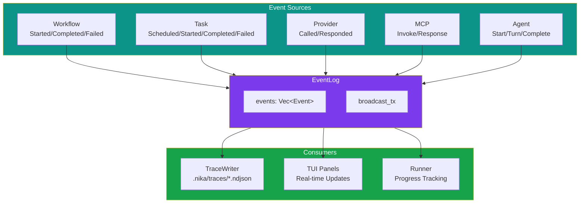

```
┌─────────────────────────────────────────────────────────────────────────────┐
│  EVENT SYSTEM ARCHITECTURE                                                  │
├─────────────────────────────────────────────────────────────────────────────┤
│                                                                             │
│  SOURCES                         EVENTLOG                    CONSUMERS      │
│  ┌─────────┐                                                                │
│  │Workflow │──┐                ┌─────────────┐          ┌─────────────┐    │
│  │ Events  │  │                │             │          │ TraceWriter │    │
│  └─────────┘  │   emit()       │  EventLog   │  recv()  │   (NDJSON)  │    │
│  ┌─────────┐  │ ─────────────▶ │             │ ───────▶ └─────────────┘    │
│  │  Task   │──┤                │  - events   │          ┌─────────────┐    │
│  │ Events  │  │                │  - broadcast│  recv()  │     TUI     │    │
│  └─────────┘  │                │             │ ───────▶ │   (panels)  │    │
│  ┌─────────┐  │                └─────────────┘          └─────────────┘    │
│  │Provider │──┤                                         ┌─────────────┐    │
│  │ Events  │  │                                  recv() │   Runner    │    │
│  └─────────┘  │                               ───────▶  │  (progress) │    │
│  ┌─────────┐  │                                         └─────────────┘    │
│  │  MCP    │──┤                                                             │
│  │ Events  │  │                                                             │
│  └─────────┘  │                                                             │
│  ┌─────────┐  │                                                             │
│  │ Agent   │──┘                                                             │
│  │ Events  │                                                                │
│  └─────────┘                                                                │
│                                                                             │
└─────────────────────────────────────────────────────────────────────────────┘
```

### EventKind Variants (16+)

```rust
pub enum EventKind {
    // Workflow Level (3)
    WorkflowStarted { task_count, generation_id, workflow_hash, nika_version },
    WorkflowCompleted { final_output, total_duration_ms },
    WorkflowFailed { error, failed_task },

    // Task Level (4)
    TaskScheduled { task_id, dependencies },
    TaskStarted { task_id, inputs },
    TaskCompleted { task_id, output, duration_ms },
    TaskFailed { task_id, error, duration_ms },

    // Fine-Grained (3)
    TemplateResolved { task_id, template, result },
    ProviderCalled { task_id, provider, model, prompt_len },
    ProviderResponded { task_id, request_id, input_tokens, output_tokens, ... },

    // Context Assembly (1)
    ContextAssembled { task_id, sources, excluded, total_tokens, budget_used_pct, truncated },

    // MCP Events (2)
    McpInvoke { task_id, call_id, mcp_server, tool, resource },
    McpResponse { task_id, call_id, output_len, duration_ms, cached, is_error },

    // Agent Events (3)
    AgentStart { task_id, max_turns, mcp_servers },
    AgentTurn { task_id, turn_index, kind, metadata },  // v0.4.1: includes thinking
    AgentComplete { task_id, turns, stop_reason },
}
```

### EventLog

Thread-safe, append-only event log:

```rust
pub struct EventLog {
    events: Arc<RwLock<Vec<Event>>>,
    start_time: Instant,
    next_id: Arc<AtomicU64>,
    broadcast_tx: Option<broadcast::Sender<Event>>,
}

impl EventLog {
    pub fn new() -> Self;
    pub fn new_with_broadcast() -> (Self, broadcast::Receiver<Event>);

    pub fn emit(&self, kind: EventKind) -> u64;
    pub fn events(&self) -> Vec<Event>;
    pub fn filter_task(&self, task_id: &str) -> Vec<Event>;
    pub fn workflow_events(&self) -> Vec<Event>;
}
```

### Event Structure

```rust
pub struct Event {
    pub id: u64,              // Monotonic sequence ID
    pub timestamp_ms: u64,    // Time since workflow start
    pub kind: EventKind,      // Event type and data
}
```

---

## 10. Observability and Traces

### NDJSON Trace Files

Execution traces are written to `.nika/traces/`:

```
.nika/
└── traces/
    ├── 2026-02-19T14-30-45-a1b2.ndjson
    ├── 2026-02-19T14-25-12-c3d4.ndjson
    └── ...
```

### Trace Format

Each line is a JSON event:

```json
{"id":0,"timestamp_ms":0,"kind":{"type":"workflow_started","task_count":3,"generation_id":"2026-02-19T14-30-45-a1b2","workflow_hash":"xxh3:abc123...","nika_version":"0.4.1"}}
{"id":1,"timestamp_ms":5,"kind":{"type":"task_started","task_id":"fetch_context","inputs":{}}}
{"id":2,"timestamp_ms":150,"kind":{"type":"mcp_invoke","task_id":"fetch_context","call_id":"uuid-1234","mcp_server":"novanet","tool":"novanet_generate"}}
{"id":3,"timestamp_ms":500,"kind":{"type":"mcp_response","task_id":"fetch_context","call_id":"uuid-1234","output_len":1234,"duration_ms":345,"cached":false,"is_error":false}}
{"id":4,"timestamp_ms":510,"kind":{"type":"task_completed","task_id":"fetch_context","output":{...},"duration_ms":505}}
...
```

### TraceWriter

```rust
pub struct TraceWriter {
    writer: Arc<Mutex<BufWriter<File>>>,
    path: PathBuf,
}

impl TraceWriter {
    pub fn new(generation_id: &str) -> Result<Self>;
    pub fn write_event(&self, event: &Event) -> Result<()>;
    pub fn write_all(&self, event_log: &EventLog) -> Result<()>;
}

pub fn generate_generation_id() -> String;
// Format: "YYYY-MM-DDTHH-MM-SS-XXXX" (random hex suffix)

pub fn calculate_workflow_hash(yaml: &str) -> String;
// Format: "xxh3:XXXXXXXXXXXXXXXX"
```

### Trace Commands

```bash
# List all traces
nika trace list
nika trace list --limit 5

# Show trace details
nika trace show 2026-02-19T14-30-45-a1b2

# Export trace
nika trace export 2026-02-19T14-30-45 --format json --output trace.json
nika trace export 2026-02-19T14-30-45 --format yaml

# Clean old traces
nika trace clean --keep 10
```

---

## 11. for_each Parallelism

### Parallel Execution Overview

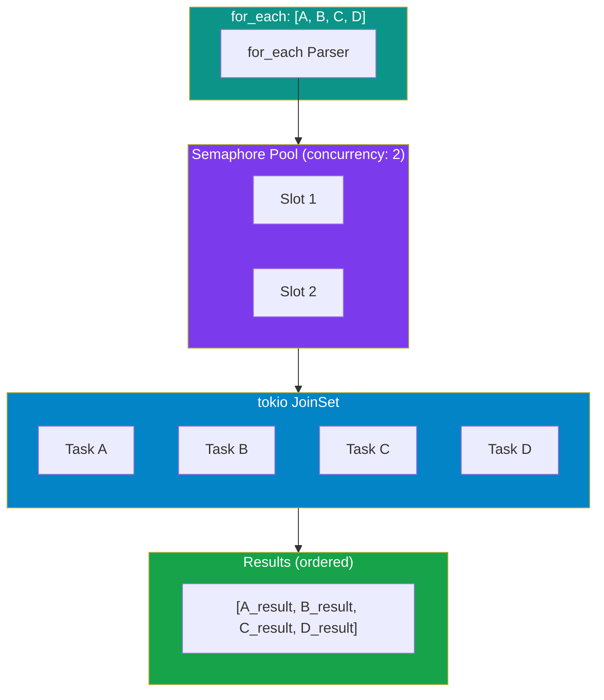

```
┌─────────────────────────────────────────────────────────────────────────────┐
│  for_each PARALLEL EXECUTION                                                │
├─────────────────────────────────────────────────────────────────────────────┤
│                                                                             │
│  INPUT: for_each: ["A", "B", "C", "D"]                                      │
│         concurrency: 2                                                      │
│                                                                             │
│  TIME ──────────────────────────────────────────────────────────────────▶   │
│                                                                             │
│  Slot 1:  ┌──────────┐          ┌──────────┐                               │
│           │  Task A  │          │  Task C  │                               │
│           └──────────┘          └──────────┘                               │
│                                                                             │
│  Slot 2:  ┌──────────┐          ┌──────────┐                               │
│           │  Task B  │          │  Task D  │                               │
│           └──────────┘          └──────────┘                               │
│                                                                             │
│  RESULT: [A_result, B_result, C_result, D_result]  (original order)        │
│                                                                             │
│  ─────────────────────────────────────────────────────────────────────────  │
│                                                                             │
│  COMPARISON:                                                                │
│                                                                             │
│  concurrency=1 (sequential):                                                │
│    [A]───▶[B]───▶[C]───▶[D]                      Total: 4 * avg_time       │
│                                                                             │
│  concurrency=2:                                                             │
│    [A]   [C]                                                                │
│    [B]───▶[D]                                     Total: 2 * avg_time       │
│                                                                             │
│  concurrency=4 (all parallel):                                              │
│    [A]                                                                      │
│    [B]                                            Total: 1 * max_time       │
│    [C]                                                                      │
│    [D]                                                                      │
│                                                                             │
└─────────────────────────────────────────────────────────────────────────────┘
```

### Basic Syntax (Flat Format)

```yaml
tasks:
  - id: process_locales
    for_each: ["en-US", "fr-FR", "de-DE", "ja-JP"]  # Array or binding
    as: locale                                        # Loop variable name
    concurrency: 4                                    # Max parallel
    fail_fast: true                                   # Stop on error
    infer:
      prompt: "Generate content for {{use.locale}}"
```

### Binding Expressions

```yaml
tasks:
  - id: fetch_entities
    invoke:
      mcp: novanet
      tool: novanet_search
      params:
        category: "products"

  - id: process_entities
    use:
      entities: fetch_entities.results
    for_each: "$entities"           # Binding syntax 1
    # for_each: "{{use.entities}}"  # Binding syntax 2 (also works)
    as: entity
    concurrency: 5
    fail_fast: false
    invoke:
      mcp: novanet
      tool: novanet_generate
      params:
        entity: "{{use.entity.key}}"
        locale: "en-US"

flows:
  - source: fetch_entities
    target: process_entities
```

### Configuration Options

| Property | Type | Default | Description |
|----------|------|---------|-------------|
| `for_each` | array/binding | required | Array literal or binding expression |
| `as` | string | `"item"` | Loop variable name |
| `concurrency` | integer | `1` | Max parallel tasks |
| `fail_fast` | boolean | `true` | Stop on first error |

> **Note:** Binding expressions are resolved at runtime. Use `$name` or `{{use.name}}`.

### Implementation

Uses `tokio::spawn` with `JoinSet` for true concurrent execution:

```rust
// Simplified executor logic
let mut join_set = JoinSet::new();
let semaphore = Arc::new(Semaphore::new(concurrency));

for item in items {
    let permit = semaphore.clone().acquire_owned().await?;
    join_set.spawn(async move {
        let result = execute_task(item).await;
        drop(permit);
        result
    });
}

// Collect results in order
let results = join_set.join_all().await;
```

### Execution Patterns

```
concurrency=1 (sequential):
  [Item 1] → [Item 2] → [Item 3] → [Item 4]

concurrency=2:
  [Item 1]   [Item 3]
  [Item 2] → [Item 4]

concurrency=4 (all parallel):
  [Item 1]
  [Item 2]
  [Item 3]
  [Item 4]
```

---

## 12. Terminal UI (TUI)

### Launching TUI

```bash
cargo run -- tui workflow.nika.yaml
```

### 4-Panel Layout

```
┌─────────────────────────────────────────────────────────────────────────────┐
│  NIKA TUI v0.4.1                                    [?] Help  [q] Quit     │
├───────────────────────────────────┬─────────────────────────────────────────┤
│                                   │                                         │
│  PROGRESS (33%)                   │  CONTEXT                                │
│  ━━━━━━━━━░░░░░░░░░░░░░░░░░      │                                         │
│                                   │  task: generate_content                 │
│  Tasks:                           │  entity: qr-code                        │
│  ✓ fetch_context     [2.1s]      │  locale: fr-FR                          │
│  ● polish_content    [running]    │                                         │
│  ○ validate_quality  [pending]    │  MCP Calls:                             │
│                                   │  └─ novanet_generate (345ms)            │
│                                   │                                         │
├───────────────────────────────────┼─────────────────────────────────────────┤
│                                   │                                         │
│  DAG                              │  REASONING                              │
│                                   │                                         │
│  fetch_context ─────┐             │  <thinking>                             │
│                     ├──▶ polish   │  Let me analyze the entity context...   │
│  (MCP: novanet)     │    content  │  The denomination_forms provide:        │
│                     │             │  - text: "code QR"                      │
│  validate_quality ◀─┘             │  - title: "Code QR"                     │
│  (waiting)                        │  </thinking>                            │
│                                   │                                         │
└───────────────────────────────────┴─────────────────────────────────────────┘
```

### Keybindings

| Key | Action |
|-----|--------|
| `q` / `Esc` | Quit |
| `?` / `h` | Toggle help |
| `Tab` | Cycle panels |
| `↑` / `↓` | Scroll within panel |
| `←` / `→` | Navigate timeline |
| `Enter` | Expand/collapse item |
| `r` | Restart workflow |

### Real-Time Event Streaming

TUI subscribes to EventLog broadcasts:

```rust
let (event_log, rx) = EventLog::new_with_broadcast();

// TUI receives events via rx
tokio::spawn(async move {
    while let Ok(event) = rx.recv().await {
        update_ui(event);
    }
});
```

---

## 13. CLI Commands

### Quick Reference

```
┌─────────────────────────────────────────────────────────────────────────────┐
│  NIKA CLI COMMANDS                                                          │
├─────────────────────────────────────────────────────────────────────────────┤
│                                                                             │
│  EXECUTION                                                                  │
│  ┌─────────────────────────────────────────────────────────────────────┐   │
│  │  nika run <file>            Execute workflow                        │   │
│  │  nika run <file> --provider Execute with specific provider          │   │
│  │  nika run <file> --model    Execute with specific model             │   │
│  └─────────────────────────────────────────────────────────────────────┘   │
│                                                                             │
│  VALIDATION                                                                 │
│  ┌─────────────────────────────────────────────────────────────────────┐   │
│  │  nika validate <file>       Parse and validate workflow             │   │
│  └─────────────────────────────────────────────────────────────────────┘   │
│                                                                             │
│  INTERACTIVE                                                                │
│  ┌─────────────────────────────────────────────────────────────────────┐   │
│  │  nika tui <file>            Launch 4-panel TUI                      │   │
│  └─────────────────────────────────────────────────────────────────────┘   │
│                                                                             │
│  TRACES                                                                     │
│  ┌─────────────────────────────────────────────────────────────────────┐   │
│  │  nika trace list            List all traces                         │   │
│  │  nika trace show <id>       Display trace events                    │   │
│  │  nika trace export <id>     Export trace to file                    │   │
│  │  nika trace clean           Remove old traces                       │   │
│  └─────────────────────────────────────────────────────────────────────┘   │
│                                                                             │
└─────────────────────────────────────────────────────────────────────────────┘
```

### Command Reference

| Command | Description | Options |
|---------|-------------|---------|
| `nika run <file>` | Execute workflow | `--provider`, `--model` |
| `nika validate <file>` | Parse and validate | none |
| `nika tui <file>` | Launch interactive TUI | none |
| `nika trace list` | List all traces | `--limit <n>` |
| `nika trace show <id>` | Display trace events | none |
| `nika trace export <id>` | Export trace | `--format`, `--output` |
| `nika trace clean` | Remove old traces | `--keep <n>` |

```bash
# Run workflow
nika run <file> [--provider <p>] [--model <m>]

# Validate workflow (parse only)
nika validate <file>

# Interactive TUI
nika tui <file>

# Trace management
nika trace list [--limit <n>]
nika trace show <id>
nika trace export <id> [--format json|yaml] [--output <file>]
nika trace clean [--keep <n>]
```

### Examples

```bash
# Run with default provider
cargo run -- run examples/uc1-entity-generation.nika.yaml

# Run with mock provider (no API calls)
cargo run -- run examples/uc1-entity-generation.nika.yaml --provider mock

# Run with specific model
cargo run -- run workflow.nika.yaml --provider claude --model claude-opus-4-20250514

# Validate before running
cargo run -- validate examples/uc1-entity-generation.nika.yaml

# Launch TUI
cargo run -- tui examples/uc1-entity-generation.nika.yaml

# List recent traces
cargo run -- trace list --limit 5

# Show trace events
cargo run -- trace show 2026-02-19T14-30-45-a1b2

# Export to JSON
cargo run -- trace export 2026-02-19T14-30-45 --format json --output trace.json
```

---

## 14. Error Handling

### Error Architecture

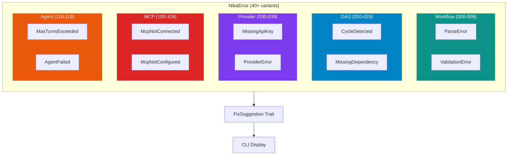

```
┌─────────────────────────────────────────────────────────────────────────────┐
│  ERROR CODE ARCHITECTURE                                                    │
├─────────────────────────────────────────────────────────────────────────────┤
│                                                                             │
│  ┌────────────┐   ┌────────────┐   ┌────────────┐   ┌────────────┐        │
│  │  000-009   │   │  010-019   │   │  020-029   │   │  030-039   │        │
│  │  Workflow  │   │   Schema   │   │    DAG     │   │  Provider  │        │
│  └────────────┘   └────────────┘   └────────────┘   └────────────┘        │
│                                                                             │
│  ┌────────────┐   ┌────────────┐   ┌────────────┐   ┌────────────┐        │
│  │  040-049   │   │  050-059   │   │  060-069   │   │  070-079   │        │
│  │  Template  │   │   Path     │   │   Output   │   │ Use Block  │        │
│  └────────────┘   └────────────┘   └────────────┘   └────────────┘        │
│                                                                             │
│  ┌────────────┐   ┌────────────┐   ┌────────────┐   ┌────────────┐        │
│  │  080-089   │   │  090-099   │   │  100-109   │   │  110-119   │        │
│  │ DAG Valid. │   │  JSONPath  │   │    MCP     │   │   Agent    │        │
│  └────────────┘   └────────────┘   └────────────┘   └────────────┘        │
│                                                                             │
│  ┌────────────┐   ┌────────────┐                                           │
│  │  120-129   │   │  130-139   │                                           │
│  │ (Reserved) │   │    TUI     │                                           │
│  └────────────┘   └────────────┘                                           │
│                                                                             │
└─────────────────────────────────────────────────────────────────────────────┘
```

### Error Code Ranges

| Range | Category | Key Errors |
|-------|----------|------------|
| `NIKA-000-009` | Workflow errors | ParseError, WorkflowFailed |
| `NIKA-010-019` | Schema/validation errors | InvalidSchema, UnsupportedVersion |
| `NIKA-020-029` | DAG errors | CycleDetected, InvalidFlow |
| `NIKA-030-039` | Provider errors | MissingApiKey, ProviderError |
| `NIKA-040-049` | Template/binding errors | TemplateError, InvalidBinding |
| `NIKA-050-059` | Path/task errors | TaskNotFound, PathResolution |
| `NIKA-060-069` | Output errors | InvalidFormat, SchemaValidation |
| `NIKA-070-079` | Use block validation | UnknownAlias, InvalidPath |
| `NIKA-080-089` | DAG validation | NotUpstream, MissingDependency |
| `NIKA-090-099` | JSONPath/IO errors | JSONPathError, IOError |
| `NIKA-100-109` | MCP errors | McpNotConnected, McpNotConfigured |
| `NIKA-110-119` | Agent errors | MaxTurnsExceeded, AgentFailed |
| `NIKA-120-129` | (Reserved) | Unused - resilience module removed in v0.4 |
| `NIKA-130-139` | TUI errors | RenderError, InputError |

### Common Errors

| Code | Error | Fix |
|------|-------|-----|
| `NIKA-001` | Parse error | Check YAML syntax |
| `NIKA-010` | Invalid schema | Use `nika/workflow@0.4` (or 0.1-0.3 for older features) |
| `NIKA-020` | Cycle detected | Remove circular dependencies |
| `NIKA-032` | Missing API key | Set `ANTHROPIC_API_KEY` or `OPENAI_API_KEY` |
| `NIKA-071` | Unknown alias | Declare alias in `use:` block |
| `NIKA-100` | MCP not connected | Check MCP server config |
| `NIKA-105` | MCP not configured | Add server to workflow `mcp:` |
| `NIKA-110` | Max turns exceeded | Increase `max_turns` or simplify task |

### FixSuggestion Trait

```rust
impl FixSuggestion for NikaError {
    fn fix_suggestion(&self) -> Option<&str> {
        match self {
            Self::MissingApiKey { .. } =>
                Some("Set the API key env var (ANTHROPIC_API_KEY or OPENAI_API_KEY)"),
            Self::CycleDetected { .. } =>
                Some("Remove circular dependencies from your workflow"),
            // ...
        }
    }
}
```

CLI displays suggestions:

```
Error: [NIKA-032] Missing API key for provider 'claude'
  Fix: Set the API key env var (ANTHROPIC_API_KEY or OPENAI_API_KEY)
```

---

## 15. Architecture Decision Records

### Core ADRs

| ADR | Title | Key Decision |
|-----|-------|--------------|
| **ADR-001** | 5 Semantic Verbs | Exactly 5 verbs: infer, exec, fetch, invoke, agent |
| **ADR-002** | YAML-First | Workflows as YAML files, not code |
| **ADR-003** | MCP-Only | Zero Cypher Rule - NovaNet via MCP only |

### ADR-001: 5 Semantic Verbs

**Decision:** Nika uses exactly 5 semantic verbs.

**Rationale:**
- Balance simplicity (few verbs) with completeness (all AI patterns)
- Each verb is irreducible:
  - `infer:` - Non-deterministic AI capability
  - `exec:` - Deterministic system integration
  - `fetch:` - HTTP with built-in semantics
  - `invoke:` - MCP protocol, tool-based AI
  - `agent:` - Multi-turn loops with tools

**Rejected alternatives:**
- `transform:` - Use `infer:` with transformation prompt
- `validate:` - Use `exec:` with validation script
- `loop:` - Use `for_each:` modifier instead

### ADR-002: YAML-First

**Decision:** Workflows are defined in YAML files.

**Why YAML over alternatives:**
| Factor | YAML | JSON | TOML | DSL |
|--------|------|------|------|-----|
| Multi-line strings | Excellent | Poor | OK | Excellent |
| Comments | Yes | No | Yes | Yes |
| Industry standard | Yes (K8s, CI) | Yes | Less | No |
| IDE support | Excellent | Excellent | Limited | None |

**Benefits:**
- Static analysis before execution
- DAG visualization from file
- Git-friendly diffs
- Non-programmers can edit

### ADR-003: MCP-Only Integration

**Decision:** Zero Cypher Rule - all NovaNet access via MCP.

**Rationale:**
| Factor | Direct Neo4j | MCP-Only |
|--------|--------------|----------|
| Coupling | Tight | Loose |
| Schema changes | Break Nika | Transparent |
| Security | Cypher injection risk | Validated tools |
| Caching | Manual | MCP server handles |

**Compliance check:**
```yaml
# WRONG - direct Cypher
- exec:
    command: "cypher-shell 'MATCH (e:Entity) RETURN e'"

# RIGHT - semantic MCP tool
- invoke:
    mcp: novanet
    tool: novanet_describe
```

---

## 16. Development Guide

### Setup

```bash
# Clone and enter directory
cd nika-dev/tools/nika

# Install dependencies
cargo build

# Run tests
cargo test

# Run with coverage
cargo llvm-cov nextest
```

### Testing Strategy

1. **Unit tests:** In-file `#[cfg(test)]` modules
2. **Integration tests:** `tests/` directory
3. **Snapshot tests:** `insta` for YAML/JSON outputs
4. **Property tests:** `proptest` for parser fuzzing

### TDD Workflow

```rust
// 1. Write failing test
#[test]
fn test_parse_workflow_with_for_each() {
    let yaml = r#"
schema: "nika/workflow@0.4"
tasks:
  - id: test
    for_each: ["a", "b"]
    exec: { command: "echo {{use.item}}" }
"#;
    let workflow: Workflow = serde_yaml::from_str(yaml).unwrap();
    assert!(workflow.tasks[0].for_each.is_some());
}

// 2. Run test (fails)
// 3. Implement feature
// 4. Run test (passes)
// 5. Refactor
```

### Code Style

```rust
// Imports: group by std, external, internal
use std::sync::Arc;

use serde::Deserialize;
use tokio::sync::OnceCell;

use crate::error::NikaError;
use crate::event::EventLog;

// Error handling: use NikaError with codes
fn parse_workflow(yaml: &str) -> Result<Workflow, NikaError> {
    serde_yaml::from_str(yaml)
        .map_err(|e| NikaError::ParseError { details: e.to_string() })
}

// Logging: use tracing macros
tracing::info!(task_id = %task_id, "Task completed");
tracing::debug!(provider = %name, model = %model, "Provider called");
```

### Commit Conventions

```
type(scope): description

feat(agent): add extended_thinking support
fix(mcp): handle reconnection on broken pipe
test(binding): add property tests for template resolution
docs(book): add complete YAML schema reference
```

---

## 17. Troubleshooting

### Common Issues

#### "MCP server not configured"

```
Error: [NIKA-105] MCP server 'novanet' not configured in workflow
```

**Solution:** Add MCP configuration to workflow:

```yaml
mcp:
  novanet:
    command: cargo
    args: [run, -p, novanet-mcp]
```

#### "Missing API key"

```
Error: [NIKA-032] Missing API key for provider 'claude'
```

**Solution:** Set environment variable:

```bash
export ANTHROPIC_API_KEY=sk-ant-...
# or
export OPENAI_API_KEY=sk-...
```

#### "Cycle detected in DAG"

```
Error: [NIKA-020] Cycle detected in DAG: a -> b -> c -> a
```

**Solution:** Review flows and remove circular dependencies.

#### "Unknown alias"

```
Error: [NIKA-071] Unknown alias '{{use.data}}' - not declared in use: block
```

**Solution:** Declare the alias:

```yaml
use:
  data: previous_task
infer:
  prompt: "Process {{use.data}}"
```

#### "use.X is not upstream"

```
Error: [NIKA-081] use.data.from='task_c' is not upstream of task 'task_b'
```

**Solution:** Add missing flow:

```yaml
flows:
  - source: task_c
    target: task_b
```

### Debug Tips

1. **Enable verbose logging:**
   ```bash
   RUST_LOG=debug cargo run -- run workflow.nika.yaml
   ```

2. **Use mock provider for testing:**
   ```bash
   cargo run -- run workflow.nika.yaml --provider mock
   ```

3. **Validate before running:**
   ```bash
   cargo run -- validate workflow.nika.yaml
   ```

4. **Check trace files:**
   ```bash
   cargo run -- trace list
   cargo run -- trace show <id>
   ```

5. **Use TUI for real-time observation:**
   ```bash
   cargo run -- tui workflow.nika.yaml
   ```

---

## 18. Examples

### UC1: Entity Generation

```yaml
# examples/uc1-entity-generation.nika.yaml
schema: "nika/workflow@0.4"
provider: claude

mcp:
  novanet:
    command: cargo
    args: [run, -p, novanet-mcp]
    env:
      NEO4J_URI: bolt://localhost:7687

tasks:
  - id: fetch_context
    invoke:
      mcp: novanet
      tool: novanet_generate
      params:
        entity: "qr-code"
        locale: "fr-FR"
        forms: ["text", "title", "abbrev", "url"]
    output:
      format: json

  - id: polish_content
    use:
      ctx: fetch_context
    infer:
      prompt: |
        You are a native French content specialist.

        ENTITY: {{use.ctx.entity}}
        DENOMINATION FORMS: {{use.ctx.denomination_forms}}

        Generate polished EntityNative content in JSON.
    output:
      format: json

  - id: validate_quality
    use:
      original: fetch_context
      polished: polish_content
    infer:
      prompt: |
        Validate the polished content against original forms.

        ORIGINAL: {{use.original.denomination_forms}}
        POLISHED: {{use.polished}}

        Return {"is_valid": true/false, "issues": [], "score": 0-100}
    output:
      format: json

flows:
  - source: fetch_context
    target: polish_content
  - source: fetch_context
    target: validate_quality
  - source: polish_content
    target: validate_quality
```

### UC2: Multi-Locale Generation with for_each

```yaml
# examples/uc2-multi-locale-generation.nika.yaml
schema: "nika/workflow@0.4"
provider: claude

mcp:
  novanet:
    command: cargo
    args: [run, -p, novanet-mcp]

tasks:
  - id: generate_all_locales
    for_each: ["en-US", "fr-FR", "de-DE", "ja-JP", "es-ES"]
    as: locale
    concurrency: 3
    invoke:
      mcp: novanet
      tool: novanet_generate
      params:
        entity: "qr-code"
        locale: "{{use.locale}}"
        forms: ["text", "title"]
    output:
      format: json
```

### UC3: Research Agent with Extended Thinking (v0.4)

```yaml
# examples/v04-reasoning-capture.nika.yaml
schema: "nika/workflow@0.4"
provider: claude

tasks:
  - id: analyze_with_reasoning
    agent:
      prompt: |
        Analyze why QR codes are effective for marketing.
        Think through this step by step before answering.
      extended_thinking: true
      thinking_budget: 8192  # v0.4: configurable (default: 4096)
      model: claude-sonnet-4-20250514
      max_turns: 1
    output:
      format: text

  - id: summarize
    use:
      analysis: analyze_with_reasoning
    infer:
      prompt: |
        Summarize this analysis in 2 sentences:
        {{use.analysis}}
      model: claude-haiku-4-20250514
    output:
      format: text

flows:
  - source: analyze_with_reasoning
    target: summarize
```

**Extended Thinking Metadata (v0.4.1):**

When `extended_thinking: true`, the agent's reasoning is captured in traces:

```rust
pub struct AgentTurnMetadata {
    pub thinking: Option<String>,  // Claude's <thinking> content
    pub response_text: String,     // Main response
    pub input_tokens: u32,         // v0.4.1: Now correctly tracked
    pub output_tokens: u32,        // v0.4.1: Now correctly tracked
    pub cache_read_tokens: u32,
    pub stop_reason: String,
}
```

---

## Appendix: Complete YAML Schema

```yaml
# Complete Nika Workflow Schema Reference
# Version: nika/workflow@0.4

# ============================================================================
# ROOT STRUCTURE
# ============================================================================

schema: "nika/workflow@0.4"  # Required: Schema version

provider: claude             # Optional: Default provider (claude|openai|mock)
model: claude-sonnet-4-20250514  # Optional: Default model

# ============================================================================
# MCP SERVER CONFIGURATION
# ============================================================================

mcp:                         # Optional: MCP server definitions
  server_name:               # Server name (used in invoke.mcp)
    command: string          # Required: Command to run
    args:                    # Optional: Command arguments
      - string
    env:                     # Optional: Environment variables
      KEY: value
    cwd: string              # Optional: Working directory

# ============================================================================
# TASKS
# ============================================================================

tasks:                       # Required: Task list
  - id: string               # Required: Unique task identifier

    # Data Binding
    use:                     # Optional: Data binding from other tasks
      alias: task.path                    # Simple path
      alias2: task.path ?? default        # With default value
      alias3: 'task.path ?? {"key": 1}'   # Complex default (quoted)

    # Parallel Iteration (v0.3+)
    for_each: [a, b, c]      # Optional: Array to iterate
    as: item                 # Optional: Loop variable (default: "item")
    concurrency: 5           # Optional: Max parallel (default: 1)
    fail_fast: true          # Optional: Stop on error (default: true)

    # Output Configuration
    output:                  # Optional: Output handling
      format: json           # json | text | yaml
      schema:                # Optional: JSON Schema validation
        type: object
        properties: {}

    # ========================================================================
    # VERBS (exactly one required)
    # ========================================================================

    # infer: LLM Inference
    infer:
      prompt: string         # Required: Prompt with {{use.alias}} templates
      provider: string       # Optional: Override provider
      model: string          # Optional: Override model

    # exec: Shell Command
    exec:
      command: string        # Required: Shell command

    # fetch: HTTP Request
    fetch:
      url: string            # Required: URL with templates
      method: GET            # Optional: GET|POST|PUT|DELETE
      headers:               # Optional: HTTP headers
        Header-Name: value
      body: string           # Optional: Request body

    # invoke: MCP Tool Call
    invoke:
      mcp: string            # Required: MCP server name
      tool: string           # XOR: Tool name
      resource: string       # XOR: Resource URI
      params:                # Optional: Tool parameters (JSON)
        key: value

    # agent: Agentic Execution
    agent:
      prompt: string         # Required: Agent goal
      system: string         # Optional: System prompt
      provider: string       # Optional: Override provider
      model: string          # Optional: Override model
      mcp:                   # Optional: MCP servers for tools
        - server_name
      max_turns: 10          # Optional: Max iterations (1-100)
      token_budget: 100000   # Optional: Token limit
      stop_conditions:       # Optional: Early termination
        - "COMPLETE"
      extended_thinking: true  # Optional: Enable reasoning (v0.4+)
      thinking_budget: 8192    # Optional: Thinking tokens (v0.4+)

# ============================================================================
# FLOWS (DAG EDGES)
# ============================================================================

flows:                       # Optional: Task dependencies
  - source: task_a           # Single or [multiple] sources
    target: task_b           # Single or [multiple] targets
```

---

## References

- **Repository:** `nika-dev/tools/nika/`
- **CLAUDE.md:** `nika-dev/tools/nika/CLAUDE.md`
- **ADRs:** `nika-dev/tools/nika/.claude/rules/adr/`
- **Examples:** `nika-dev/tools/nika/examples/`
- **rig-core:** https://github.com/0xPlaygrounds/rig
- **rmcp:** https://crates.io/crates/rmcp
- **MCP Spec:** https://spec.modelcontextprotocol.io/

---

*This document is the authoritative technical reference for Nika v0.4.1.*
