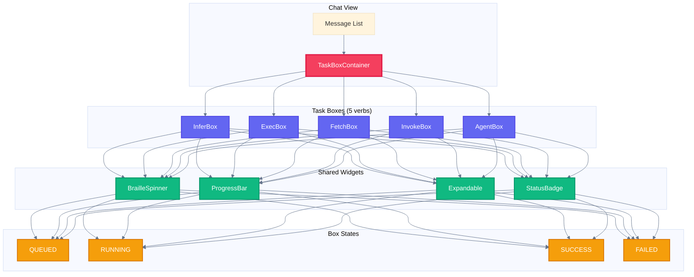
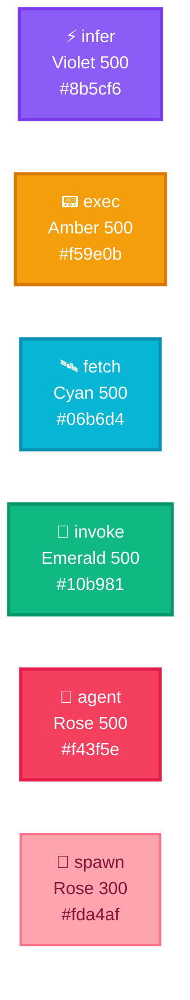
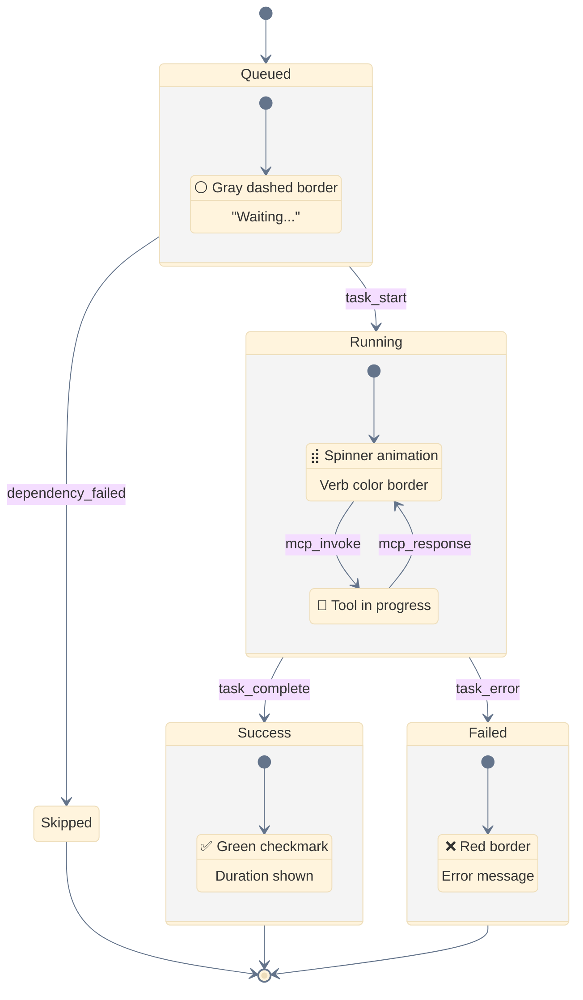
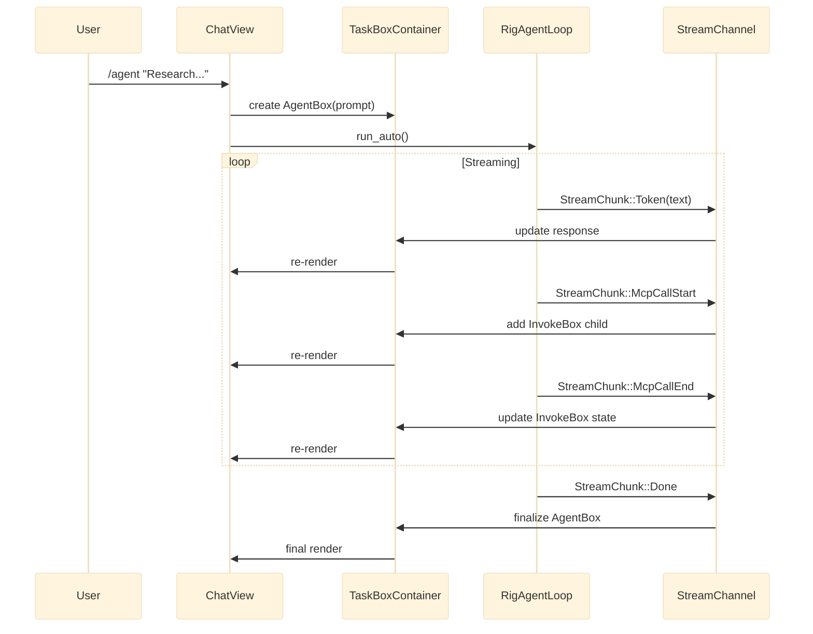

# Task Boxes Design — Nika TUI v0.8.2

**Date:** 2026-02-24
**Version:** v0.8.2
**Status:** 🔵 DESIGN COMPLETE
**Effort Estimate:** ~8-12 hours

---

## Executive Summary

Replace linear message display with **Task Boxes** — structured visual containers that show each verb execution with inputs, outputs, metrics, and status. Each of the 5 verbs gets a distinct visual treatment with color-coded borders, icons, and verb-specific information panels.

---

## Architecture Overview



---

## Visual Taxonomy

### Verb Color System (Tailwind Palette)



### Color Reference Table

| Verb | Icon | Tailwind | Hex | RGB |
|------|------|----------|-----|-----|
| `infer:` | ⚡ | Violet 500 | `#8b5cf6` | `rgb(139, 92, 246)` |
| `exec:` | 📟 | Amber 500 | `#f59e0b` | `rgb(245, 158, 11)` |
| `fetch:` | 🛰️ | Cyan 500 | `#06b6d4` | `rgb(6, 182, 212)` |
| `invoke:` | 🔌 | Emerald 500 | `#10b981` | `rgb(16, 185, 129)` |
| `agent:` | 🐔 | Rose 500 | `#f43f5e` | `rgb(244, 63, 94)` |
| spawn | 🐤 | Rose 300 | `#fda4af` | `rgb(253, 164, 175)` |

### Status Indicators

| State | Icon | Border | Animation |
|-------|------|--------|-----------|
| QUEUED | ⚪ | Gray dashed | None |
| RUNNING | ⣾ | Verb color solid | Braille spinner |
| SUCCESS | ✅ | Green | Checkmark fade-in |
| FAILED | ❌ | Red | Error highlight |
| SKIPPED | ⏭️ | Gray italic | None |

---

## State Machine



---

## Component Specifications

### 1. AgentBox (Container) — 🐔 Rose

The main container for `/agent` commands with nested child boxes.

```
╭─────────────────────────────────────────────────────────────────────╮
│ 🐔 AGENT: Research competitors and write market analysis   ⣾ 00:12 │
├─────────────────────────────────────────────────────────────────────┤
│ Turn 1/5 │ 📊 1.2K in / 456 out │ 💰 $0.02 │ 🔌 3 tools           │
├─────────────────────────────────────────────────────────────────────┤
│                                                                     │
│  ╭─ 🔌 INVOKE: novanet_describe ─────────────── ✅ 0.8s ──╮        │
│  │ server: novanet                                        │        │
│  │ params: { entity: "qr-code" }                          │        │
│  │ ▼ result (234 chars)                                   │        │
│  ╰────────────────────────────────────────────────────────╯        │
│                                                                     │
│  ╭─ 🐤 SPAWN: subtask-research ──────────────── ⣾ 2.3s ───╮        │
│  │ prompt: "Research competitor pricing models..."        │        │
│  │ depth: 1/3 │ max_turns: 5                              │        │
│  ╰────────────────────────────────────────────────────────╯        │
│                                                                     │
│  ╭─ ⚡ INFER ────────────────────────────────── ✅ 1.4s ───╮        │
│  │ model: claude-sonnet-4-6                               │        │
│  │ ▼ response (1,234 chars)                               │        │
│  ╰────────────────────────────────────────────────────────╯        │
│                                                                     │
├─────────────────────────────────────────────────────────────────────┤
│ FINAL RESPONSE                                                      │
│ ┊ Based on my analysis of the QR code market...                     │
│ ┊ [truncated, press Enter to expand]                                │
╰─────────────────────────────────────────────────────────────────────╯
```

**Struct:**

```rust
pub struct AgentBox {
    pub task_id: String,
    pub prompt: String,
    pub turn: u32,
    pub max_turns: u32,
    pub tokens_in: u32,
    pub tokens_out: u32,
    pub cost: f64,
    pub children: Vec<TaskBox>,
    pub final_response: Option<String>,
    pub state: BoxState,
    pub expanded: bool,
    pub frame: usize,
    pub start_time: Instant,
}
```

---

### 2. InferBox — ⚡ Violet

LLM text generation with streaming support.

```
╭─ ⚡ INFER ──────────────────────────────────────── ✅ 1.4s ───╮
│ model: claude-sonnet-4-6                                      │
├───────────────────────────────────────────────────────────────┤
│ PROMPT                                                        │
│ ┊ Generate a market analysis for QR Code AI targeting...      │
│ ┊ [truncated at 200 chars, press Enter to expand]             │
├───────────────────────────────────────────────────────────────┤
│ RESPONSE                                    ▼ streaming...    │
│ ┊ Based on my analysis, the QR code market is experiencing    │
│ ┊ significant growth with a CAGR of 16.5%...█                 │
├───────────────────────────────────────────────────────────────┤
│ 📊 1,234 in │ 567 out │ 🧠 Claude │ 💭 thinking: 45 tokens    │
╰───────────────────────────────────────────────────────────────╯
```

**States:**

| State | Visual |
|-------|--------|
| QUEUED | ⚪ Gray dashed, "Waiting..." |
| RUNNING | ⣾ Violet border, streaming cursor █ |
| SUCCESS | ✅ Green checkmark, token counts |
| FAILED | ❌ Red border, error message |

**Struct:**

```rust
pub struct InferBox {
    pub model: String,
    pub prompt: String,
    pub response: String,
    pub tokens_in: u32,
    pub tokens_out: u32,
    pub thinking_tokens: Option<u32>,
    pub duration_ms: u64,
    pub state: BoxState,
    pub expanded_prompt: bool,
    pub expanded_response: bool,
    pub streaming_cursor: bool,
    pub frame: usize,
}
```

---

### 3. ExecBox — 📟 Amber

Shell command execution with stdout/stderr separation.

```
╭─ 📟 EXEC ──────────────────────────────────────── ✅ 0.3s ───╮
│ $ npm run build                                               │
├───────────────────────────────────────────────────────────────┤
│ STDOUT                                                        │
│ ┊ > qrcode-ai@1.0.0 build                                     │
│ ┊ > next build                                                │
│ ┊                                                             │
│ ┊ ✓ Creating optimized production build                       │
│ ┊ ✓ Compiled successfully                                     │
├───────────────────────────────────────────────────────────────┤
│ STDERR ⚠️                                                      │
│ ┊ warning: peer dependency not found                          │
├───────────────────────────────────────────────────────────────┤
│ exit: 0 │ pid: 12345 │ cwd: /home/user/project                │
╰───────────────────────────────────────────────────────────────╯
```

**Exit Code Colors:**

| Exit Code | Color | Meaning |
|-----------|-------|---------|
| 0 | Green | Success |
| 1-125 | Red | Error |
| 126 | Amber | Permission denied |
| 127 | Amber | Command not found |
| 128+ | Red | Signal termination |

**Struct:**

```rust
pub struct ExecBox {
    pub command: String,
    pub stdout: String,
    pub stderr: String,
    pub exit_code: Option<i32>,
    pub pid: Option<u32>,
    pub cwd: Option<String>,
    pub duration_ms: u64,
    pub state: BoxState,
    pub expanded_stdout: bool,
    pub expanded_stderr: bool,
    pub frame: usize,
}
```

---

### 4. FetchBox — 🛰️ Cyan

HTTP request with request/response details.

```
╭─ 🛰️ FETCH ─────────────────────────────────────── ✅ 0.5s ───╮
│ GET https://api.example.com/v1/data                           │
├───────────────────────────────────────────────────────────────┤
│ REQUEST                                                       │
│ ┊ headers: { Authorization: "Bearer ***" }                    │
│ ┊ body: null                                                  │
├───────────────────────────────────────────────────────────────┤
│ RESPONSE                                          200 OK      │
│ ┊ { "data": [...], "count": 42 }                              │
├───────────────────────────────────────────────────────────────┤
│ 📦 1.2 KB │ ⏱️ TTFB: 120ms │ 🔄 retries: 0                    │
╰───────────────────────────────────────────────────────────────╯
```

**HTTP Status Colors:**

| Range | Color | Meaning |
|-------|-------|---------|
| 2xx | Green | Success |
| 3xx | Cyan | Redirect |
| 4xx | Amber | Client error |
| 5xx | Red | Server error |

**Struct:**

```rust
pub struct FetchBox {
    pub method: String,
    pub url: String,
    pub request_headers: HashMap<String, String>,
    pub request_body: Option<String>,
    pub status_code: Option<u16>,
    pub response_body: Option<String>,
    pub response_size: u64,
    pub ttfb_ms: u64,
    pub duration_ms: u64,
    pub retries: u32,
    pub state: BoxState,
    pub expanded_request: bool,
    pub expanded_response: bool,
    pub frame: usize,
}
```

---

### 5. InvokeBox — 🔌 Emerald

MCP tool call with params/result.

```
╭─ 🔌 INVOKE: novanet_describe ──────────────────── ✅ 0.8s ───╮
│ server: novanet                                               │
├───────────────────────────────────────────────────────────────┤
│ PARAMS                                                        │
│ ┊ entity: "qr-code"                                           │
│ ┊ locale: "fr-FR"                                             │
│ ┊ forms: ["text", "title"]                                    │
├───────────────────────────────────────────────────────────────┤
│ RESULT                                        ▼ 234 chars     │
│ ┊ { "entity": { "key": "qr-code", "native": {...} } }         │
╰───────────────────────────────────────────────────────────────╯
```

**Struct:**

```rust
pub struct InvokeBox {
    pub tool: String,
    pub server: String,
    pub params: serde_json::Value,
    pub result: Option<serde_json::Value>,
    pub duration_ms: u64,
    pub state: BoxState,
    pub expanded_params: bool,
    pub expanded_result: bool,
    pub frame: usize,
}
```

---

## Shared Widgets

### BrailleSpinner

```rust
pub const BRAILLE_SPINNER: &[char] = &['⣾', '⣽', '⣻', '⢿', '⡿', '⣟', '⣯', '⣷'];

pub struct BrailleSpinner {
    frame: usize,
    color: Color,
}

impl BrailleSpinner {
    pub fn tick(&mut self) {
        self.frame = (self.frame + 1) % BRAILLE_SPINNER.len();
    }

    pub fn char(&self) -> char {
        BRAILLE_SPINNER[self.frame]
    }
}
```

### Expandable Section

```rust
pub struct Expandable {
    pub title: String,
    pub content: String,
    pub expanded: bool,
    pub max_collapsed_lines: usize,
    pub char_count: usize,
}

impl Expandable {
    pub fn toggle(&mut self) {
        self.expanded = !self.expanded;
    }

    pub fn render(&self) -> String {
        if self.expanded {
            self.content.clone()
        } else {
            let truncated = self.content
                .lines()
                .take(self.max_collapsed_lines)
                .collect::<Vec<_>>()
                .join("\n");
            format!("{}\n▼ {} chars (press Enter to expand)", truncated, self.char_count)
        }
    }
}
```

### StatusBadge

```rust
pub enum BoxState {
    Queued,
    Running { frame: usize },
    Success { duration_ms: u64 },
    Failed { error: String },
    Skipped { reason: String },
}

impl BoxState {
    pub fn icon(&self) -> &'static str {
        match self {
            BoxState::Queued => "⚪",
            BoxState::Running { frame } => {
                let chars = &['⣾', '⣽', '⣻', '⢿', '⡿', '⣟', '⣯', '⣷'];
                // Return as &'static str via leak (in actual impl, use match)
                "⣾"
            }
            BoxState::Success { .. } => "✅",
            BoxState::Failed { .. } => "❌",
            BoxState::Skipped { .. } => "⏭️",
        }
    }

    pub fn suffix(&self) -> String {
        match self {
            BoxState::Queued => "Waiting...".to_string(),
            BoxState::Running { .. } => "Running".to_string(),
            BoxState::Success { duration_ms } => format!("{:.1}s", *duration_ms as f64 / 1000.0),
            BoxState::Failed { error } => error.clone(),
            BoxState::Skipped { reason } => reason.clone(),
        }
    }
}
```

---

## Data Flow



---

## Keyboard Navigation

| Key | Action |
|-----|--------|
| `↑` / `↓` | Navigate between boxes |
| `Enter` / `Space` | Expand/collapse focused section |
| `Tab` | Cycle through expandable sections in box |
| `c` | Copy result to clipboard |
| `r` | Retry failed task |
| `Esc` | Collapse all sections |

---

## Implementation Plan

### Phase 1: Core Types (2 hours)

#### Task 1.1: Create BoxState enum

**File:** `src/tui/widgets/task_box/state.rs` (NEW)

```rust
//! Task Box state management

use std::time::Instant;

/// State of a task box
#[derive(Debug, Clone)]
pub enum BoxState {
    Queued,
    Running { start: Instant, frame: usize },
    Success { duration_ms: u64 },
    Failed { error: String, duration_ms: u64 },
    Skipped { reason: String },
}
```

#### Task 1.2: Create TaskBox enum

**File:** `src/tui/widgets/task_box/mod.rs` (NEW)

```rust
//! Task Box widgets for verb visualization

mod state;
mod infer;
mod exec;
mod fetch;
mod invoke;
mod agent;

pub use state::BoxState;
pub use infer::InferBox;
pub use exec::ExecBox;
pub use fetch::FetchBox;
pub use invoke::InvokeBox;
pub use agent::AgentBox;

/// Union type for all task boxes
#[derive(Debug, Clone)]
pub enum TaskBox {
    Infer(InferBox),
    Exec(ExecBox),
    Fetch(FetchBox),
    Invoke(InvokeBox),
    Agent(AgentBox),
}
```

### Phase 2: Individual Box Widgets (4 hours)

#### Task 2.1: InferBox widget

**File:** `src/tui/widgets/task_box/infer.rs`

- Implement `Widget` trait
- Handle streaming cursor animation
- Thinking tokens display
- Expandable prompt/response sections

#### Task 2.2: ExecBox widget

**File:** `src/tui/widgets/task_box/exec.rs`

- Separate stdout/stderr panels
- Exit code coloring
- Live streaming output

#### Task 2.3: FetchBox widget

**File:** `src/tui/widgets/task_box/fetch.rs`

- HTTP method/URL header
- Request/Response sections
- Status code badge with color

#### Task 2.4: InvokeBox widget

**File:** `src/tui/widgets/task_box/invoke.rs`

- Tool name in header
- Server badge
- JSON params/result with syntax highlighting

#### Task 2.5: AgentBox container

**File:** `src/tui/widgets/task_box/agent.rs`

- Nested children rendering
- Turn progress bar
- Token/cost metrics bar
- Final response section

### Phase 3: Integration (3 hours)

#### Task 3.1: Update ChatView

**File:** `src/tui/views/chat.rs`

- Replace `ChatMessage::AgentResponse` with `TaskBox::Agent`
- Wire `StreamChunk` events to box updates
- Handle keyboard navigation

#### Task 3.2: Update StreamChunk handling

**File:** `src/tui/app.rs`

- Map `StreamChunk::McpCallStart` → new `InvokeBox` child
- Map `StreamChunk::Token` → update current box response
- Map `StreamChunk::Metrics` → update metrics bar

### Phase 4: Polish (2 hours)

#### Task 4.1: Animations

- Braille spinner at 10 FPS
- Border pulse on active tool calls
- Fade-in for success checkmark

#### Task 4.2: Accessibility

- Screen reader labels for states
- High contrast mode support
- Keyboard-only navigation

---

## File Structure

```
src/tui/widgets/
├── mod.rs                    # Export all widgets
├── task_box/
│   ├── mod.rs               # TaskBox enum + exports
│   ├── state.rs             # BoxState enum
│   ├── colors.rs            # Verb color constants
│   ├── infer.rs             # InferBox widget
│   ├── exec.rs              # ExecBox widget
│   ├── fetch.rs             # FetchBox widget
│   ├── invoke.rs            # InvokeBox widget
│   ├── agent.rs             # AgentBox container widget
│   └── shared/
│       ├── expandable.rs    # Expandable section
│       ├── spinner.rs       # BrailleSpinner
│       └── status.rs        # StatusBadge
├── mcp_call_box.rs          # DEPRECATED (replaced by InvokeBox)
└── infer_stream_box.rs      # DEPRECATED (replaced by InferBox)
```

---

## Test Plan

### Unit Tests

```rust
#[cfg(test)]
mod tests {
    use super::*;

    #[test]
    fn test_box_state_icons() {
        assert_eq!(BoxState::Queued.icon(), "⚪");
        assert_eq!(BoxState::Success { duration_ms: 1000 }.icon(), "✅");
        assert_eq!(BoxState::Failed { error: "err".into(), duration_ms: 0 }.icon(), "❌");
    }

    #[test]
    fn test_verb_colors() {
        assert_eq!(VerbColor::Infer.hex(), "#8b5cf6");
        assert_eq!(VerbColor::Exec.hex(), "#f59e0b");
    }

    #[test]
    fn test_expandable_toggle() {
        let mut exp = Expandable::new("Test", "Long content...");
        assert!(!exp.expanded);
        exp.toggle();
        assert!(exp.expanded);
    }
}
```

### Integration Tests

```bash
# Manual test flow
nika chat
> /agent Research QR code competitors --mcp novanet

# Verify:
# 1. AgentBox appears with rose border
# 2. InvokeBox children appear for MCP calls
# 3. Braille spinner animates during execution
# 4. Token counts update in real-time
# 5. Final response expandable
# 6. Enter key expands/collapses sections
```

---

## Dependencies

**Already available:**
- `ratatui = "0.29"` — Widget framework
- `crossterm` — Terminal events
- `tokio` — Async runtime

**No new dependencies needed.**

---

## Success Criteria

1. ✅ Each verb has distinct visual box with correct color
2. ✅ Agent container shows nested tool calls
3. ✅ Real-time updates via StreamChunk
4. ✅ Expandable sections for long content
5. ✅ Keyboard navigation between boxes
6. ✅ Status indicators (spinner, checkmark, X)
7. ✅ Token/cost metrics displayed
8. ✅ All 1,902+ tests pass
9. ✅ 60 FPS maintained during animations

---

## References

- [Ratatui Widgets](https://docs.rs/ratatui/latest/ratatui/widgets/)
- [Claude Code UX Patterns](../../.claude/rules/PERFORMANCE.md)
- [Tailwind Color Palette](https://tailwindcss.com/docs/customizing-colors)
- [Nika Streaming Implementation](./2025-02-24-agent-streaming-implementation.md)
