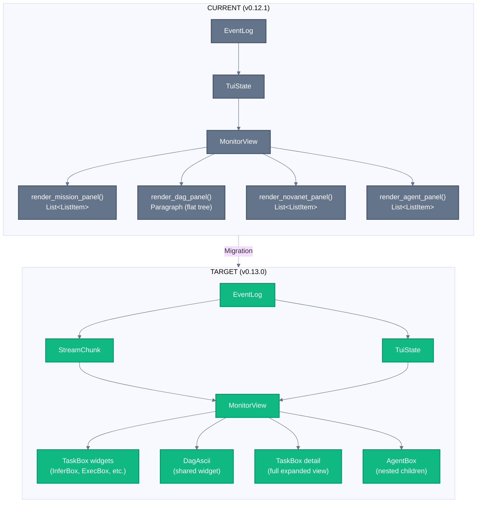
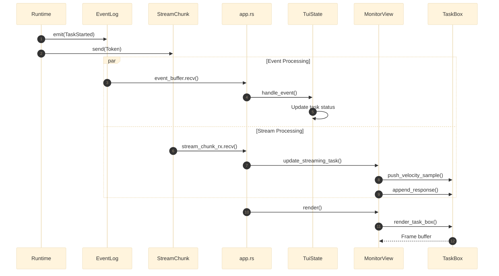
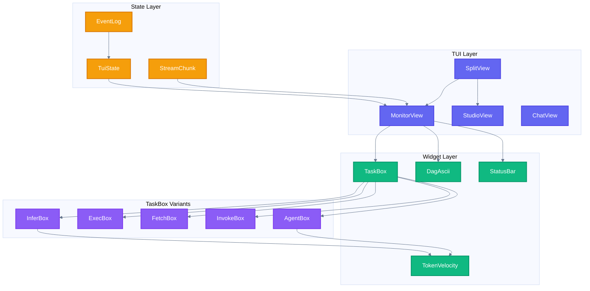
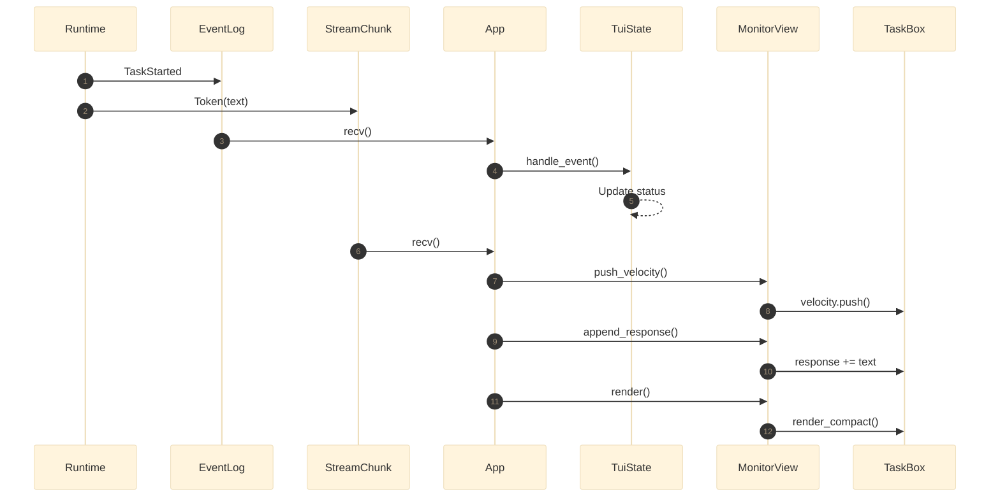

# Runner View Redesign — Complete Implementation Plan

> **Version:** v0.13.0 | **Date:** 2026-02-26 | **Author:** Claude + Thibaut
> **Status:** APPROVED | **Effort:** 12-17 hours | **Priority:** HIGH

---

## Executive Summary

This plan transforms the Monitor/Runner view from a basic 4-panel display into a rich, real-time execution dashboard with TaskBox widgets, shared DAG visualization, streaming metrics, and cost tracking.

```
┌─────────────────────────────────────────────────────────────────────────────┐
│  TRANSFORMATION OVERVIEW                                                     │
├─────────────────────────────────────────────────────────────────────────────┤
│                                                                             │
│  BEFORE (v0.12.1)              →         AFTER (v0.13.0)                   │
│  ─────────────────                       ──────────────────                 │
│  Simple List<ListItem>         →         TaskBox widgets (5 verbs)         │
│  Flat ASCII tree               →         DagAscii with real edges          │
│  Basic duration only           →         TokenVelocity + Cost ($0.024)     │
│  MCP calls list                →         Full InvokeBox with retry badge   │
│  Agent turns text              →         AgentBox with nested children     │
│  No YAML visibility            →         Split-pane Studio+Monitor         │
│                                                                             │
└─────────────────────────────────────────────────────────────────────────────┘
```

---

## Table of Contents

1. [Vision & Target](#1-vision--target)
2. [Architecture Overview](#2-architecture-overview)
3. [Phase 1: Shared DAG Widget](#3-phase-1-shared-dag-widget)
4. [Phase 2: TaskBox Migration](#4-phase-2-taskbox-migration)
5. [Phase 3: Event Wiring](#5-phase-3-event-wiring)
6. [Phase 4: Real-Time Metrics](#6-phase-4-real-time-metrics)
7. [Phase 5: Split-Pane Mode](#7-phase-5-split-pane-mode)
8. [File Changes Summary](#8-file-changes-summary)
9. [Test Requirements](#9-test-requirements)
10. [Success Criteria](#10-success-criteria)

---

## 1. Vision & Target

### Target ASCII Mockup (Final State)

```
┏━━━━━━━━━━━━━━━━━━━━━━━━━━━━━━━━━━━━━━━━━━━━━━━━━━━━━━━━━━━━━━━━━━━━━━━━━━━━━━━━━━━━━━━━━━━━━━━━━━━━━━━━━━━━━━┓
┃  NIKA                                                                                    v0.13.0 │ ⌘K Help  ┃
┠──────────────────────────────────────────────────────────────────────────────────────────────────────────────┨
┃  [h] Home   [c] Chat   [s] Studio   [r] Runner ◀━━                                    claude-sonnet-4-6 🧠  ┃
┣━━━━━━━━━━━━━━━━━━━━━━━━━━━━━━━━━━━━━━━━━━━━━━━━━━━━━━━━━━━━━━━━━━━━━━━━━━━━━━━━━━━━━━━━━━━━━━━━━━━━━━━━━━━━━━┫
┃                                                                                                              ┃
┃  ╔══════════════════════════════════════════════╦═══════════════════════════════════════════════════════════╗  ┃
┃  ║  ◉ MISSION CONTROL                    [1]   ║  ◎ DAG EXECUTION                                     [2]  ║  ┃
┃  ╠══════════════════════════════════════════════╬═══════════════════════════════════════════════════════════╣  ┃
┃  ║                                              ║                                                           ║  ┃
┃  ║  ╭─ ⚡ INFER ────────────────── ✅ 1.2s ───╮ ║      generate-landing-page.nika.yaml                      ║  ┃
┃  ║  │ fetch_entity                            │ ║                                                           ║  ┃
┃  ║  │ model: claude-sonnet-4-6                │ ║          ┌──────────────────┐                             ║  ┃
┃  ║  │ 📊 234 in │ 567 out │ $0.004            │ ║          │   fetch_entity   │ ✅                          ║  ┃
┃  ║  ╰─────────────────────────────────────────╯ ║          │     ⚡ infer      │                             ║  ┃
┃  ║                                              ║          └────────┬─────────┘                             ║  ┃
┃  ║  ╭─ 🔌 INVOKE ──────────────── ✅ 0.8s ───╮ ║                   │                                       ║  ┃
┃  ║  │ validate_schema                         │ ║                   ▼                                       ║  ┃
┃  ║  │ tool: novanet_describe @ novanet        │ ║          ┌──────────────────┐                             ║  ┃
┃  ║  │ 📥 { entity: "qr-code" }                │ ║          │  validate_schema │ ✅                          ║  ┃
┃  ║  ╰─────────────────────────────────────────╯ ║          │    🔌 invoke     │                             ║  ┃
┃  ║                                              ║          └────────┬─────────┘                             ║  ┃
┃  ║  ╭─ ⚡ INFER ────────────────── ◐ 12.4s ──╮ ║                   │                                       ║  ┃
┃  ║  │ generate_content                        │ ║                   ▼                                       ║  ┃
┃  ║  │ model: claude-sonnet-4-6    streaming █ │ ║          ┌──────────────────┐                             ║  ┃
┃  ║  │ ▁▂▃▅▇█▇▅ 47 tok/s │ $0.024              │ ║          │ generate_content │ ◐ ━━━▶                      ║  ┃
┃  ║  ╰─────────────────────────────────────────╯ ║          │     ⚡ infer      │  ⣾ running                 ║  ┃
┃  ║                                              ║          └────────┬─────────┘                             ║  ┃
┃  ║  ╭─ 📟 EXEC ───────────────────── ◦ ──────╮ ║                   │                                       ║  ┃
┃  ║  │ run_build                               │ ║                   ▼                                       ║  ┃
┃  ║  │ $ npm run build                         │ ║          ┌──────────────────┐                             ║  ┃
┃  ║  │ waiting for: generate_content           │ ║          │    run_build     │ ◦                           ║  ┃
┃  ║  ╰─────────────────────────────────────────╯ ║          │     📟 exec      │  queued                     ║  ┃
┃  ║                                              ║          └────────┬─────────┘                             ║  ┃
┃  ║  ╭─ 🛰️ FETCH ──────────────────── ◦ ──────╮ ║                   │                                       ║  ┃
┃  ║  │ deploy_preview                          │ ║                   ▼                                       ║  ┃
┃  ║  │ POST https://api.vercel.com/deploy      │ ║          ┌──────────────────┐                             ║  ┃
┃  ║  │ waiting for: run_build                  │ ║          │  deploy_preview  │ ◦                           ║  ┃
┃  ║  ╰─────────────────────────────────────────╯ ║          │    🛰️ fetch      │  queued                     ║  ┃
┃  ║                                              ║          └──────────────────┘                             ║  ┃
┃  ║  ─────────────────────────────────────────── ║                                                           ║  ┃
┃  ║  Tasks: 2/5 ✅  │  Elapsed: 00:14.4         ║      Legend: ✅ done  ◐ running  ◦ queued  ❌ failed      ║  ┃
┃  ║  Progress: ███████████░░░░░░░░░░░░░░░ 40%   ║                                                           ║  ┃
┃  ╠══════════════════════════════════════════════╬═══════════════════════════════════════════════════════════╣  ┃
┃  ║  ◎ TASK DETAIL                        [3]   ║  ◎ AGENT REASONING                                   [4]  ║  ┃
┃  ╠══════════════════════════════════════════════╬═══════════════════════════════════════════════════════════╣  ┃
┃  ║                                              ║                                                           ║  ┃
┃  ║  ╭─ ⚡ INFER ──────────────── ◐ 12.4s ────╮ ║  ┌─ Turn 1/3 ─────────────────────────────────────────┐   ║  ┃
┃  ║  │ model: claude-sonnet-4-6               │ ║  │                                                     │   ║  ┃
┃  ║  │ provider: Anthropic                    │ ║  │  "Je vais analyser l'entité qr-code pour générer   │   ║  ┃
┃  ║  ├────────────────────────────────────────┤ ║  │   une landing page optimisée..."                    │   ║  ┃
┃  ║  │ PROMPT                                 │ ║  │                                                     │   ║  ┃
┃  ║  │ ┊ Generate a landing page for the      │ ║  │  ╭─ 🔌 novanet_describe ──────────── ✅ 0.8s ───╮  │   ║  ┃
┃  ║  │ ┊ QR Code AI product targeting the     │ ║  │  │ entity: "qr-code" → { key: "qr-code" }       │  │   ║  ┃
┃  ║  │ ┊ French market...                     │ ║  │  ╰──────────────────────────────────────────────╯  │   ║  ┃
┃  ║  │ ┊                          [Enter ▼]   │ ║  │                                                     │   ║  ┃
┃  ║  ├────────────────────────────────────────┤ ║  └─────────────────────────────────────────────────────┘   ║  ┃
┃  ║  │ RESPONSE                    streaming █│ ║                                                           ║  ┃
┃  ║  │ ┊ # QR Code AI - Créez des QR Codes    │ ║  ┌─ Turn 2/3 ─────────────────────────────────────────┐   ║  ┃
┃  ║  │ ┊ Intelligents                         │ ║  │                                                     │   ║  ┃
┃  ║  │ ┊                                      │ ║  │  "Maintenant je génère le contenu de la page..."   │   ║  ┃
┃  ║  │ ┊ ## Transformez vos liens...█         │ ║  │                                                     │   ║  ┃
┃  ║  │ ┊                          [Enter ▼]   │ ║  │  ╭─ ⚡ infer ────────────────────── ◐ 12.4s ────╮  │   ║  ┃
┃  ║  ├────────────────────────────────────────┤ ║  │  │ streaming... 1,847 tokens │ ▁▂▃▅▇█ 47t/s    │  │   ║  ┃
┃  ║  │ 💭 THINKING                   [t toggle]│ ║  │  ╰──────────────────────────────────────────────╯  │   ║  ┃
┃  ║  │ ┊ Pour cette landing page française,   │ ║  │                                                     │   ║  ┃
┃  ║  │ ┊ je dois considérer les aspects...    │ ║  └─────────────────────────────────────────────────────┘   ║  ┃
┃  ║  ├────────────────────────────────────────┤ ║                                                           ║  ┃
┃  ║  │ 📊 1,234 in │ 1,847 out │ 156 thinking │ ║  ─────────────────────────────────────────────────────────  ║  ┃
┃  ║  │ 💰 $0.024   │ ⏱️ 12.4s  │ ▁▂▃▅▇ 47t/s │ ║  💭 Extended Thinking:                                    ║  ┃
┃  ║  ╰────────────────────────────────────────╯ ║  ┊ "Pour cette landing page française, je dois..."       ║  ┃
┃  ║                                              ║                                                           ║  ┃
┃  ╚══════════════════════════════════════════════╩═══════════════════════════════════════════════════════════╝  ┃
┃                                                                                                              ┃
┣━━━━━━━━━━━━━━━━━━━━━━━━━━━━━━━━━━━━━━━━━━━━━━━━━━━━━━━━━━━━━━━━━━━━━━━━━━━━━━━━━━━━━━━━━━━━━━━━━━━━━━━━━━━━━━┫
┃  Runner │ ◐ Running │ 2/5 tasks │ 40% │ 00:14.4 │ 3,237 tokens │ $0.024 │ 🔌 novanet ✓    [Space] Pause [?]  ┃
┗━━━━━━━━━━━━━━━━━━━━━━━━━━━━━━━━━━━━━━━━━━━━━━━━━━━━━━━━━━━━━━━━━━━━━━━━━━━━━━━━━━━━━━━━━━━━━━━━━━━━━━━━━━━━━━┛
```

### Key Visual Elements

| Element | Description | Location |
|---------|-------------|----------|
| **TaskBox widgets** | Rich verb-colored boxes with metrics | Panel 1 (Mission Control) |
| **DagAscii** | Real edge connections with status icons | Panel 2 (DAG Execution) |
| **Detailed TaskBox** | Full InferBox with PROMPT/RESPONSE sections | Panel 3 (Task Detail) |
| **Agent Turns** | Nested tool calls inside turn boxes | Panel 4 (Agent Reasoning) |
| **TokenVelocity** | Sparkline showing tokens/sec | In TaskBox footer |
| **Cost tracking** | USD cost per task and total | In TaskBox footer + status bar |
| **Streaming cursor** | `█` blinking cursor during streaming | RESPONSE section |

---

## 2. Architecture Overview

### Current vs Target Architecture



### Data Flow Architecture



---

## 3. Phase 1: Shared DAG Widget

**Objective:** Replace `render_dag_panel()` with shared `DagAscii` widget
**Effort:** 2-3 hours
**Priority:** 🔴 HIGH (blocks Phase 2)

### 3.1 Current State

```rust
// monitor.rs:219-290 — CURRENT (70 lines of duplicated code)
fn render_dag_panel(&self, frame: &mut Frame, area: Rect, state: &TuiState, theme: &Theme, focused: bool) {
    // Manual tree rendering with ├── └── prefixes
    // No real edges, no bindings, no data previews
}
```

### 3.2 Target State

```rust
// monitor.rs — TARGET (10 lines using shared widget)
fn render_dag_panel(&self, frame: &mut Frame, area: Rect, state: &TuiState, theme: &Theme, focused: bool) {
    let nodes = self.build_dag_nodes(state);
    let deps = self.build_dependencies(state);

    let dag = DagAscii::new(&nodes)
        .with_dependencies(&deps)
        .with_mode(NodeBoxMode::Minimal)
        .with_frame(self.frame)
        .with_theme(theme);

    dag.render(frame, area);
}
```

### 3.3 Implementation Steps

#### Step 1.1: Verify DagAscii API (30 min)

Read and understand `dag_ascii.rs`:

```bash
# Files to read
src/tui/widgets/dag_ascii.rs      # Main widget
src/tui/widgets/dag_node_box.rs   # Node rendering
src/tui/widgets/dag_layout.rs     # Sugiyama layout
src/tui/widgets/dag_edge.rs       # Edge rendering
```

**Checklist:**
- [ ] `DagAscii::new()` signature
- [ ] `NodeBoxData` struct fields
- [ ] `NodeBoxMode::Minimal` vs `Expanded`
- [ ] How dependencies are passed
- [ ] How bindings/previews work

#### Step 1.2: Create Node Conversion (45 min)

Add method to convert `TuiState` tasks to `NodeBoxData`:

```rust
// monitor.rs — NEW METHOD
impl MonitorView {
    /// Convert TuiState tasks to DagAscii NodeBoxData
    fn build_dag_nodes(&self, state: &TuiState) -> Vec<NodeBoxData> {
        state.task_order.iter()
            .filter_map(|task_id| state.tasks.get(task_id))
            .map(|task| NodeBoxData {
                id: task.id.clone(),
                verb: self.task_to_verb_color(task),
                status: task.status.clone(),
                estimate: task.duration_ms
                    .map(|d| format!("{:.1}s", d as f64 / 1000.0))
                    .unwrap_or_default(),
                prompt_preview: task.input.as_ref().map(|s| truncate_to_width(s, 30)),
                model: state.provider_info.model.clone(),
                for_each_count: task.for_each_count,
                for_each_items: vec![],
            })
            .collect()
    }

    /// Convert task verb string to VerbColor
    fn task_to_verb_color(&self, task: &TaskState) -> VerbColor {
        match task.verb.as_deref() {
            Some("infer") => VerbColor::Infer,
            Some("exec") => VerbColor::Exec,
            Some("fetch") => VerbColor::Fetch,
            Some("invoke") => VerbColor::Invoke,
            Some("agent") => VerbColor::Agent,
            _ => VerbColor::Infer, // Default
        }
    }
}
```

#### Step 1.3: Create Dependency Conversion (30 min)

```rust
// monitor.rs — NEW METHOD
impl MonitorView {
    /// Build dependency map from TuiState
    fn build_dependencies(&self, state: &TuiState) -> HashMap<String, Vec<String>> {
        let mut deps: HashMap<String, Vec<String>> = HashMap::new();

        for (task_id, task) in &state.tasks {
            if let Some(ref dependencies) = task.dependencies {
                deps.insert(task_id.clone(), dependencies.clone());
            }
        }

        deps
    }
}
```

#### Step 1.4: Replace render_dag_panel (30 min)

```rust
// monitor.rs — REPLACE render_dag_panel()
fn render_dag_panel(
    &self,
    frame: &mut Frame,
    area: Rect,
    state: &TuiState,
    theme: &Theme,
    focused: bool,
) {
    // Build data from state
    let nodes = self.build_dag_nodes(state);
    let deps = self.build_dependencies(state);

    // Create block with focus styling
    let title = if focused { "◉ DAG EXECUTION" } else { "◎ DAG EXECUTION" };
    let border_color = if focused { theme.highlight } else { theme.border };

    let block = Block::default()
        .title(format!(" {} [2] ", title))
        .borders(Borders::ALL)
        .border_style(Style::default().fg(border_color));

    let inner = block.inner(area);
    frame.render_widget(block, area);

    // Render DagAscii in inner area
    if !nodes.is_empty() {
        let dag = DagAscii::new(&nodes)
            .with_dependencies(&deps)
            .with_mode(NodeBoxMode::Minimal)
            .with_frame(self.frame)
            .with_scroll((0, self.scroll[1] as u16));

        // Render using DagAscii's render method
        dag.render_to_frame(frame, inner, theme);
    } else {
        // Empty state
        let empty = Paragraph::new("No tasks yet")
            .style(Style::default().fg(theme.muted));
        frame.render_widget(empty, inner);
    }
}
```

#### Step 1.5: Add Imports (5 min)

```rust
// monitor.rs — ADD IMPORTS
use crate::tui::widgets::{
    DagAscii, NodeBoxData, NodeBoxMode, VerbColor,
};
use std::collections::HashMap;
```

### 3.4 Testing

```bash
# Run existing DAG tests
cargo test dag_ --lib

# Run Monitor view tests
cargo test monitor_ --lib

# Manual test
cargo run -- studio examples/multi-task-workflow.nika.yaml
# Then press 'r' to switch to Runner view
```

**Expected Result:**
- DAG panel shows real box-drawing edges
- Nodes have verb icons and status colors
- Scroll works with j/k keys

---

## 4. Phase 2: TaskBox Migration

**Objective:** Replace `List<ListItem>` with `TaskBox` widgets in Mission Control
**Effort:** 4-5 hours
**Priority:** 🔴 HIGH

### 4.1 Current State

```rust
// monitor.rs:143-216 — CURRENT
fn render_mission_panel(...) {
    let items: Vec<ListItem> = state.task_order.iter()
        .map(|id| {
            // Simple text-based ListItem
            ListItem::new(Line::from(vec![
                Span::raw(status_icon),
                Span::raw(&task.id),
                Span::raw(progress_bar),
            ]))
        })
        .collect();

    let list = List::new(items);
    frame.render_widget(list, area);
}
```

### 4.2 Target State

```rust
// monitor.rs — TARGET
fn render_mission_panel(...) {
    let task_boxes = self.build_task_boxes(state);

    for (i, task_box) in task_boxes.iter().enumerate() {
        let task_area = self.calculate_task_area(inner, i, task_boxes.len());
        task_box.render_compact(frame, task_area, theme);
    }
}
```

### 4.3 Implementation Steps

#### Step 2.1: Add TaskBox State to MonitorView (30 min)

```rust
// monitor.rs — MODIFY MonitorView struct
pub struct MonitorView {
    pub focus: PanelId,
    pub scroll: [usize; 4],
    pub frame: u8,

    // NEW: TaskBox tracking
    pub task_boxes: HashMap<String, TaskBox>,
    pub selected_task: Option<String>,

    // NEW: Streaming state
    pub velocity_samples: HashMap<String, VecDeque<f32>>,
}

impl MonitorView {
    pub fn new() -> Self {
        Self {
            focus: PanelId::RunnerMission,
            scroll: [0; 4],
            frame: 0,
            task_boxes: HashMap::new(),
            selected_task: None,
            velocity_samples: HashMap::new(),
        }
    }
}
```

#### Step 2.2: Create TaskBox Factory Methods (1h)

```rust
// monitor.rs — NEW METHODS
impl MonitorView {
    /// Create or update TaskBox from task state
    pub fn upsert_task_box(&mut self, task_id: &str, task: &TaskState, state: &TuiState) {
        let task_box = match task.verb.as_deref() {
            Some("infer") => self.create_infer_box(task_id, task, state),
            Some("exec") => self.create_exec_box(task_id, task),
            Some("fetch") => self.create_fetch_box(task_id, task),
            Some("invoke") => self.create_invoke_box(task_id, task),
            Some("agent") => self.create_agent_box(task_id, task, state),
            _ => self.create_infer_box(task_id, task, state), // Default
        };

        self.task_boxes.insert(task_id.to_string(), task_box);
    }

    fn create_infer_box(&self, task_id: &str, task: &TaskState, state: &TuiState) -> TaskBox {
        let mut infer = InferBox::new(
            state.provider_info.model.clone().unwrap_or_default(),
            task.input.clone().unwrap_or_default(),
        );

        // Set state
        infer.state = match task.status {
            TaskStatus::Pending => BoxState::Queued,
            TaskStatus::Running => BoxState::running(),
            TaskStatus::Success => BoxState::success(task.duration_ms.unwrap_or(0)),
            TaskStatus::Failed => BoxState::failed(
                task.error.clone().unwrap_or_default(),
                task.duration_ms.unwrap_or(0),
            ),
            TaskStatus::Paused => BoxState::Queued, // TODO: Add Paused state
        };

        // Set output if complete
        if let Some(ref output) = task.output {
            infer.response = output.clone();
        }

        // Set tokens from metrics
        infer.tokens_in = state.metrics.input_tokens as u32;
        infer.tokens_out = state.metrics.output_tokens as u32;
        infer.update_cost();

        // Set velocity if we have samples
        if let Some(samples) = self.velocity_samples.get(task_id) {
            for &sample in samples {
                infer.velocity.push(sample);
            }
        }

        TaskBox::Infer(infer)
    }

    fn create_exec_box(&self, task_id: &str, task: &TaskState) -> TaskBox {
        let command = task.input.clone().unwrap_or_default();
        let mut exec = ExecBox::new(command);

        exec.state = self.task_status_to_box_state(task);

        if let Some(ref output) = task.output {
            exec.stdout = output.clone();
        }

        // Parse exit code from output if available
        // Format: "exit: N" in the task output

        TaskBox::Exec(exec)
    }

    fn create_fetch_box(&self, task_id: &str, task: &TaskState) -> TaskBox {
        // Parse method and URL from input
        let (method, url) = self.parse_fetch_input(&task.input);
        let mut fetch = FetchBox::new(method, url);

        fetch.state = self.task_status_to_box_state(task);

        if let Some(ref output) = task.output {
            fetch.response_body = Some(output.clone());
        }

        TaskBox::Fetch(fetch)
    }

    fn create_invoke_box(&self, task_id: &str, task: &TaskState) -> TaskBox {
        // Parse tool and server from task
        let tool = task.tool.clone().unwrap_or_default();
        let server = task.server.clone().unwrap_or_else(|| "unknown".to_string());

        let mut invoke = InvokeBox::new(tool, server);
        invoke.state = self.task_status_to_box_state(task);

        // Set params from input
        if let Some(ref input) = task.input {
            if let Ok(params) = serde_json::from_str(input) {
                invoke = invoke.with_params(params);
            }
        }

        // Set result from output
        if let Some(ref output) = task.output {
            if let Ok(result) = serde_json::from_str(output) {
                invoke = invoke.with_result(result);
            }
        }

        TaskBox::Invoke(invoke)
    }

    fn create_agent_box(&self, task_id: &str, task: &TaskState, state: &TuiState) -> TaskBox {
        let prompt = task.input.clone().unwrap_or_default();
        let mut agent = AgentBox::new(task_id.to_string(), prompt);

        agent.state = self.task_status_to_box_state(task);

        // Set turn info from agent_turns
        agent.turn = state.agent_turns.len() as u32;
        agent.max_turns = 10; // TODO: Get from params

        // Set tokens
        agent.tokens_in = state.metrics.input_tokens as u32;
        agent.tokens_out = state.metrics.output_tokens as u32;
        agent.update_cost();

        // Add nested children for each turn's tool calls
        // This will be populated from agent_turns state

        TaskBox::Agent(agent)
    }

    fn task_status_to_box_state(&self, task: &TaskState) -> BoxState {
        match task.status {
            TaskStatus::Pending => BoxState::Queued,
            TaskStatus::Running => BoxState::running(),
            TaskStatus::Success => BoxState::success(task.duration_ms.unwrap_or(0)),
            TaskStatus::Failed => BoxState::failed(
                task.error.clone().unwrap_or_default(),
                task.duration_ms.unwrap_or(0),
            ),
            TaskStatus::Paused => BoxState::Queued,
        }
    }

    fn parse_fetch_input(&self, input: &Option<String>) -> (String, String) {
        // Parse "GET https://..." or JSON { method: "GET", url: "..." }
        if let Some(ref s) = input {
            if let Some((method, url)) = s.split_once(' ') {
                return (method.to_string(), url.to_string());
            }
        }
        ("GET".to_string(), "unknown".to_string())
    }
}
```

#### Step 2.3: Update render_mission_panel (1h)

```rust
// monitor.rs — REPLACE render_mission_panel
fn render_mission_panel(
    &mut self,  // Now &mut self to update task_boxes
    frame: &mut Frame,
    area: Rect,
    state: &TuiState,
    theme: &Theme,
    focused: bool,
) {
    // Block with title
    let title = if focused { "◉ MISSION CONTROL" } else { "◎ MISSION CONTROL" };
    let border_color = if focused { theme.highlight } else { theme.border };

    let block = Block::default()
        .title(format!(" {} [1] ", title))
        .borders(Borders::ALL)
        .border_style(Style::default().fg(border_color));

    let inner = block.inner(area);
    frame.render_widget(block, area);

    // Update task boxes from state
    for task_id in &state.task_order {
        if let Some(task) = state.tasks.get(task_id) {
            self.upsert_task_box(task_id, task, state);
        }
    }

    // Calculate layout for task boxes
    let task_count = state.task_order.len();
    if task_count == 0 {
        let empty = Paragraph::new("No tasks scheduled")
            .style(Style::default().fg(theme.muted));
        frame.render_widget(empty, inner);
        return;
    }

    // Each TaskBox in Compact mode is ~4 lines
    let box_height = 4u16;
    let visible_start = self.scroll[0];
    let visible_count = (inner.height / box_height) as usize;

    for (i, task_id) in state.task_order.iter()
        .skip(visible_start)
        .take(visible_count)
        .enumerate()
    {
        if let Some(task_box) = self.task_boxes.get(task_id) {
            let y_offset = i as u16 * box_height;
            let task_area = Rect {
                x: inner.x,
                y: inner.y + y_offset,
                width: inner.width,
                height: box_height.min(inner.height.saturating_sub(y_offset)),
            };

            // Highlight selected task
            let is_selected = self.selected_task.as_ref() == Some(task_id);

            self.render_task_box_compact(frame, task_area, task_box, theme, is_selected);
        }
    }

    // Footer with summary
    let footer_y = inner.y + inner.height.saturating_sub(2);
    if footer_y > inner.y {
        let completed = state.tasks.values()
            .filter(|t| matches!(t.status, TaskStatus::Success))
            .count();

        let summary = Line::from(vec![
            Span::styled(
                format!("Tasks: {}/{} ✅  │  ", completed, task_count),
                Style::default().fg(theme.success),
            ),
            Span::styled(
                format!("Elapsed: {:02}:{:04.1}",
                    state.workflow.elapsed_ms / 60000,
                    (state.workflow.elapsed_ms % 60000) as f64 / 1000.0
                ),
                Style::default().fg(theme.muted),
            ),
        ]);

        frame.render_widget(
            Paragraph::new(summary),
            Rect { x: inner.x, y: footer_y, width: inner.width, height: 1 },
        );

        // Progress bar
        let progress_pct = state.workflow.progress_pct();
        let bar_width = inner.width.saturating_sub(2);
        let filled = ((progress_pct / 100.0) * bar_width as f64) as u16;

        let progress_bar = format!(
            "{}{}",
            "█".repeat(filled as usize),
            "░".repeat((bar_width - filled) as usize),
        );

        frame.render_widget(
            Paragraph::new(format!("Progress: {} {:3.0}%", progress_bar, progress_pct))
                .style(Style::default().fg(theme.info)),
            Rect { x: inner.x, y: footer_y + 1, width: inner.width, height: 1 },
        );
    }
}
```

#### Step 2.4: Add Compact TaskBox Renderer (1h)

```rust
// monitor.rs — NEW METHOD
impl MonitorView {
    /// Render TaskBox in compact mode (4 lines)
    fn render_task_box_compact(
        &self,
        frame: &mut Frame,
        area: Rect,
        task_box: &TaskBox,
        theme: &Theme,
        selected: bool,
    ) {
        match task_box {
            TaskBox::Infer(infer) => self.render_infer_compact(frame, area, infer, theme, selected),
            TaskBox::Exec(exec) => self.render_exec_compact(frame, area, exec, theme, selected),
            TaskBox::Fetch(fetch) => self.render_fetch_compact(frame, area, fetch, theme, selected),
            TaskBox::Invoke(invoke) => self.render_invoke_compact(frame, area, invoke, theme, selected),
            TaskBox::Agent(agent) => self.render_agent_compact(frame, area, agent, theme, selected),
        }
    }

    fn render_infer_compact(
        &self,
        frame: &mut Frame,
        area: Rect,
        infer: &InferBox,
        theme: &Theme,
        selected: bool,
    ) {
        let verb_color = VerbColor::Infer.to_color();
        let status_icon = infer.state.icon();
        let duration = infer.state.duration_string();

        // Border color based on state
        let border_color = if selected {
            theme.highlight
        } else {
            infer.state.border_color_with_pulse(verb_color, self.frame)
        };

        // Box drawing
        let top_border = format!(
            "╭─ ⚡ INFER {}─ {} ─╮",
            "─".repeat(area.width.saturating_sub(22) as usize),
            format!("{} {}", status_icon, duration),
        );

        let model_line = format!(
            "│ {}{}│",
            truncate_to_width(&infer.model, area.width.saturating_sub(4) as usize),
            " ".repeat((area.width.saturating_sub(4) as usize).saturating_sub(infer.model.len())),
        );

        // Metrics line with velocity sparkline
        let velocity_sparkline = infer.velocity.sparkline_chars();
        let metrics = format!(
            "│ 📊 {} in │ {} out │ {} │ 💰 ${:.3}│",
            infer.tokens_in,
            infer.tokens_out,
            velocity_sparkline,
            infer.cost.unwrap_or(0.0),
        );

        let bottom_border = format!("╰{}╯", "─".repeat(area.width.saturating_sub(2) as usize));

        // Render lines
        let lines = vec![
            Line::styled(top_border, Style::default().fg(border_color)),
            Line::styled(model_line, Style::default().fg(theme.text)),
            Line::styled(metrics, Style::default().fg(theme.muted)),
            Line::styled(bottom_border, Style::default().fg(border_color)),
        ];

        frame.render_widget(Paragraph::new(lines), area);
    }

    // Similar methods for other TaskBox types...
    fn render_exec_compact(&self, frame: &mut Frame, area: Rect, exec: &ExecBox, theme: &Theme, selected: bool) {
        let verb_color = VerbColor::Exec.to_color();
        let status_icon = exec.state.icon();
        let duration = exec.state.duration_string();
        let border_color = if selected { theme.highlight } else { verb_color };

        let top = format!("╭─ 📟 EXEC {}─ {} ─╮", "─".repeat(area.width.saturating_sub(21) as usize), format!("{} {}", status_icon, duration));
        let cmd = format!("│ $ {}│", truncate_to_width(&exec.command, area.width.saturating_sub(6) as usize));
        let exit = if let Some(code) = exec.exit_code {
            format!("│ exit: {}{}│", code, " ".repeat(area.width.saturating_sub(12) as usize))
        } else {
            format!("│{}│", " ".repeat(area.width.saturating_sub(2) as usize))
        };
        let bottom = format!("╰{}╯", "─".repeat(area.width.saturating_sub(2) as usize));

        let lines = vec![
            Line::styled(top, Style::default().fg(border_color)),
            Line::styled(cmd, Style::default().fg(theme.text)),
            Line::styled(exit, Style::default().fg(theme.muted)),
            Line::styled(bottom, Style::default().fg(border_color)),
        ];

        frame.render_widget(Paragraph::new(lines), area);
    }

    fn render_fetch_compact(&self, frame: &mut Frame, area: Rect, fetch: &FetchBox, theme: &Theme, selected: bool) {
        let verb_color = VerbColor::Fetch.to_color();
        let status_icon = fetch.state.icon();
        let duration = fetch.state.duration_string();
        let border_color = if selected { theme.highlight } else { verb_color };

        let status_str = fetch.status_code.map(|c| format!("{}", c)).unwrap_or_default();

        let top = format!("╭─ 🛰️ FETCH {}─ {} ─╮", "─".repeat(area.width.saturating_sub(22) as usize), format!("{} {}", status_icon, duration));
        let url = format!("│ {} {}│", fetch.method, truncate_to_width(&fetch.url, area.width.saturating_sub(8) as usize));
        let status = format!("│ status: {}{}│", status_str, " ".repeat(area.width.saturating_sub(12 + status_str.len()) as usize));
        let bottom = format!("╰{}╯", "─".repeat(area.width.saturating_sub(2) as usize));

        let lines = vec![
            Line::styled(top, Style::default().fg(border_color)),
            Line::styled(url, Style::default().fg(theme.text)),
            Line::styled(status, Style::default().fg(theme.muted)),
            Line::styled(bottom, Style::default().fg(border_color)),
        ];

        frame.render_widget(Paragraph::new(lines), area);
    }

    fn render_invoke_compact(&self, frame: &mut Frame, area: Rect, invoke: &InvokeBox, theme: &Theme, selected: bool) {
        let verb_color = VerbColor::Invoke.to_color();
        let status_icon = invoke.state.icon();
        let duration = invoke.state.duration_string();
        let border_color = if selected { theme.highlight } else { verb_color };

        let top = format!("╭─ 🔌 INVOKE {}─ {} ─╮", "─".repeat(area.width.saturating_sub(23) as usize), format!("{} {}", status_icon, duration));
        let tool = format!("│ {} @ {}│", truncate_to_width(&invoke.tool, 20), truncate_to_width(&invoke.server, area.width.saturating_sub(26) as usize));
        let params = format!("│ 📥 {}│", truncate_to_width(&invoke.params_oneline_cached.clone().unwrap_or_default(), area.width.saturating_sub(6) as usize));
        let bottom = format!("╰{}╯", "─".repeat(area.width.saturating_sub(2) as usize));

        let lines = vec![
            Line::styled(top, Style::default().fg(border_color)),
            Line::styled(tool, Style::default().fg(theme.text)),
            Line::styled(params, Style::default().fg(theme.muted)),
            Line::styled(bottom, Style::default().fg(border_color)),
        ];

        frame.render_widget(Paragraph::new(lines), area);
    }

    fn render_agent_compact(&self, frame: &mut Frame, area: Rect, agent: &AgentBox, theme: &Theme, selected: bool) {
        let verb_color = VerbColor::Agent.to_color();
        let status_icon = agent.state.icon();
        let duration = agent.state.duration_string();
        let border_color = if selected { theme.highlight } else { verb_color };

        let top = format!("╭─ 🐔 AGENT {}─ {} ─╮", "─".repeat(area.width.saturating_sub(22) as usize), format!("{} {}", status_icon, duration));
        let turn = format!("│ Turn {}/{} │ {} tools │ 💰 ${:.3}│", agent.turn, agent.max_turns, agent.tool_calls, agent.cost);
        let prompt = format!("│ {}│", truncate_to_width(&agent.prompt, area.width.saturating_sub(4) as usize));
        let bottom = format!("╰{}╯", "─".repeat(area.width.saturating_sub(2) as usize));

        let lines = vec![
            Line::styled(top, Style::default().fg(border_color)),
            Line::styled(turn, Style::default().fg(theme.text)),
            Line::styled(prompt, Style::default().fg(theme.muted)),
            Line::styled(bottom, Style::default().fg(border_color)),
        ];

        frame.render_widget(Paragraph::new(lines), area);
    }
}
```

#### Step 2.5: Wire StreamChunk to Monitor (1h)

In `app.rs`, dispatch streaming events to Monitor view:

```rust
// app.rs — MODIFY stream processing section (~line 876-1154)

// Find the existing StreamChunk processing block and add Monitor updates

StreamChunk::Token(text) => {
    // Existing Chat view update
    if let Some(chat) = &mut self.chat_view {
        chat.handle_streaming_token(&text);
    }

    // NEW: Monitor view update
    if let Some(monitor) = &mut self.monitor_view {
        if let Some(task_id) = &self.current_streaming_task {
            monitor.push_velocity_sample(task_id, tokens_per_sec);
            monitor.append_response(task_id, &text);
        }
    }
}

StreamChunk::InferStart { model, prompt, task_id } => {
    // Track current streaming task
    self.current_streaming_task = task_id.clone();

    // NEW: Initialize Monitor TaskBox
    if let Some(monitor) = &mut self.monitor_view {
        if let Some(ref id) = task_id {
            monitor.start_streaming_task(id, &model, &prompt);
        }
    }
}

StreamChunk::InferComplete { tokens_in, tokens_out, task_id } => {
    // NEW: Complete Monitor TaskBox
    if let Some(monitor) = &mut self.monitor_view {
        if let Some(ref id) = task_id {
            monitor.complete_streaming_task(id, tokens_in, tokens_out);
        }
    }
    self.current_streaming_task = None;
}
```

Add helper methods to MonitorView:

```rust
// monitor.rs — NEW STREAMING METHODS
impl MonitorView {
    /// Push velocity sample for streaming task
    pub fn push_velocity_sample(&mut self, task_id: &str, tokens_per_sec: f32) {
        self.velocity_samples
            .entry(task_id.to_string())
            .or_insert_with(|| VecDeque::with_capacity(30))
            .push_back(tokens_per_sec);

        // Also update TaskBox if it exists
        if let Some(TaskBox::Infer(infer)) = self.task_boxes.get_mut(task_id) {
            infer.velocity.push(tokens_per_sec);
        }
    }

    /// Append response text to streaming task
    pub fn append_response(&mut self, task_id: &str, text: &str) {
        if let Some(TaskBox::Infer(infer)) = self.task_boxes.get_mut(task_id) {
            infer.response.push_str(text);
            infer.streaming_cursor = true;
        }
    }

    /// Start streaming for a task
    pub fn start_streaming_task(&mut self, task_id: &str, model: &str, prompt: &str) {
        let mut infer = InferBox::new(model.to_string(), prompt.to_string());
        infer.state = BoxState::running();
        infer.streaming_cursor = true;

        self.task_boxes.insert(task_id.to_string(), TaskBox::Infer(infer));
        self.velocity_samples.insert(task_id.to_string(), VecDeque::with_capacity(30));
    }

    /// Complete streaming task
    pub fn complete_streaming_task(&mut self, task_id: &str, tokens_in: u32, tokens_out: u32) {
        if let Some(TaskBox::Infer(infer)) = self.task_boxes.get_mut(task_id) {
            infer.tokens_in = tokens_in;
            infer.tokens_out = tokens_out;
            infer.streaming_cursor = false;
            infer.update_cost();
            // State will be set to Success when TaskCompleted event arrives
        }
    }
}
```

### 4.4 Testing

```bash
# TaskBox unit tests
cargo test task_box --lib

# Monitor integration tests
cargo test monitor_task_box --lib

# Manual streaming test (requires API key)
export ANTHROPIC_API_KEY=sk-ant-...
cargo run -- run examples/test-infer-streaming.nika.yaml
```

---

## 5. Phase 3: Event Wiring

**Objective:** Handle `McpRetry`, `Log`, `Custom` events; display `recent_templates` and `spawned_agents`
**Effort:** 1-2 hours
**Priority:** 🟡 MEDIUM

### 5.1 Add Missing Event Handlers

```rust
// state.rs — ADD to handle_event() match block (around line 2248)

EventKind::McpRetry { task_id, attempt, max_attempts, error } => {
    // Find the MCP call and update retry info
    if let Some(call) = self.mcp_calls.iter_mut()
        .find(|c| c.task_id.as_ref().map(|t| t.as_ref()) == Some(task_id.as_ref()))
    {
        call.retry_attempt = Some(*attempt);
        call.retry_max = Some(*max_attempts);
        call.last_error = Some(error.to_string());
    }
    self.dirty.novanet = true;
}

EventKind::Log { level, message, task_id } => {
    self.recent_logs.push_back(LogEntry {
        level: level.clone(),
        message: message.to_string(),
        task_id: task_id.clone(),
        timestamp_ms,
    });

    // Keep only last 100 logs
    while self.recent_logs.len() > 100 {
        self.recent_logs.pop_front();
    }

    self.dirty.logs = true;
}

EventKind::Custom { name, payload, task_id } => {
    self.custom_events.push(CustomEvent {
        name: name.to_string(),
        payload: payload.clone(),
        task_id: task_id.clone(),
        timestamp_ms,
    });
    self.dirty.novanet = true;
}
```

### 5.2 Add State Fields

```rust
// state.rs — ADD to TuiState struct

/// Recent log entries (last 100)
pub recent_logs: VecDeque<LogEntry>,

/// Custom events from workflows
pub custom_events: Vec<CustomEvent>,

// ADD structs
#[derive(Debug, Clone)]
pub struct LogEntry {
    pub level: LogLevel,
    pub message: String,
    pub task_id: Option<Arc<str>>,
    pub timestamp_ms: u64,
}

#[derive(Debug, Clone)]
pub struct CustomEvent {
    pub name: String,
    pub payload: serde_json::Value,
    pub task_id: Option<Arc<str>>,
    pub timestamp_ms: u64,
}

// ADD to DirtyFlags
pub struct DirtyFlags {
    // ... existing fields ...
    pub logs: bool,
}
```

### 5.3 Display Spawned Agents in Agent Panel

```rust
// monitor.rs — MODIFY render_agent_panel

fn render_agent_panel(...) {
    // ... existing code ...

    // Add spawned agents tree after turns
    if !state.spawned_agents.is_empty() {
        let spawn_y = /* calculate position */;

        let spawn_title = Line::styled(
            "─── Spawned Agents ───",
            Style::default().fg(theme.info),
        );
        frame.render_widget(Paragraph::new(spawn_title), /* area */);

        for (i, spawn) in state.spawned_agents.iter().enumerate() {
            let indent = "  ".repeat(spawn.depth as usize);
            let spawn_line = format!(
                "{}🐤 {} (depth={}, parent={})",
                indent,
                spawn.child_task_id,
                spawn.depth,
                spawn.parent_task_id,
            );
            // Render spawn_line
        }
    }
}
```

### 5.4 Display Recent Templates (Debugging)

```rust
// monitor.rs — ADD to render_novanet_panel

fn render_novanet_panel(...) {
    // ... existing MCP calls rendering ...

    // Add template resolution debug section
    if !state.recent_templates.is_empty() {
        let template_title = Line::styled(
            "─── Template Resolutions ───",
            Style::default().fg(theme.muted),
        );
        // ... render title ...

        for template in state.recent_templates.iter().rev().take(5) {
            let template_line = format!(
                "{}: {{{{use.{}}}}} → {}",
                truncate_to_width(&template.task_id, 12),
                template.alias,
                truncate_to_width(&template.resolved_value, 30),
            );
            // Render template_line in dim style
        }
    }
}
```

---

## 6. Phase 4: Real-Time Metrics

**Objective:** Add TokenVelocity sparklines and cost tracking everywhere
**Effort:** 2-3 hours
**Priority:** 🟡 MEDIUM

### 6.1 Centralize Cost Calculation

```rust
// NEW FILE: src/tui/utils/cost.rs

/// Cost rates per million tokens (USD)
pub struct CostRates {
    pub input_rate: f64,
    pub output_rate: f64,
}

impl CostRates {
    pub fn for_model(model: &str) -> Self {
        match model.to_lowercase().as_str() {
            m if m.contains("claude-3-opus") => Self { input_rate: 15.0, output_rate: 75.0 },
            m if m.contains("claude-3-sonnet") || m.contains("claude-sonnet") => Self { input_rate: 3.0, output_rate: 15.0 },
            m if m.contains("claude-3-haiku") || m.contains("claude-haiku") => Self { input_rate: 0.25, output_rate: 1.25 },
            m if m.contains("gpt-4o") => Self { input_rate: 5.0, output_rate: 15.0 },
            m if m.contains("gpt-4-turbo") => Self { input_rate: 10.0, output_rate: 30.0 },
            m if m.contains("gpt-3.5") => Self { input_rate: 0.5, output_rate: 1.5 },
            m if m.contains("mistral-large") => Self { input_rate: 2.0, output_rate: 6.0 },
            m if m.contains("mistral-medium") => Self { input_rate: 2.7, output_rate: 8.1 },
            m if m.contains("llama") || m.contains("ollama") => Self { input_rate: 0.0, output_rate: 0.0 }, // Local
            _ => Self { input_rate: 1.0, output_rate: 3.0 }, // Default fallback
        }
    }

    pub fn calculate(&self, input_tokens: u32, output_tokens: u32) -> f64 {
        let input_cost = (input_tokens as f64 / 1_000_000.0) * self.input_rate;
        let output_cost = (output_tokens as f64 / 1_000_000.0) * self.output_rate;
        input_cost + output_cost
    }
}

/// Calculate cost for a given model and token counts
pub fn calculate_cost(model: &str, input_tokens: u32, output_tokens: u32) -> f64 {
    CostRates::for_model(model).calculate(input_tokens, output_tokens)
}
```

### 6.2 Add Metrics to Status Bar

```rust
// status_bar.rs — MODIFY StatusBar rendering

impl StatusBar {
    pub fn render_runner_status(
        &self,
        frame: &mut Frame,
        area: Rect,
        state: &TuiState,
        theme: &Theme,
    ) {
        let phase_icon = state.workflow.phase.icon();
        let phase_text = state.workflow.phase.text();

        let completed = state.tasks.values()
            .filter(|t| matches!(t.status, TaskStatus::Success))
            .count();
        let total = state.tasks.len();

        let progress_pct = state.workflow.progress_pct();

        let elapsed_secs = state.workflow.elapsed_ms as f64 / 1000.0;
        let elapsed_str = if elapsed_secs < 60.0 {
            format!("{:.1}s", elapsed_secs)
        } else {
            format!("{}:{:04.1}", (elapsed_secs / 60.0) as u32, elapsed_secs % 60.0)
        };

        let total_tokens = state.metrics.input_tokens + state.metrics.output_tokens;
        let token_str = if total_tokens > 1000 {
            format!("{:.1}K", total_tokens as f64 / 1000.0)
        } else {
            format!("{}", total_tokens)
        };

        let cost_str = format!("${:.3}", state.metrics.cost_usd);

        let mcp_status = if state.mcp_connected {
            format!("🔌 {} ✓", state.mcp_server_name.as_deref().unwrap_or("mcp"))
        } else {
            "🔌 ✗".to_string()
        };

        let status_line = Line::from(vec![
            Span::styled("Runner", Style::default().fg(theme.info).add_modifier(Modifier::BOLD)),
            Span::raw(" │ "),
            Span::styled(format!("{} {}", phase_icon, phase_text), Style::default().fg(theme.text)),
            Span::raw(" │ "),
            Span::styled(format!("{}/{} tasks", completed, total), Style::default().fg(theme.success)),
            Span::raw(" │ "),
            Span::styled(format!("{:.0}%", progress_pct), Style::default().fg(theme.info)),
            Span::raw(" │ "),
            Span::styled(elapsed_str, Style::default().fg(theme.muted)),
            Span::raw(" │ "),
            Span::styled(format!("{} tokens", token_str), Style::default().fg(theme.muted)),
            Span::raw(" │ "),
            Span::styled(cost_str, Style::default().fg(Color::Yellow)),
            Span::raw(" │ "),
            Span::styled(mcp_status, Style::default().fg(if state.mcp_connected { theme.success } else { theme.error })),
            Span::raw("    "),
            Span::styled("[Space] Pause [?] Help", Style::default().fg(theme.muted)),
        ]);

        frame.render_widget(Paragraph::new(status_line), area);
    }
}
```

### 6.3 Update State Metrics

```rust
// state.rs — MODIFY ProviderResponded handler

EventKind::ProviderResponded { input_tokens, output_tokens, model, .. } => {
    self.metrics.input_tokens += *input_tokens as u64;
    self.metrics.output_tokens += *output_tokens as u64;

    // Calculate cost using centralized function
    let cost = crate::tui::utils::cost::calculate_cost(
        model.as_deref().unwrap_or("unknown"),
        *input_tokens,
        *output_tokens,
    );
    self.metrics.cost_usd += cost;

    self.dirty.progress = true;
}
```

---

## 7. Phase 5: Split-Pane Mode

**Objective:** Allow viewing YAML (Studio) and execution (Monitor) side-by-side
**Effort:** 3-4 hours
**Priority:** 🟢 LOW (can be deferred)

### 7.1 Add New View Variant

```rust
// views/mod.rs — ADD to TuiView enum

#[derive(Debug, Clone, Copy, PartialEq, Eq)]
pub enum TuiView {
    Home,
    Chat,
    Studio,
    Monitor,      // Renamed from Runner for clarity
    Settings,
    Help,
    SplitStudioMonitor,  // NEW: Split pane mode
}
```

### 7.2 Create Split View

```rust
// NEW FILE: src/tui/views/split.rs

//! Split View - Studio + Monitor side-by-side

use super::{StudioView, MonitorView, TuiView, ViewAction};
use crate::tui::state::TuiState;
use crate::tui::theme::Theme;
use crossterm::event::{KeyCode, KeyEvent};
use ratatui::{
    layout::{Constraint, Direction, Layout, Rect},
    Frame,
};

/// Split pane view combining Studio (left) and Monitor (right)
pub struct SplitView {
    pub studio: StudioView,
    pub monitor: MonitorView,
    pub focus: SplitFocus,
    pub split_ratio: u16,  // Percentage for left pane (default 50)
}

#[derive(Debug, Clone, Copy, PartialEq, Eq)]
pub enum SplitFocus {
    Studio,
    Monitor,
}

impl SplitView {
    pub fn new() -> Self {
        Self {
            studio: StudioView::new(),
            monitor: MonitorView::new(),
            focus: SplitFocus::Studio,
            split_ratio: 50,
        }
    }

    pub fn with_file(file_path: &str) -> Self {
        let mut view = Self::new();
        view.studio.load_file(file_path);
        view
    }

    pub fn toggle_focus(&mut self) {
        self.focus = match self.focus {
            SplitFocus::Studio => SplitFocus::Monitor,
            SplitFocus::Monitor => SplitFocus::Studio,
        };
    }

    pub fn adjust_split(&mut self, delta: i16) {
        let new_ratio = (self.split_ratio as i16 + delta).clamp(20, 80) as u16;
        self.split_ratio = new_ratio;
    }
}

impl View for SplitView {
    fn render(&mut self, frame: &mut Frame, area: Rect, state: &TuiState, theme: &Theme) {
        // Split horizontally
        let chunks = Layout::default()
            .direction(Direction::Horizontal)
            .constraints([
                Constraint::Percentage(self.split_ratio),
                Constraint::Percentage(100 - self.split_ratio),
            ])
            .split(area);

        // Render both views
        self.studio.render(frame, chunks[0], state, theme);
        self.monitor.render(frame, chunks[1], state, theme);

        // Draw focus indicator
        let focused_area = match self.focus {
            SplitFocus::Studio => chunks[0],
            SplitFocus::Monitor => chunks[1],
        };
        // Highlight border of focused pane
    }

    fn handle_key(&mut self, key: KeyEvent, state: &mut TuiState) -> ViewAction {
        match key.code {
            // Tab switches focus between panes
            KeyCode::Tab => {
                self.toggle_focus();
                ViewAction::None
            }

            // Ctrl+Left/Right adjusts split ratio
            KeyCode::Left if key.modifiers.contains(KeyModifiers::CONTROL) => {
                self.adjust_split(-5);
                ViewAction::None
            }
            KeyCode::Right if key.modifiers.contains(KeyModifiers::CONTROL) => {
                self.adjust_split(5);
                ViewAction::None
            }

            // Escape exits split mode
            KeyCode::Esc => ViewAction::SwitchView(TuiView::Monitor),

            // Delegate to focused view
            _ => match self.focus {
                SplitFocus::Studio => self.studio.handle_key(key, state),
                SplitFocus::Monitor => self.monitor.handle_key(key, state),
            }
        }
    }

    fn tick(&mut self, state: &mut TuiState) {
        self.studio.tick(state);
        self.monitor.tick(state);
    }

    fn status_line(&self, state: &TuiState) -> String {
        format!(
            "Split │ {} │ [Tab] Switch │ [Ctrl+←/→] Resize │ [Esc] Exit",
            match self.focus {
                SplitFocus::Studio => "Studio focused",
                SplitFocus::Monitor => "Monitor focused",
            }
        )
    }
}
```

### 7.3 Add Keybinding to Enter Split Mode

```rust
// monitor.rs — ADD to handle_key

KeyCode::Char('y') => {
    // 'y' for YAML - enter split mode
    ViewAction::SwitchView(TuiView::SplitStudioMonitor)
}
```

---

## 8. File Changes Summary

### Files to Modify

| File | Changes | LOC |
|------|---------|-----|
| `monitor.rs` | Major rewrite - TaskBox, DagAscii | ~+400 |
| `state.rs` | Add fields, handle 3 events | ~+80 |
| `app.rs` | Wire StreamChunk to Monitor | ~+50 |
| `status_bar.rs` | Add runner metrics display | ~+60 |
| `mod.rs` (views) | Add SplitStudioMonitor variant | ~+5 |

### New Files

| File | Purpose | LOC |
|------|---------|-----|
| `split.rs` | Split pane view | ~200 |
| `utils/cost.rs` | Centralized cost calculation | ~50 |

### Imports to Add (monitor.rs)

```rust
use crate::tui::widgets::{
    DagAscii, NodeBoxData, NodeBoxMode, VerbColor,
    TaskBox, InferBox, ExecBox, FetchBox, InvokeBox, AgentBox,
    BoxState, TokenVelocity,
};
use std::collections::{HashMap, VecDeque};
```

---

## 9. Test Requirements

### Unit Tests

| Test | Description | File |
|------|-------------|------|
| `test_monitor_task_box_creation` | TaskBox factory methods | `monitor.rs` |
| `test_monitor_dag_nodes_conversion` | TuiState → NodeBoxData | `monitor.rs` |
| `test_monitor_velocity_tracking` | TokenVelocity updates | `monitor.rs` |
| `test_monitor_cost_calculation` | Cost accumulation | `monitor.rs` |
| `test_state_mcp_retry_handler` | McpRetry event handling | `state.rs` |
| `test_state_log_handler` | Log event handling | `state.rs` |
| `test_cost_rates_models` | Model-specific rates | `cost.rs` |

### Integration Tests

| Test | Description |
|------|-------------|
| `test_monitor_streaming_integration` | Full streaming flow |
| `test_monitor_dag_ascii_integration` | DagAscii rendering |
| `test_split_view_focus_switching` | Split pane navigation |

### Manual Tests

```bash
# Test TaskBox rendering
cargo run -- run examples/multi-verb-workflow.nika.yaml

# Test streaming metrics
export ANTHROPIC_API_KEY=sk-ant-...
cargo run -- run examples/test-infer-streaming.nika.yaml

# Test split mode
cargo run -- studio examples/workflow.nika.yaml
# Then press 'y' to enter split mode
```

---

## 10. Success Criteria

### Must Have (Phase 1-2)

- [ ] DagAscii renders in Monitor with real edges
- [ ] TaskBox widgets show in Mission Control
- [ ] All 5 verb types render correctly
- [ ] Streaming updates TaskBox in real-time
- [ ] TokenVelocity sparkline displays
- [ ] Cost shows per-task and total

### Should Have (Phase 3-4)

- [ ] McpRetry badge shows "Retry 2/3"
- [ ] Log entries display in panel
- [ ] Spawned agents tree visible
- [ ] Template resolutions debug visible
- [ ] Status bar shows all metrics

### Nice to Have (Phase 5)

- [ ] Split-pane Studio+Monitor mode
- [ ] Resizable split ratio
- [ ] YAML highlighting synced with execution

### Quality Gates

- [ ] All existing tests pass
- [ ] 20+ new tests added
- [ ] Zero clippy warnings
- [ ] Manual smoke test passes
- [ ] ASCII mockup matches implementation

---

## Appendix A: ASCII Component Reference

### TaskBox Compact (4 lines)

```
╭─ ⚡ INFER ────────────────────── ✅ 1.2s ───╮
│ task_id                                     │
│ model: claude-sonnet-4-6                    │
│ 📊 234 in │ 567 out │ ▁▂▃▅▇ │ 💰 $0.004    │
╰─────────────────────────────────────────────╯
```

### TaskBox Expanded (8+ lines)

```
╭─ ⚡ INFER ────────────────────── ◐ 12.4s ──╮
│ model: claude-sonnet-4-6                    │
│ provider: Anthropic                         │
├─────────────────────────────────────────────┤
│ PROMPT                                      │
│ ┊ Generate a landing page for...            │
├─────────────────────────────────────────────┤
│ RESPONSE                         streaming █│
│ ┊ # QR Code AI - Créez des QR Codes...      │
├─────────────────────────────────────────────┤
│ 📊 1,234 in │ 1,847 out │ 💭 156 thinking  │
│ 💰 $0.024   │ ⏱️ 12.4s  │ ▁▂▃▅▇█ 47 tok/s │
╰─────────────────────────────────────────────╯
```

### DAG Node (DagAscii)

```
┌──────────────────┐
│   fetch_entity   │ ✅
│     ⚡ infer      │
└────────┬─────────┘
         │
         ▼
┌──────────────────┐
│ generate_content │ ◐ ━━━▶
│     ⚡ infer      │  ⣾
└────────┬─────────┘
```

### Status Icons

| Icon | State | Description |
|------|-------|-------------|
| `✅` | Success | Task completed |
| `◐` | Running | Task executing |
| `◦` | Queued | Task waiting |
| `❌` | Failed | Task errored |
| `⏸` | Paused | Task paused |
| `⣾` | Spinner | Animated running |
| `█` | Cursor | Streaming cursor |

### Verb Icons & Colors

| Verb | Icon | Color (Tailwind) |
|------|------|------------------|
| `infer:` | ⚡ | Violet `#8b5cf6` |
| `exec:` | 📟 | Amber `#f59e0b` |
| `fetch:` | 🛰️ | Cyan `#06b6d4` |
| `invoke:` | 🔌 | Emerald `#10b981` |
| `agent:` | 🐔 | Rose `#f43f5e` |
| subagent | 🐤 | Teal `#14b8a6` |

---

## Appendix B: Mermaid Architecture Diagrams

### Component Hierarchy



### Event Flow



---

**Document Version:** 1.0.0
**Last Updated:** 2026-02-26
**Next Review:** After Phase 2 completion
