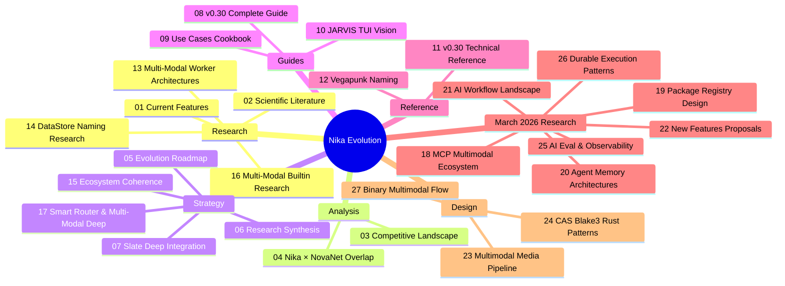
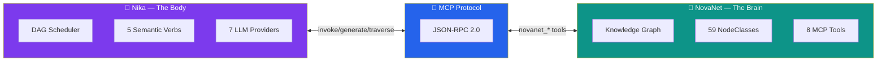
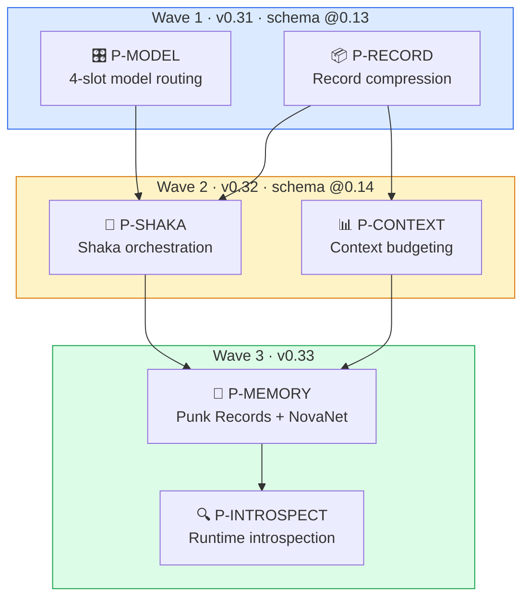
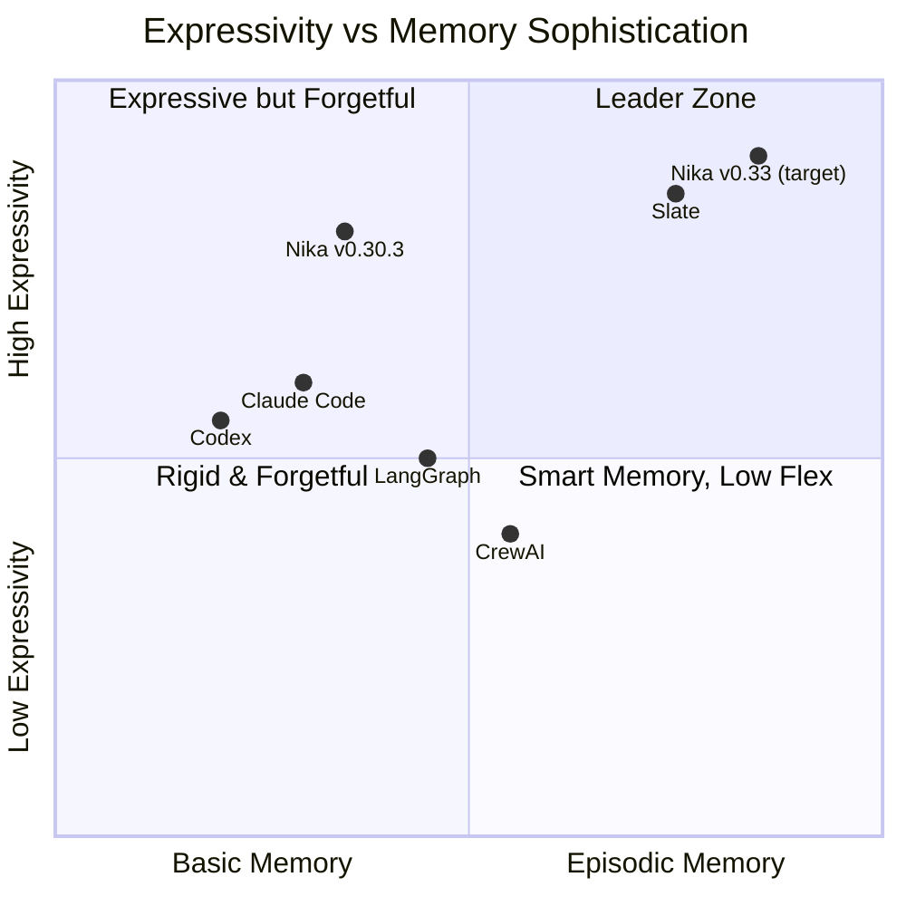

# 🦋 Nika Evolution — Research & Strategy

> Comprehensive research corpus for Nika's next evolution phase.
> 26 research agents deployed. 6 papers analyzed. 5 competitors mapped. 30 research documents produced.

**Nika** v0.30.3 · **NovaNet** v0.20.0 · Updated 2026-03-17

---

## 🗺️ Document Map

| # | Document | Purpose | Key Output |
|:-:|----------|---------|------------|
| [01](./01-current-features.md) | **Current Features** | Exhaustive Nika v0.30.3 + NovaNet v0.20 inventory | 368 files, 217K lines, 6,725 tests[^1] |
| [02](./02-scientific-literature.md) | **Scientific Literature** | RLM, CodeAct, THREAD, Context-Folding, Swarms | 6 papers → 6 priorities |
| [03](./03-competitive-landscape.md) | **Competitive Landscape** | Slate, Claude Code, Codex, LangGraph, CrewAI | Competitive positioning |
| [04](./04-nika-novanet-overlap.md) | **Nika × NovaNet Overlap** | Boundary rules, synergy opportunities | Golden Rule definition |
| [05](./05-evolution-roadmap.md) | **Evolution Roadmap** | 6 priorities in 3 waves with full designs | Implementation blueprint |
| [06](./06-research-synthesis-report.md) | **Research Synthesis** | Complete synthesis from 13 research agents | Unified strategy |
| [07](./07-slate-deep-integration.md) | **Slate Deep Integration** | Thread/record/weaving → Nika architecture | Kernel upgrade plan |
| [08](./08-nika-030-complete-guide.md) | **v0.30 Complete Guide** | Comprehensive tutorial: Nika + NovaNet + all 6 features | User-facing guide |
| [09](./09-use-cases-cookbook.md) | **Use Cases Cookbook** | 3 concrete use cases with full YAML workflows | Copy-paste recipes |
| [10](./10-jarvis-tui-vision.md) | **JARVIS TUI Vision** | Iron Man-inspired TUI design for shaka orchestration | Visual design spec |
| [11](./11-nika-030-technical-reference.md) | **v0.30 Technical Reference** | Complete technical spec: structs, traits, schemas | API-level reference |
| [12](./12-vegapunk-naming.md) | **Vegapunk Naming** | One Piece-inspired naming system for Nika v0.30 | Naming spec + codebase impact |
| [13](./13-multimodal-worker-architectures.md) | **Multi-Modal Worker Architectures** | How frameworks handle multi-modal workers | Validated Approach C (worker-level) |
| [14](./14-datastore-naming-research.md) | **DataStore Naming Research** | RunContext naming decision, industry survey | RunContext chosen over alternatives |
| [15](./15-ecosystem-coherence.md) | **Ecosystem Coherence** | Unified view of all ecosystem pieces | Complete system topology |
| [16](./16-multimodal-builtin-research.md) | **Multi-Modal Builtin Research** | mistral.rs capabilities, Rust ML ecosystem | Native vision support roadmap |
| [17](./17-smart-router-multimodal-deep.md) | **Smart Router & Multi-Modal Deep** | Smart Router pattern, complete tool inventory | Native RAG + translation tools |
| [18](./18-mcp-multimodal-ecosystem-march2026.md) | **MCP Multimodal Ecosystem** | MCP image gen, SEO, multimodal servers (March 2026) | 15+ image gen, 5+ SEO MCP servers |
| [19](./19-package-registry-design.md) | **Package Registry Design** | `nika pkg` design and distribution | Package system architecture |
| [20](./20-agent-memory-architectures.md) | **Agent Memory Architectures** | Memory patterns for AI agents | 3-tier memory design validation |
| [21](./21-ai-workflow-landscape-march2026.md) | **AI Workflow Landscape** | Dify HITL, Amp Checks, LangSmith memory, AutoGen MCP | Industry trends March 2026 |
| [22](./22-new-features-proposals-march2026.md) | **New Features Proposals** | 10 new features + YAGNI + wave mapping + gap analysis | Synthesis document |
| [23](./23-multimodal-media-pipeline-design.md) | **Multimodal Media Pipeline** | B+ design: MediaRef + CAS-ready blake3 layout | Implementation blueprint |
| [24](./24-cas-blake3-rust-patterns.md) | **CAS Blake3 Rust Patterns** | Content-addressable storage with blake3 hashing | CAS implementation patterns |
| [25](./25-ai-eval-testing-observability.md) | **AI Eval & Observability** | Langfuse, OTel GenAI, promptfoo, Braintrust | Eval-as-code patterns |
| [26](./26-durable-execution-checkpoint-patterns.md) | **Durable Execution Patterns** | Restate, Temporal, context engineering | Journal-based recovery |
| [27](./27-binary-multimodal-flow-patterns.md) | **Binary Multimodal Flow** | Binary data handling in multimodal pipelines | Flow pattern reference |
| — | [MCP Ecosystem Raw](./mcp-ecosystem-march-2026.md) | Raw MCP server catalog | 100+ servers cataloged |
| — | [MCP Media Servers](./mcp-media-servers-catalog-2026.md) | MCP media server catalog | Media server inventory |
| — | [Agent Memory Rust Patterns](./research-agent-memory-rust-patterns.md) | Rust patterns for agent memory | Implementation patterns |
| — | [Rust Binary Handling](./research-rust-binary-handling.md) | Rust binary data handling research | Binary handling patterns |
| — | [CAS Crates 2026](./research-cas-crates-2026.md) | CAS crate ecosystem survey | Crate comparison |

---

## 🏗️ Architecture: Brain + Body + MCP

> [!IMPORTANT]
> **The Golden Rule** — Five lines that govern every architectural decision:
>
> | Concern | Owner | Why |
> |---------|-------|-----|
> | **KNOWING** things | NovaNet | Knowledge graph, entities, locales, semantics |
> | **DOING** things | Nika | Workflow execution, DAG, verbs, providers |
> | **CONNECTING** | MCP | Protocol boundary, zero Cypher in Nika |
> | **THINKING** | Records | Shaka orchestration, model routing, confidence |
> | **REMEMBERING** | Records → NovaNet | Cross-session memory, entity-linked persistence |

---

## 🎯 The 6 Priorities

📋 Priority details

| Priority | What | Inspired By | Key Rust Change |
|----------|------|-------------|-----------------|
| **P-MODEL** | 4-slot model routing (edison/atlas/york/pythagoras) | Slate cross-model[^2], THREAD[^3] | `model_slots` in `AnalyzedWorkflow` |
| **P-RECORD** | LLM compression at task completion boundaries | Slate episodes[^2], Context-Folding[^4] | `Record` struct in `runtime/` |
| **P-SHAKA** | Dynamic satellite dispatch via thread weaving | Slate strategy/tactics[^2], AlphaZero[^5] | Orchestration mode in `runner.rs` |
| **P-CONTEXT** | Working memory awareness, token budget tracking | Slate dumb zone[^2], Context-Folding[^4] | Budget tracking in `RunContext` |
| **P-MEMORY** | 3-tier memory: Egghead (HOT/RAM) → Punk Records (WARM/NDJSON disk) → NovaNet (COLD/promoted) | Slate sessions[^2], Memory-R1[^6] | `RecordLog` for WARM tier, MCP tools for COLD promotion |
| **P-INTROSPECT** | 6 runtime introspection builtin tools | RLM REPL[^7] | New tools in `runtime/builtin.rs` |

> [!TIP]
> **Core Insight** — Nika's DAG IS Slate's kernel. Tasks ARE processes. `TaskResult` IS return values. `RunContext` IS RAM.
> We don't BUILD Slate — we UPGRADE the kernel with 4 additions, then persist via NovaNet.

---

## ⚔️ Competitive Positioning

| Competitor | Key Differentiator | Nika's Response |
|-----------|-------------------|-----------------|
| **Slate**[^2] | Threads, episodes, thread weaving, cross-model | Integrate all 8 concepts via P-MODEL → P-MEMORY |
| **LangGraph** | Python flexibility, checkpointing | Keep YAML-first, add introspection (P-INTROSPECT) |
| **CrewAI** | 3-type memory system | Use Punk Records (WARM/local) + NovaNet (COLD/promoted) as memory backend (P-MEMORY) |
| **Claude Code** | Conversation-driven, subagent delegation | Nika is Claude Code's workflow engine |

> [!NOTE]
> **Nika's moat** — No competitor has: YAML-first declarative workflows + knowledge graph integration + 5 semantic verbs + entity-linked episodic memory. The combination is unique.

---

## 📚 Sources

📄 Academic Papers (6)

| Paper | ID | Key Contribution |
|-------|----|-----------------|
| **RLM** | [arXiv:2512.24601](https://arxiv.org/abs/2512.24601) | Recursive Language Models with REPL memory (MIT, 2025) |
| **CodeAct** | [arXiv:2402.01030](https://arxiv.org/abs/2402.01030) | Code actions for LLM agents (ICML 2024, 451 citations) |
| **THREAD** | [arXiv:2405.17402](https://arxiv.org/abs/2405.17402) | Hierarchical agent decomposition with recursive spawning |
| **Context-Folding** | [arXiv:2510.11967](https://arxiv.org/abs/2510.11967) | Branch/fold sub-trajectory compression |
| **LLM Swarms** | [arXiv:2506.14496](https://arxiv.org/abs/2506.14496) | Rule-based vs LLM swarm comparison |
| **Memory-R1** | [arXiv:2508.19828](https://arxiv.org/abs/2508.19828) | RL-trained agent memory policies |

🏢 Products & Protocols (7)

| Product | Type | Reference |
|---------|------|-----------|
| **Slate** | Agent framework | [randomlabs.ai/blog/slate](https://randomlabs.ai/blog/slate) · [docs](https://docs.randomlabs.ai) · npm: `@randomlabs/slate` |
| **Claude Code** | AI coding agent | Anthropic |
| **Codex** | AI coding agent | OpenAI |
| **LangGraph** | Agent framework | LangChain |
| **CrewAI** | Multi-agent framework | — |
| **MCP** | Protocol | Anthropic — Model Context Protocol |
| **A2A** | Protocol | Google → Linux Foundation — Agent-to-Agent |

💻 Codebase Verification

All claims verified against actual source code on 2026-03-17:

| Claim | Verified Value | Method |
|-------|---------------|--------|
| Rust files | 368 | `find src -name '*.rs' -not -path '*/target-main/*' \| wc -l` |
| Lines of code | 217,304 | `find src -name '*.rs' -not -path '*/target-main/*' -exec cat {} + \| wc -l` |
| Tests passing | 6,725 | `cargo test -- --list \| grep "test$" \| wc -l` |
| Modules | 21 | `ls -d src/*/` |
| EventKind variants | 32 | Comment in `src/event/log.rs` |
| Provider definitions | 20+ | `src/core/providers.rs` |
| Model definitions | 36 | `src/core/models.rs` |
| MCP aliases | 48+ | `src/core/mcp_aliases.rs` |

### Research Methodology

- **26 research agents** deployed in parallel (13 original + 5 March 2026 web research + 8 multimodal media pipeline)
- **12-step ultrathink** sequential analysis (Slate → Nika concept mapping)
- **11-step ultrathink** multimodal media pipeline design (rmcp types, CAS patterns, industry validation)
- **30 research documents** produced (01-features through 27-binary-multimodal-flow + 4 unnumbered research files)
- **Full Slate blog** scraped and analyzed (26 academic references in blog)
- **March 2026 research**: 5 agents covering workflow trends, MCP ecosystem, durable execution, eval/observability, SEO AI tools
- **Multimodal research**: 8 agents covering MCP media servers, binary handling patterns, rmcp types, blake3 CAS, Rust ecosystem

---

[📋 Index](./00-README.md) · [01 Features →](./01-current-features.md)

---

[^1]: Verified via `cargo test -- --list | grep "test$" | wc -l` on 2026-03-17. Counts exclude `src/target-main/` build artifacts (12 files, ~36K lines). See [01-current-features.md](./01-current-features.md) for full inventory.
[^2]: Slate by Random Labs — [Technical blog post](https://randomlabs.ai/blog/slate) with thread-based episodic memory architecture. The "4 model slots" design (edison/atlas/york/pythagoras) is our proposal, inspired by Slate's cross-model composition support (Sonnet + Codex).
[^3]: THREAD: Thinking Deeper with Recursive Spawning — [arXiv:2405.17402](https://arxiv.org/abs/2405.17402)
[^4]: Context-Folding: Scaling Long-Horizon LLM Agent — [arXiv:2510.11967](https://arxiv.org/abs/2510.11967)
[^5]: McGrath et al., "Acquisition of Chess Knowledge in AlphaZero" — [PNAS 2022](https://www.pnas.org/doi/10.1073/pnas.2206625119). Cited in Slate blog for strategy/tactics separation.
[^6]: Memory-R1: RL-trained agent memory policies — [arXiv:2508.19828](https://arxiv.org/abs/2508.19828)
[^7]: RLM: Recursive Language Models — [arXiv:2512.24601](https://arxiv.org/abs/2512.24601) (MIT, 2025)
