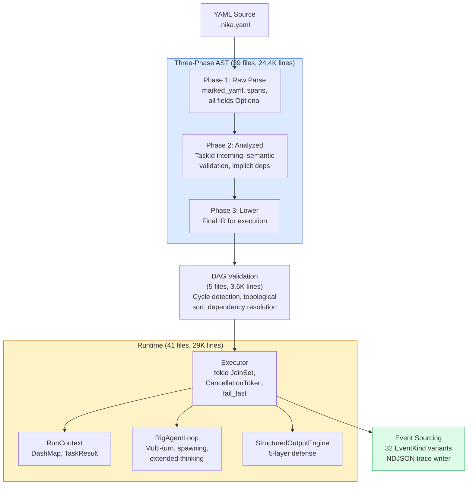
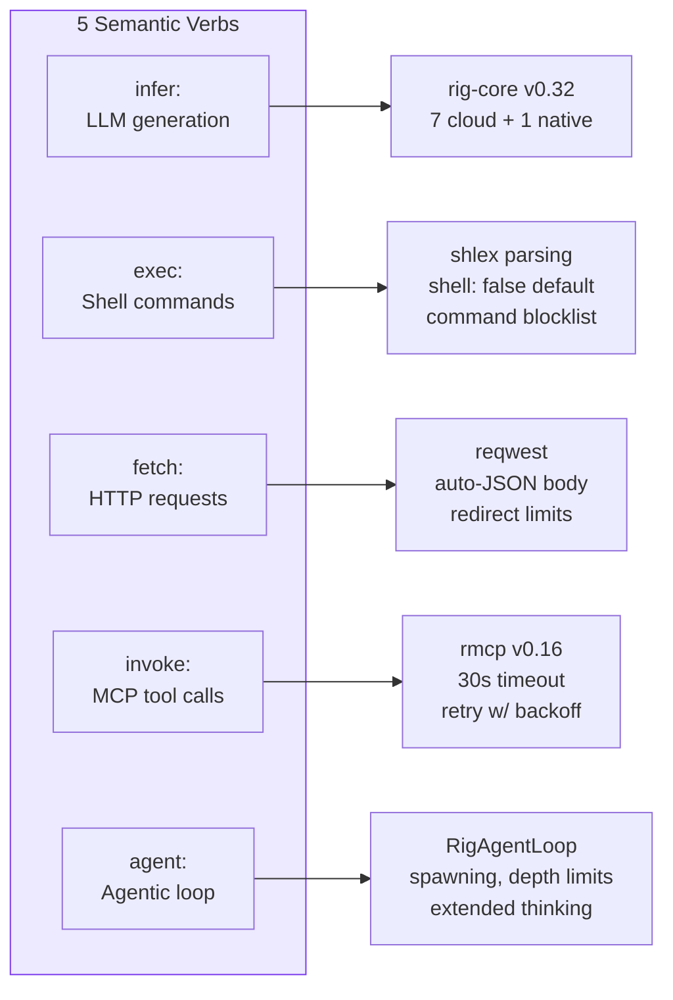
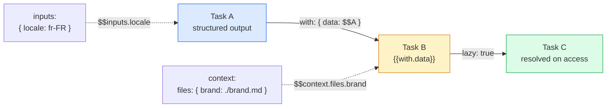
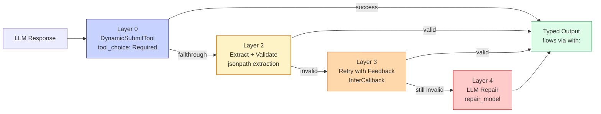
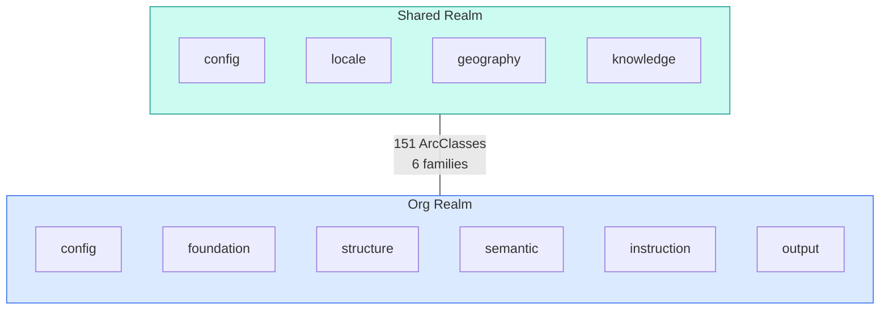
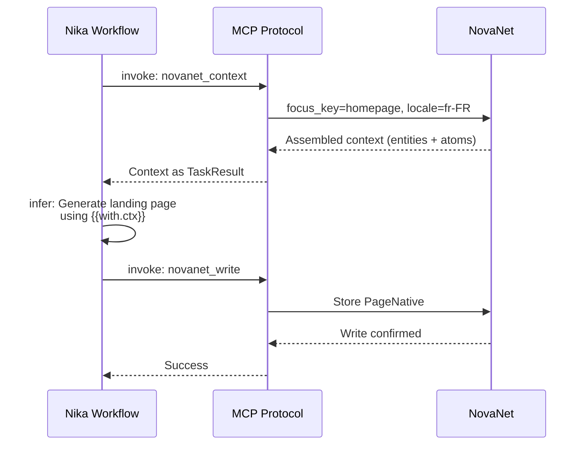

# 01 — Current Features Inventory

> Exhaustive map of Nika v0.30.3 + NovaNet v0.21.0 capabilities.
> Every claim verified against actual source code on 2026-03-17.

**Nika** v0.30.3 · **NovaNet** v0.21.0 · Updated 2026-03-17

---

## Nika v0.30.3 — The Body

**Stats:** 368 Rust source files[^1] | 217K lines[^2] | 6,032 test functions[^3] | Zero clippy warnings

### Core Architecture



### Module Breakdown

| Module | Files | Lines | Role |
|--------|------:|------:|------|
| **tui** | 164 | 88,611 | Terminal UI -- 4 views, 8 sub-modules (app, highlight, providers, state, tokens, views, widgets, wizard) |
| **runtime** | 41 | 28,987 | Execution engine, agent loop, builtins, structured output, security, artifacts, HITL, partial execution |
| **ast** | 39 | 24,398 | Three-phase YAML parser (Raw -> Analyzed -> Lower), guardrails, completion, limits, decompose |
| **binding** | 9 | 11,218 | Data flow, lazy bindings, transform engine (31 ops), template resolution |
| **lsp** | 14 | 8,637 | Language Server Protocol -- diagnostics, completion, hover, definition, semantic tokens, code actions |
| **init** | 10 | 8,139 | Project initialization wizard, 6-tier workflow templates |
| **mcp** | 12 | 7,894 | MCP client (rmcp v0.16), pool, retry, validation, nika config |
| **provider** | 7 | 4,666 | rig-core v0.32 adapter -- 7 cloud + 1 native provider |
| **core** | 8 | 4,532 | Zero-dep definitions: 19 providers, model catalog, 48 MCP aliases |
| **cli** | 12 | 4,457 | CLI entry and 18 subcommands (trace, provider, mcp, model, pkg, config, etc.) |
| **new** | 3 | 4,134 | `nika new` workflow creation wizard with templates |
| **tools** | 9 | 3,647 | 12 builtin tools -- 7 core + 5 file, plus rig adapter and router |
| **dag** | 5 | 3,571 | DAG construction, cycle detection, binding validation |
| **event** | 4 | 2,896 | EventLog with 32 variants, AgentTurnMetadata, broadcast channels |
| **registry** | 6 | 2,507 | Package registry -- API, lockfile, resolver, operations |
| **io** | 5 | 1,780 | Atomic writes, path security, template engine, writer |
| **store** | 3 | 1,135 | RunContext -- DashMap-based concurrent task result storage |
| **secrets** | 5 | 1,155 | Keychain, daemon IPC, fallback resolution chain |
| **source** | 3 | 715 | Source file tracking, span registry |
| **util** | 5 | 681 | Constants (timeouts), atomic FS, string interning, system info |

> [!NOTE]
> 20 modules totaling 368 source files (excluding build artifacts in `target-main/`). The TUI alone accounts for 45% of all source files and 41% of all lines -- reflecting the investment in developer experience.

---

### Feature Catalog

#### 1. Five Semantic Verbs



| Verb | Purpose | Implementation |
|------|---------|----------------|
| `infer:` | LLM text generation | rig-core `CompletionModel`, 7 cloud + 1 native provider, streaming |
| `exec:` | Shell command execution | shlex parsing, `shell: false` default, command blocklist, env sanitization |
| `fetch:` | HTTP requests | reqwest, auto-JSON body via `json:` field, redirect limits |
| `invoke:` | MCP tool calls | rmcp v0.16, timeout enforcement (30s), retry with exponential backoff |
| `agent:` | Multi-turn agentic loop | rig-core `AgentBuilder`, spawning, depth limits, guardrails |

**Verb syntax:** `infer:` and `exec:` support shorthand string form (`infer: "prompt"`) plus full object form (`infer: { prompt, model, temperature }`). All five verbs are implemented in `src/runtime/executor/verbs.rs`.

#### 2. LLM Provider Ecosystem

**7 cloud providers** (rig-core v0.32):

| Provider | ID | Env Var | Key Prefix |
|----------|----|---------|------------|
| Anthropic Claude | `anthropic` | `ANTHROPIC_API_KEY` | `sk-ant-` |
| OpenAI | `openai` | `OPENAI_API_KEY` | `sk-` |
| Mistral AI | `mistral` | `MISTRAL_API_KEY` | -- |
| Groq | `groq` | `GROQ_API_KEY` | `gsk_` |
| DeepSeek | `deepseek` | `DEEPSEEK_API_KEY` | `sk-` |
| Google Gemini | `gemini` | `GEMINI_API_KEY` | -- |
| **xAI Grok** | `xai` | `XAI_API_KEY` | `xai-` |

**1 local provider** (mistral.rs):
- `NativeRuntime` -- GGUF models, Metal/CUDA acceleration
- `provider: native` in workflows, streaming via `infer_stream()`
- Model catalog with quantization support (Q2_K through Q8_0)

**11 MCP providers:** neo4j, github, slack, perplexity, firecrawl, supadata, dataforseo, ahrefs, postgres, filesystem, memory

**Auto-detection:** `RigProvider::auto()` checks env vars in priority order: Anthropic -> OpenAI -> Mistral -> Groq -> DeepSeek -> Gemini -> xAI -> Native[^4].

**Total: 19 known providers** (7 LLM + 11 MCP + 1 Local), all defined in `src/core/providers.rs`.

#### 3. Agent Capabilities

- **Multi-turn loop:** `RigAgentLoop` with rig `AgentBuilder`, chat history via `Chat` trait (`add_to_history()`, `chat_continue()`, `with_history()`)
- **Extended thinking:** Claude-only, `thinking_budget: 1024-65536`, reasoning captured in `AgentTurnMetadata` (in `src/runtime/rig_agent_loop/thinking.rs`)
- **Spawn sub-agents:** `SpawnAgentTool` with `depth_limit` (default 3, max 10), emits `AgentSpawned` events
- **DynamicSubmitTool injection** (v0.30.0): Runtime JSON schema enforcement via `tool_choice: Required`
- **Completion detection modes:** 3 modes -- `explicit` (nika:complete tool), `natural` (no more tool calls), `pattern` (regex match)
- **Confidence routing:** Configurable threshold (default 0.7) with max retries for low-confidence results
- **Streaming:** All 8 providers (7 cloud + 1 native) support real-time token streaming
- **Guardrails:** 4 types -- length, schema, regex, llm -- with escalation actions (retry, escalate, fail)

#### 4. Builtin Tools (12)

**Core tools (7):**

| Tool | Purpose |
|------|---------|
| `nika:sleep` | Pause execution for a duration |
| `nika:log` | Emit structured log messages |
| `nika:emit` | Emit custom events to the event stream |
| `nika:assert` | Validate conditions during execution |
| `nika:prompt` | Request HITL input from the user |
| `nika:run` | Execute a sub-workflow |
| `nika:complete` | Signal explicit task completion with result/confidence/reasoning |

**File tools (5, agent-only):**

| Tool | Purpose |
|------|---------|
| `nika:read` | Read file contents |
| `nika:write` | Write file contents (10MB limit) |
| `nika:edit` | Edit file with search/replace |
| `nika:glob` | Find files matching glob patterns |
| `nika:grep` | Search file contents with regex |

All builtin tools implement the `BuiltinTool` trait and are wrapped via `NikaBuiltinToolAdapter` for rig-core `ToolDyn` compatibility. The `BuiltinToolRouter` handles dispatch.

#### 5. Data Flow & Bindings



- **`with:` block:** Typed bindings with `WithEntry` -- source, binding_type, default, lazy, transform
- **`BindingPath` syntax:** `$task_id`, `$task_id.field`, `$context.files.X`, `$inputs.param`, `$env.VAR`, `$item` (for for_each)
- **`{{with.alias}}` templates:** Variable interpolation in prompts, 2-pass resolution (Pass 1: `{{with.*}}`, Pass 2: `{{context.*}}` + `{{inputs.*}}` + `{{env.*}}`)
- **Transform pipes:** Inline transforms via `| sort | unique | first(3)` syntax (31 operations)
- **Typed bindings:** `binding_type` enforces string/number/integer/boolean/array/object/any
- **Lazy bindings:** `lazy: true` defers resolution until access, with optional `default`
- **Fallback operator:** `??` for null-safe defaults

#### 6. Transform Engine

31 chained operations via pipe syntax (`sort | unique | first(3)`), implemented as the `TransformOp` enum in `src/binding/transform.rs` (1,356 lines):

| Category | Operations | Count |
|----------|-----------|-------|
| **String** | `upper`, `lower`, `trim`, `trim_start`, `trim_end` | 5 |
| **Collection** | `length`, `first`, `last`, `first(N)`, `last(N)`, `keys`, `values`, `flatten`, `reverse`, `sort`, `unique`, `compact` | 12 |
| **Type conversion** | `to_string`, `to_number`, `to_bool`, `to_json`, `parse_json` | 5 |
| **Numeric** | `round(N)`, `abs`, `ceil`, `floor` | 4 |
| **Utility** | `default(V)`, `type_of`, `join(S)`, `split(S)`, `shell` | 5 |

**Null handling semantics:**
- **Propagating:** null in -> null out (`length`, `keys`, `type_of`, `to_string`, `to_json`)
- **Failing:** null in -> NIKA-153 error (`upper`, `lower`, `sort`, etc.)
- **Safe:** Use `default()` or `??` to handle nulls before failing transforms

85 tests cover the transform engine[^6].

#### 7. DAG Execution

- **Parallel execution:** `for_each` with `concurrency` control and `JoinSet`, **IndexMap for deterministic result order** (v0.30.3)
- **`fail_fast:`** `tokio::select!` cancellation of in-flight tasks on first failure
- **`depends_on:`** Explicit task ordering edges (combined with implicit deps from `with:` bindings)
- **`DependencyFailed`/`DependencyChainFailed`:** Cascading failure propagation with deadlock detection
- **Decompose modifier:** Runtime DAG expansion via MCP traversal (`decompose: { strategy: semantic, traverse: HAS_CHILD, source: $entity }`) -- 3 strategies: semantic, static, nested
- **Topological sort:** Ensures valid execution order, distinguishes true cycles from chain failures

#### 8. Structured Output (5-Layer) -- v0.30.0

5-layer defense system for ~99.99% JSON Schema compliance, implemented in `src/runtime/structured_output.rs` (1,365 lines):



| Layer | Name | Mechanism | Location |
|-------|------|-----------|----------|
| **0** | DynamicSubmitTool | Provider-native schema enforcement via synthetic tool injection with `tool_choice: Required` | `src/runtime/submit_tool.rs` |
| **1** | rig Extractor | Rust types with `#[derive(JsonSchema)]` via schemars (future) | -- |
| **2** | Extract + Validate | Extract JSON from raw output, validate against `SchemaRef` | `structured_output.rs` |
| **3** | Retry with Feedback | Re-prompt LLM with validation errors via `InferCallback` | `structured_output.rs` |
| **4** | LLM Repair | Separate call to fix invalid JSON, optionally with different model | `structured_output.rs` |

Each layer emits `StructuredOutputAttempt` events. Success emits `StructuredOutputSuccess` with total attempt count.

```yaml
# Example: structured output feeding typed bindings
- id: extract_data
  infer: "Extract product information"
  output:
    schema:
      type: object
      properties:
        name: { type: string }
        price: { type: number }
      required: [name, price]
    max_retries: 3
    enable_repair: true

- id: format
  with:
    product: "$extract_data"       # Typed object guaranteed
  infer: "Format {{with.product.name}} at ${{with.product.price}}"
```

#### 9. MCP Client (rmcp v0.16)

- **Server management:** 48 pre-configured aliases via `MCP_ALIASES` in `src/core/mcp_aliases.rs` across 6 categories:

| Category | Count | Examples |
|----------|------:|---------|
| Anthropic Official | 8 | filesystem, memory, puppeteer, brave-search, github, gitlab |
| Databases | 8 | neo4j, postgres, mysql, sqlite, mongodb, redis, supabase, neon |
| Search & Web | 8 | perplexity, firecrawl, brave-search, exa |
| Developer Tools | 8 | github, gitlab, linear, sentry |
| Productivity | 8 | slack, google-drive, notion |
| AI & Specialized | 8 | langchain, e2b, sequential-thinking |

- **Connection pool:** `McpClientPool` using `DashMap<String, Arc<OnceCell<Arc<McpClient>>>>` -- lazy init, per-server dedup, coordinated shutdown
- **Timeout enforcement:** 30s default call timeout (`MCP_CALL_TIMEOUT`), 5min task deadline (`INVOKE_TASK_DEADLINE`)
- **Retry logic:** Exponential backoff with jitter via `backon` crate (default: 3 retries, 100ms initial, 5s max) -- retries on timeout/disconnect, not on 404/validation
- **Validation:** Schema cache, enhancer, validator in `src/mcp/validation/`
- **Error code preservation:** JSON-RPC error codes mapped to `McpErrorCode`
- **Nika config:** `.nika/config.toml` MCP server configuration with inline definitions

#### 10. Workflow Composition

- **`context:`** File loading at workflow start -- markdown, JSON, YAML, glob patterns, session restore (`src/ast/context.rs`)
- **`include:`** DAG fusion from external workflows with prefix namespacing, supports both `path:` and `pkg:` references (`src/ast/include.rs`)
- **`skills:`** Prompt augmentation files loaded at workflow start, injected into agent system prompts. Supports local paths and `pkg:` URIs (`src/ast/skill_def.rs`)
- **`pkg:`** Package registry with lockfile, resolver, API client, and operations (`src/registry/`)
- **Schema versions:** `nika/workflow@0.1` through `@0.12`
- **YAML bomb protection:** Budget system via serde-saphyr -- max depth 100, max anchors 200, max aliases 500, max nodes 50K, max scalar 1MiB (`src/ast/budget.rs`)

#### 11. Security

Comprehensive security model across 840 lines in `src/runtime/security.rs` plus `src/io/security.rs`:

| Feature | Description | Since |
|---------|-------------|-------|
| Shell-free execution | `exec:` defaults to `shell: false` -- commands parsed via shlex, no pipe/redirect unless explicit `shell: true` | v0.1 |
| Command blocklist | Blocks `rm -rf /`, `sudo`, `eval`, `mkfifo`, `nc -e`, fork bombs, base64 payloads, privilege escalation | v0.1 |
| Unicode NFKC normalization | Prevents blocklist bypass via fullwidth chars (`rm` vs `U+FF52 U+FF4D`), math bold/italic, combining chars | v0.28 |
| Control character detection | Rejects null bytes, escape sequences (0x00-0x1F except `\n` and `\t`) | v0.28 |
| Path traversal protection | `validate_artifact_path()` -- canonical path validation, strict boundary enforcement, symlink rejection | v0.18 |
| Template injection prevention | Sanitized variable interpolation, 2-pass resolution | v0.1 |
| TOCTOU mitigation | Atomic writes via temp+fsync+rename pattern | v0.18 |
| **LD_PRELOAD blocking** | Blocks `LD_PRELOAD`, `LD_LIBRARY_PATH`, `DYLD_INSERT_LIBRARIES` in exec env vars (case-insensitive) | v0.30.2 |
| **API key stripping** | `strip_sensitive_env_vars()` removes all `*_API_KEY` vars from exec subprocess environments | v0.30.2 |
| **10MB WriteTool limit** | `nika:write` enforces `MAX_WRITE_SIZE = 10MB` to prevent resource exhaustion | v0.30.2 |
| **Artifact size limit** | Configurable `max_size` (default 100MB) per workflow, NIKA-282 on exceed | v0.18 |

> [!IMPORTANT]
> Security-by-default: `exec:` requires explicit `shell: true` for pipes/redirects. All paths validated against traversal. API keys stripped from subprocesses. Unicode normalization prevents confusable bypass attacks.

#### 12. Observability

- **Event sourcing:** 32 `EventKind` variants[^5] across 10 categories:

| Category | Events |
|----------|--------|
| **Workflow lifecycle** | `WorkflowStarted`, `WorkflowCompleted`, `WorkflowFailed`, `WorkflowAborted`, `WorkflowPaused`, `WorkflowResumed` |
| **Task lifecycle** | `TaskScheduled`, `TaskStarted`, `TaskCompleted`, `TaskFailed` |
| **Template** | `TemplateResolved` |
| **Provider** | `ProviderCalled`, `ProviderResponded`, `ContextAssembled` |
| **MCP** | `McpInvoke`, `McpResponse`, `McpConnected`, `McpError`, `McpRetry` |
| **Agent** | `AgentStart`, `AgentTurn`, `AgentComplete`, `AgentSpawned` |
| **Guardrails** | `GuardrailPassed`, `GuardrailFailed`, `GuardrailEscalation` |
| **Logging** | `Log`, `Custom` |
| **Artifacts** | `ArtifactWritten`, `ArtifactFailed` |
| **Structured output** | `StructuredOutputAttempt`, `StructuredOutputSuccess` |

- **NDJSON traces:** Per-run trace files with full event replay via `nika trace list/show/export/clean`
- **`AgentTurnMetadata`:** Captures thinking content, token counts, stop_reason, tool_calls, cache tokens
- **Broadcast channels:** Real-time event streaming to TUI views
- **Event log:** 2,361 lines in `src/event/log.rs` with `ContextSource`, `ExcludedItem`, `Event`, `EventKind`, `EventLog`

#### 13. TUI (102K lines)

**4 Views:**

| View | Key | Description |
|------|-----|-------------|
| Studio | `1`/`s` | 3-panel: File browser + Editor + DAG preview |
| Runner | `2`/`r` | Real-time workflow execution monitor |
| Chat | `3`/`c` | Conversational agent interface |
| Settings | `4`/`,` | Provider config and preferences |

**8 sub-modules:** app, highlight, providers, state, tokens, views, widgets, wizard

**Studio features:** Edit history (undo/redo), session persistence, Solarized theme, syntax highlighting, schema validation, tab management, fuzzy file search, command palette.

**164 source files, 102K lines** -- the largest module in the codebase by far (41% of all lines).

#### 14. CLI Commands

18 subcommands organized from `src/main.rs` (984 lines):

| Command | Purpose |
|---------|---------|
| `nika <file>` | Run workflow directly (shortcut for `nika run`) |
| `nika run <file>` | Execute workflow with provider/model overrides |
| `nika check <file>` | Validate syntax and DAG (`--strict` tests MCP connections) |
| `nika ui` | Open interactive TUI (default: Studio view) |
| `nika chat` | TUI Chat view shortcut |
| `nika studio [file]` | TUI Studio view shortcut |
| `nika init` | Initialize new project (`.nika/`) |
| `nika new` | Create workflow from templates |
| `nika trace` | `list/show/export/clean` -- trace management |
| `nika provider` | `list/set/get/test/migrate` -- provider management |
| `nika model` | `list/pull/info/search` -- local model management |
| `nika mcp` | `add/remove/list/test/tools` -- MCP server management |
| `nika pkg` | Package registry operations |
| `nika config` | `list/get/set/edit/path` -- configuration management |
| `nika schema` | Schema validation and generation |
| `nika doctor` | System health check |
| `nika completion` | Shell completion generation (bash/zsh/fish) |
| `nika lsp` | Start language server |
| `nika workflow` | Workflow management operations |

#### 15. Error System

2,068 lines in `src/error.rs` with 309 `NIKA-` error code references across 20 ranges:

<details>
<summary>All error code ranges (NIKA-000 through NIKA-429)</summary>

| Range | Category |
|-------|----------|
| 000-009 | Workflow errors |
| 010-019 | Schema/validation errors |
| 020-029 | DAG errors |
| 030-039 | Provider errors |
| 040-049 | Template/binding errors |
| 050-059 | Path/task/security errors |
| 060-069 | Output/JSON errors |
| 070-079 | With block errors |
| 080-089 | DAG validation errors |
| 090-099 | JSONPath/IO errors |
| 100-109 | MCP errors |
| 110-119 | Agent errors |
| 120-129 | Resilience errors |
| 130-139 | TUI errors |
| 140-151 | AST analysis (Phase 2) errors |
| 160-164 | Parse errors (Phase 1 parser) |
| 200-219 | File tools + Builtin tools |
| 280-289 | Artifact errors |
| 300-309 | Structured output errors |
| 400-429 | Daemon/IO/Sync errors |

</details>

All errors use `NikaError` (never `anyhow`), with `#[diagnostic]` attributes for user-friendly messages including help text, error codes, and URLs.

#### 16. Artifact System

Declarative file output system implemented in `src/runtime/artifact_processor.rs` (1,190 lines) and `src/ast/artifact.rs`:

- **Workflow-level defaults:** `artifacts: { dir, format, mode, manifest, max_size }` -- global config inherited by all tasks
- **Task-level specs:** `artifact: true` (use defaults), `artifact: { path: ... }` (custom), or `artifact: [...]` (multiple outputs)
- **Template support:** `{{context.meta.*}}`, `{{with.*}}`, `{{task_id}}`, `{{date}}` in paths
- **Formats:** text, json, yaml
- **Modes:** overwrite, append
- **Source selection:** `source:` field to write specific binding values instead of full task output
- **Max size:** 100MB default, configurable via `max_size` (NIKA-282 on exceed)
- **Manifest tracking:** Optional manifest file tracking all artifact outputs
- **Atomic writes:** temp+fsync+rename pattern for crash safety
- **Security:** `validate_artifact_path()` prevents path traversal attacks
- **Events:** `ArtifactWritten`, `ArtifactFailed`

```yaml
# Example: artifact configuration
artifacts:
  dir: ./output/{{context.meta.date}}
  format: json
  mode: overwrite
  manifest: true
  max_size: 104857600  # 100MB

tasks:
  - id: task1
    artifact: true                      # Use workflow defaults

  - id: task2
    artifact:
      path: ./data/{{context.meta.task_id}}.json  # Custom path

  - id: task3
    artifact:                                      # Multiple outputs
      - path: ./raw.json
        source: raw_data
      - path: ./processed.json
```

#### 17. LSP (Language Server Protocol)

14 files, 8,637 lines -- IDE integration for `.nika.yaml` files:

| Capability | Description |
|------------|-------------|
| **Diagnostics** | Real-time error reporting on save |
| **Completion** | Trigger chars: `:`, `.`, `$`, `{` -- verb names, binding paths, output shorthand, template start |
| **Hover** | Documentation for verbs, fields, and bindings |
| **Go to Definition** | Jump to task definitions and `include:` path resolution |
| **Code Actions** | Quick fixes and refactoring (QUICKFIX, REFACTOR kinds) |
| **Document Symbols** | Outline view for workflow structure |
| **Semantic Tokens** | 7 token types, 2 modifiers -- full semantic highlighting |
| **Incremental Sync** | Only changed portions sent from client |

**Handlers** (in `src/lsp/handlers/`): code_action, completion, definition, hover, semantic_tokens, symbols

**Supporting infrastructure:** AST index (`ast_index.rs`, 539 lines), document store (`document_store.rs`, 329 lines), conversion utilities (`conversion.rs`, 881 lines).

#### 18. Secrets Management

5 files, 1,155 lines in `src/secrets/`:

- **Resolution chain:** daemon -> keychain -> environment variables (fallback)
- **Daemon IPC:** Unix socket at `~/.spn/daemon.sock` (`daemon.rs`)
- **Keyring:** OS keychain integration (`keyring.rs`)
- **Fallback:** Pure env var resolution (`fallback.rs`)
- **19 known providers:** Each with env var mapping (e.g., `ANTHROPIC_API_KEY`, `OPENAI_API_KEY`)
- **Key validation:** Prefix checking (`sk-ant-`, `sk-`, `gsk_`, `xai-`)

#### 19. VS Code Extension

Located at `editors/vscode/` (relative to nika repo root):

- **Language configuration:** `language-configuration.json` -- bracket matching, comments, auto-closing
- **Syntax highlighting:** TextMate grammar in `syntaxes/`
- **LSP integration:** Connects to `nika lsp` for full IDE features
- **File association:** `.nika.yaml` files automatically detected

#### 20. HITL (Human-in-the-Loop)

248 lines in `src/runtime/hitl.rs`:

- **`HitlRequest`:** message, default, timeout, choices
- **`HitlResponse`:** response, default_used
- **`HitlHandler` trait:** `async fn prompt(&self, request: HitlRequest) -> Result<HitlResponse, HitlError>`
- **Error types:** `Cancelled`, `Timeout(Duration)`, `NotAvailable`, `Other`
- **`DefaultHitlHandler`:** Headless-mode stub that returns `NotAvailable`
- **Integration:** `nika:prompt` builtin tool uses the handler during agent execution

#### 21. Partial Execution & Checkpoints

588 lines in `src/runtime/partial.rs`:

- **`PartialResult`:** content, progress (0.0-1.0), preview, stop_reason, turns_completed, tokens_used, cost_usd
- **`StopReason` enum:** `TurnsLimit`, `TokensLimit`, `CostLimit`, `DurationLimit`, `UserRequested`, `Error`
- **`PartialCheckpoint`:** Serializable checkpoint with `save_to_file()` and `load_from_file()` for resumption
- **`LimitTracker`:** Runtime tracking of turns, tokens, cost, and duration against `LimitsConfig`

```yaml
# Example: agent with limits and partial completion
agent:
  prompt: "Research {{topic}}"
  limits:
    max_turns: 20
    max_tokens: 50000
    max_cost_usd: 2.00
    max_duration_secs: 300
    on_limit_reached:
      action: complete_partial
      save_progress: true
```

#### 22. Gate Validation Workflows -- v0.30.3

39 validation workflows in `examples/gates/`:

| Category | Count | Purpose |
|----------|------:|---------|
| **e2e** | 10 | End-to-end integration tests (basic infer, OpenAI infer, chain with bindings, structured output, for_each, artifact write, fetch and process, context files, OpenAI structured, complex pipeline) |
| **audit** | 14 | Deep audit tests (multi-provider, structured xAI, for_each xAI, diamond deps, nested bindings, artifact multi, exec advanced, transforms, fetch POST, edge cases, artifact source, traces, artifact template, error recovery) |
| **trap** | 9 | Edge case and regression traps (overwrite binding, single-item for_each, deep binding chains, parallel race, for_each JSON objects, template-in-exec, large output, empty for_each, concurrent artifacts) |
| **gate** | 5 | Feature gate tests (context files, artifact single, with binding, input defaults, fallback operator) |
| **debug** | 1 | Debug helper (for_each debugging) |

#### 23. Runtime Boot Sequence

7-phase startup with progress reporting (`src/runtime/boot.rs`):

1. **Config discovery** -- find `.nika/` directory
2. **Config validation** -- parse `config.toml`
3. **Memory loading** -- load memory files
4. **Secrets loading** -- resolve from daemon/keychain/env
5. **MCP server startup** -- launch configured servers
6. **Provider validation** -- check API keys
7. **Ready state** -- system initialized

---

## NovaNet v0.21.0 — The Brain

### Schema



- **47 NodeClasses** across 2 realms (SHARED read-only + ORG)
- **151 ArcClasses** in 6 arc families
- **9 layers** across both realms
- **Generation, not translation:** `Entity (defined) -> Generate natively -> EntityNative (authored)`

### MCP Server (7 tools, v0.21.0)

> [!NOTE]
> `novanet_query` (raw Cypher) was **removed in v0.21.0** -- no more escape hatch. Previously 8 tools in v0.20.0, now 7. The `novanet_traverse` was folded into `novanet_search` walk mode in v0.20.0.

| Tool | Purpose | Key Modes |
|------|---------|-----------|
| `novanet_describe` | Bootstrap agent understanding of the knowledge graph | -- |
| `novanet_search` | Search and explore nodes | fulltext, property, hybrid, walk, triggers |
| `novanet_introspect` | Schema inspection | NodeClasses, ArcClasses, relationships |
| `novanet_context` | Unified context assembly for LLM generation | page, block, knowledge, assemble |
| `novanet_write` | Create/update data | with `dry_run` validation |
| `novanet_audit` | Quality checks + CSR metrics | -- |
| `novanet_batch` | Parallel operations | -- |

### Knowledge Atoms

| Type | Purpose |
|------|---------|
| Term | Technical vocabulary with definitions |
| Expression | Idiomatic expressions per locale |
| Pattern | Text templates/patterns |
| CultureRef | Cultural references |
| Taboo | Things to avoid per locale |
| AudienceTrait | Audience characteristics |

> [!TIP]
> Knowledge atoms are NovaNet's unique differentiator. No competitor offers per-locale cultural intelligence (expressions, taboos, audience traits) integrated into content generation.

### Key Patterns

- ***Native Pattern (ADR-029):** `EntityNative`, `PageNative`, `BlockNative` -- unified `*Native` suffix
- **Slug Ownership (ADR-030):** Page owns URL, Entity owns semantics
- **Denomination Forms (ADR-033):** text/title/abbrev/mixed/base/url
- **Provenance (ADR-042):** Per-instance tracking (ADR-024 traits deprecated)
- **Inverse Arc Tiers (ADR-026):** 3-tier system (Required/Recommended/Optional)

### Neo4j Integration

- 1,616 tests (Rust CLI + TUI)
- Cypher as source of truth (ADR-021)
- Fulltext indexes for search
- APOC for schema inspection
- 2 realms: SHARED (read-only) + ORG

---

## Nika <-> NovaNet Integration



```yaml
# The integration pattern
workflow: generate-page
mcp:
  servers:
    novanet:
      command: node
      args: ["/path/to/novanet-mcp/dist/index.js"]

tasks:
  - id: get_context
    invoke: novanet_context
    params:
      focus_key: "homepage"
      locale: "fr-FR"
      mode: page

  - id: generate
    with:
      ctx: "$get_context"
    infer: |
      Generate landing page content:
      {{with.ctx}}
```

> [!IMPORTANT]
> **Zero Cypher Rule** (ADR-003) -- Nika never queries Neo4j directly. All graph access flows through NovaNet's 7 MCP tools. MCP is the abstraction boundary.

---

## Summary Statistics

| Metric | Nika | NovaNet | Combined |
|--------|------|---------|----------|
| Source files | 368[^1] | ~200 | ~568 |
| Lines of Rust | 217K[^2] | ~50K | ~267K |
| Test functions | 6,032[^3] | 1,616 | 7,648 |
| Known providers | 19 (7 LLM + 11 MCP + 1 Local) | 0 | 19 |
| Builtin tools | 12 | 0 | 12 |
| MCP tools exposed | -- | 7 | 7 |
| MCP aliases | 48 | -- | 48 |
| Error code ranges | 20 | -- | 20 |
| CLI subcommands | 18+ | 10+ | 28+ |
| EventKind variants | 32[^5] | -- | 32 |
| Transform operations | 31 | -- | 31 |
| Gate workflows | 39 | -- | 39 |
| TUI lines | 102K | -- | 102K |

---

## v0.30.x Changelog Summary

| Version | Date | Key Changes |
|---------|------|-------------|
| v0.30.0 | 2026-03-16 | Structured output 5-layer engine, DynamicSubmitTool injection (Layer 0), artifact configuration system, `nika:complete` tool |
| v0.30.1 | 2026-03-16 | VS Code extension, LSP semantic tokens provider (7 types, 2 modifiers), Go to Definition for `include:` paths, invoke:/fetch: verb completions |
| v0.30.2 | 2026-03-16 | Security hardening: LD_PRELOAD/DYLD_INSERT_LIBRARIES blocking, API key stripping from exec subprocesses, 10MB WriteTool limit, Unicode NFKC normalization, u32->u64 token overflow fix |
| v0.30.3 | 2026-03-17 | Gate validation workflows (39 total), IndexMap for deterministic for_each order, counter overflow fix in for_each progress, agent panic prevention with output.schema |

---

<div align="center">

[<- 00 Index](./00-README.md) | [02 Scientific Literature ->](./02-scientific-literature.md)

</div>

---

[^1]: Verified via `find src -name '*.rs' -not -path '*/target-main/*' | wc -l` on 2026-03-17. Count: 368. Excludes build artifacts in `target-main/`. Raw count including target-main is 380.
[^2]: Verified via `find src -name '*.rs' -not -path '*/target-main/*' -exec cat {} + | wc -l` on 2026-03-17. Count: 217,304. Including target-main (build artifacts): 254,176.
[^3]: Verified via `grep -rn "fn test_" src/ --include="*.rs" | wc -l` on 2026-03-17. Count: 6,032 test functions. `grep -r "#\[test\]" src/ --include="*.rs" | wc -l` returns 6,631 (includes parameterized and helper functions annotated with `#[test]`).
[^4]: Verified via `grep "fn auto" src/provider/rig.rs` on 2026-03-17. `RigProvider::auto()` iterates `KNOWN_PROVIDERS` in declaration order (Anthropic first).
[^5]: Verified via `grep "^    [A-Z]" src/event/log.rs` on 2026-03-17. Count: 32 variants. Previous versions had 34 (`LimitReached` and `PartialCompletion` removed in v0.30.3).
[^6]: Verified via `grep "#\[test\]" src/binding/transform.rs | wc -l` on 2026-03-17. Count: 85.
