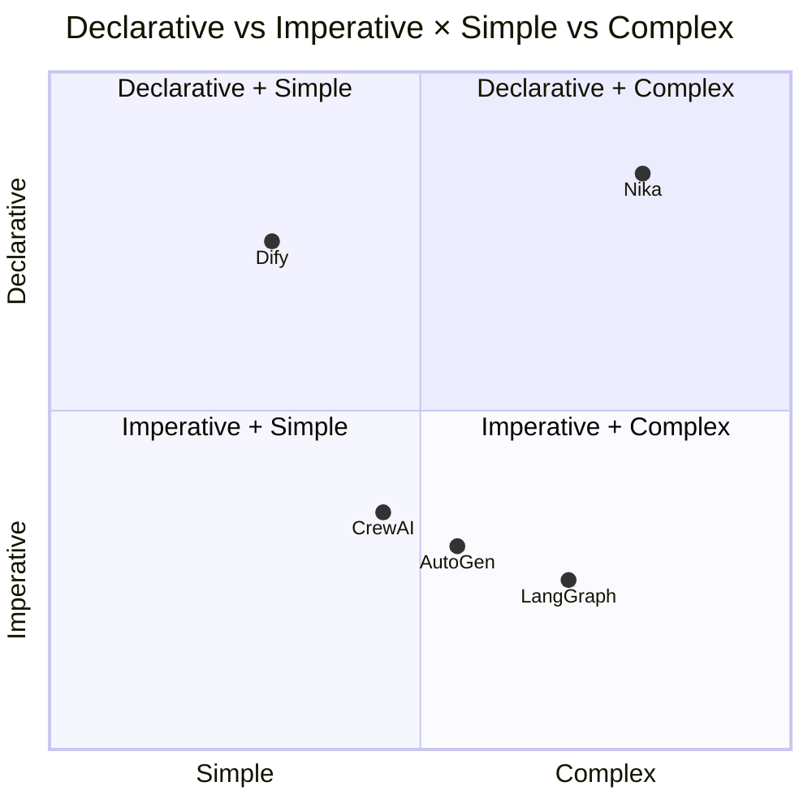
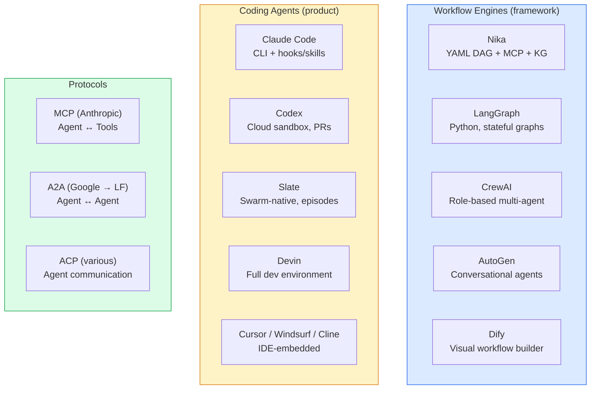
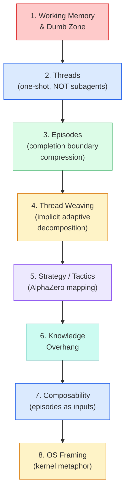
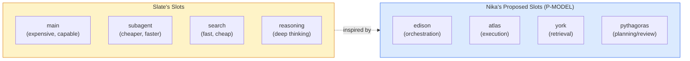
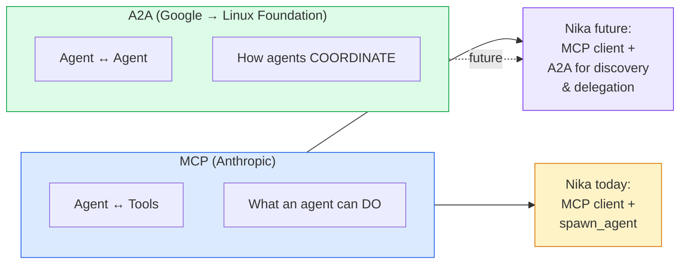
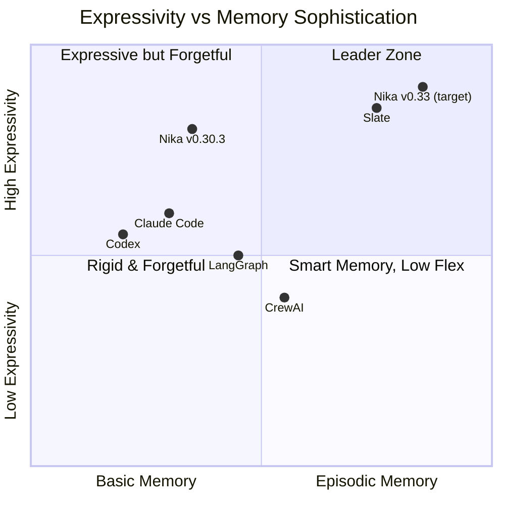
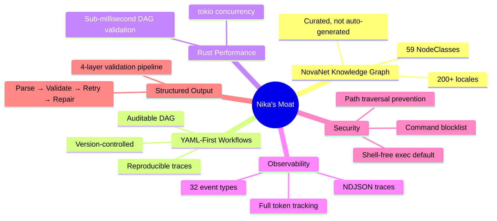

# 03 — Competitive Landscape

> Analysis of competing agent runtimes, coding agents, and protocols.
> 5 competitors mapped. 3 protocols analyzed. Positioning defined.

**Nika** v0.30.3 · **NovaNet** v0.20.0 · Updated 2026-03-14

---

## Market Map

> [!NOTE]
> Nika sits in the **Declarative + Complex** quadrant — a unique position. No other framework combines YAML-first workflows, knowledge graph integration, and multi-provider orchestration.

---

## 1. Slate by Random Labs[^1]

**Source:** Blog post + documentation + npm `@randomlabs/slate` v1.0.15
**Config:** `slate.json` / `slate.jsonc` with 3-level merge (global → project → inline)

### Architecture: 8 Interconnected Concepts

Slate solves the **context window degradation problem**: past a threshold (the "dumb zone"), LLM performance degrades. Every existing approach fails for different reasons. Slate's answer is **threads + episodes + thread weaving**.

### Slate's Critique of Existing Approaches

| Approach | Failure Mode | Slate's Alternative |
|----------|-------------|---------------------|
| **Compaction** | Lossy, unpredictable information loss | Episode compression at completion boundary |
| **Subagents** | Context isolated, can't transfer info | Threads (one-shot) + episodes (compressed handoff) |
| **Markdown Plans** | Underspecified, incomplete execution, stale | No explicit plans — implicit adaptive decomposition |
| **Task Decomposition** | Rigid, can't adapt, low expressivity | Thread weaving — orchestrator adapts per round |
| **RLM** | Blind N-step execution, no intermediate feedback | Every thread produces episode, orchestrator reviews |
| **Devin/Manus** | Context lost at compress boundary | Episodes preserve key info, entity-linked persistence |

### Slate's Model Slots

> [!IMPORTANT]
> **Attribution note:** Slate configures 4 model slots: **main**, **subagent**, **search**, **reasoning**. Our proposed 4-slot design (P-MODEL) uses **edison**, **atlas**, **york**, **pythagoras** — renaming "subagent" to "atlas" to better reflect the shaka/satellites separation from THREAD[^2] and AlphaZero[^3]. The slot concept is inspired by Slate; the specific taxonomy is our design.

### Slate's Architecture Comparison

| Dimension | ReAct | Plan | Task Trees | RLM | Devin | Claude Code | **Slate** |
|-----------|:-----:|:----:|:----------:|:---:|:-----:|:-----------:|:---------:|
| Planning | Implicit | Explicit | Explicit | None | Explicit | Implicit | Implicit |
| Decomposition | None | Manual | Static | None | Static | None | Implicit |
| Feedback | Per-step | End | End | None | Per-task | Per-step | Per-episode |
| Context isolation | None | None | Partial | None | Full | None | Per-thread |
| Compression | Compact | Compact | None | None | Compress | Compact | Episode |
| Parallelism | None | None | None | None | Multi-agent | None | Native |
| Adaptability | Low | Low | Low | Low | Medium | High | High |

### Head-to-Head: Slate vs Nika

Where Slate leads (gaps Nika must close)

| Feature | Slate | Nika | Priority |
|---------|-------|------|----------|
| Context management | Working memory awareness, episode compression | None — full context carried | P-CONTEXT |
| Model routing | 4 model slots (main/subagent/search/reasoning) | Single provider per workflow | P-MODEL |
| Episodic memory | Cross-session persistence (session files) | In-memory only | P-MEMORY |
| Strategy/tactics | Orchestrator dispatches threads, synthesizes episodes | Flat agent loop | P-SHAKA |
| Thread model | One-shot threads with episode compression | Persistent subagents | P-RECORD |
| Adaptive planning | Implicit via thread weaving, no stale plans | Static DAG, no runtime adaptation | P-SHAKA |
| Long-running tasks | Hours to days | Single session | P-MEMORY |

Where Nika leads (moat Slate cannot replicate)

| Feature | Nika | Slate |
|---------|------|-------|
| Declarative workflows | YAML DAG, version-controlled, auditable | TypeScript, imperative, opaque |
| Knowledge graph | NovaNet (59 NodeClasses, 200+ locales) | None |
| Reproducibility | NDJSON traces, deterministic DAG replay | Thread-based, non-deterministic |
| Security | Shell-free exec, command blocklist, path validation | Not documented |
| Structured output | 4-layer validation (parse → validate → retry → repair) | Not documented |
| Multi-locale | 200+ locales via NovaNet knowledge atoms | English-focused |
| Observability | 32 event types, NDJSON traces, TUI with DAG view | Basic logging |
| Cost control | Token tracking per task, budget awareness | No token budgeting |
| Record persistence | 3-tier: Egghead (HOT) → Punk Records (WARM/NDJSON) → NovaNet (COLD/promoted, graph-queryable) | Session files only |

> [!TIP]
> **Key takeaway:** Nika's DAG IS already Slate's kernel. Tasks ARE processes. `TaskResult` IS return values. `RunContext` IS RAM. We don't BUILD Slate — we UPGRADE the kernel with 4 additions (model slots, records, shaka mode, context budgets), then persist via NovaNet. See [doc 07](./07-slate-deep-integration.md) for the complete integration strategy.

---

## 2. Claude Code (Anthropic)

**Type:** CLI coding agent
**Traction:** Dominant in developer workflows (March 2026)

| Aspect | Claude Code | Nika |
|--------|------------|------|
| Interaction | Conversational | Workflow-defined |
| Reproducibility | Low (conversations) | High (YAML DAG + traces) |
| Extensibility | Hooks + skills | Verbs + MCP + includes |
| Multi-step | Ad-hoc via conversation | Structured via DAG |
| Multi-model | Claude only | 7 providers |
| Knowledge graph | None | NovaNet integration |

> [!NOTE]
> **Relationship:** Claude Code is Nika's **user**, not competitor. Nika workflows are authored and invoked from Claude Code sessions. The relationship is symbiotic — Claude Code provides the interactive shell, Nika provides the reproducible workflow engine.

---

## 3. Codex (OpenAI)

**Type:** Cloud-based coding agent — sandboxed environment, PR-oriented

| Aspect | Codex | Nika |
|--------|-------|------|
| Execution | Cloud sandbox (firecracker) | Local + cloud |
| Workflow | Single PR task | Multi-step DAG |
| Multi-model | OpenAI only | 7 providers |
| Trace | GitHub PR diffs | NDJSON events |
| Cost model | Per-task billing | Pay-per-API-call |

> [!NOTE]
> **Different markets:** Codex focuses on code-change-as-output (PRs). Nika focuses on arbitrary AI workflow orchestration.

---

## 4. LangGraph (LangChain)

**Type:** Python framework for stateful agent graphs

| Aspect | LangGraph | Nika |
|--------|-----------|------|
| Language | Python | Rust (YAML DSL) |
| Graph model | StateGraph with conditional edges | DAG with 5 verbs |
| State | Shared state dict | RunContext + bindings |
| Checkpointing | Built-in persistence | Event log (replay) |
| Performance | Python (slow) | Rust + tokio (fast) |
| MCP | Via langchain-mcp | Native rmcp |
| Knowledge graph | Manual integration | NovaNet built-in |

> [!NOTE]
> **Tradeoff:** LangGraph is more flexible (arbitrary Python) but slower, harder to reproduce, and lacks YAML-first philosophy. Nika's YAML workflows are version-controllable artifacts; LangGraph's Python graphs are code.

---

## 5. CrewAI

**Type:** Role-based multi-agent framework (Python)

| Aspect | CrewAI | Nika |
|--------|--------|------|
| Agent model | Role-based (researcher, writer, etc.) | Verb-based (infer, exec, agent) |
| Coordination | Sequential/hierarchical | DAG with parallel + for_each |
| Memory | Short/long-term/entity memory (3 types) | RunContext (session only) |
| Tools | Custom tool definitions | MCP tools + 11 builtins |

> [!WARNING]
> CrewAI's **3-type memory system** (short-term, long-term, entity) is more mature than Nika's single RunContext. This gap is addressed by P-MEMORY and P-RECORD in the [Evolution Roadmap](./05-evolution-roadmap.md).

---

## 6. SWE-bench Leaderboard (March 2026)

| Agent | Score | Model |
|-------|-------|-------|
| GPT-5.4 Pro | 95% | OpenAI |
| Claude Opus 4.6 | 91% | Anthropic |
| Devin | ~85% | Multi-model |
| SWE-Agent | ~80% | Various |

> [!TIP]
> The models themselves are converging at high capability. The differentiator is now **orchestration quality** — how effectively you chain, route, and compose LLM calls. This validates Nika's focus on workflow engineering over model capability.

---

## 7. Protocol Landscape

### MCP (Model Context Protocol)

- **Created by:** Anthropic
- **Focus:** Tool provision — exposing capabilities TO agents
- **Nika uses:** rmcp v0.16 as MCP client, NovaNet as MCP server
- **Role:** Intra-agent tooling (agent ↔ tools)

### A2A (Agent-to-Agent Protocol)

- **Created by:** Google (April 2025), donated to Linux Foundation (June 2025)
- **Key features:** Agent Cards at `/.well-known/agent.json`, JSON-RPC 2.0, SSE streaming, OAuth 2.0
- **Role:** Inter-agent communication (agent ↔ agent)

> [!NOTE]
> If Nika wants to support multi-runtime agent coordination (e.g., a Nika agent delegating to an external LangGraph agent), A2A is the protocol to adopt.

---

## Competitive Positioning

### Nika's Moat

No competitor has **all** of these:

### NovaNet's Unique Position

Research confirmed that NovaNet has **no direct competitors** in the curated-graph native-generation space:

| Closest Alternative | Why It's Different |
|--------------------|--------------------|
| GraphRAG (Microsoft) | Auto-built from documents, not curated |
| Knowledge graph + LLM research | Academic, no product |
| Wikidata / DBpedia | General purpose, not per-org content generation |

> [!IMPORTANT]
> NovaNet's combination of per-locale knowledge atoms (Expression, Pattern, CultureRef, Taboo) with entity-based content generation is **unique in the market**. No competitor offers curated, locale-aware knowledge graph integration with workflow orchestration.

---

[← 02 Scientific Literature](./02-scientific-literature.md) · [📋 Index](./00-README.md) · [04 Nika × NovaNet Overlap →](./04-nika-novanet-overlap.md)

---

[^1]: Slate by Random Labs — [Technical blog post](https://randomlabs.ai/blog/slate) with thread-based episodic memory architecture. [Documentation](https://docs.randomlabs.ai). npm: `@randomlabs/slate` v1.0.15.
[^2]: THREAD: Thinking Hierarchically for Resource-Efficient Agent Decision-making — [arXiv:2405.17402](https://arxiv.org/abs/2405.17402). Hierarchical decomposition with per-task model routing.
[^3]: McGrath et al., "Acquisition of Chess Knowledge in AlphaZero" — [PNAS 2022](https://www.pnas.org/doi/10.1073/pnas.2206625119). Cited in Slate blog for strategy/tactics separation.
