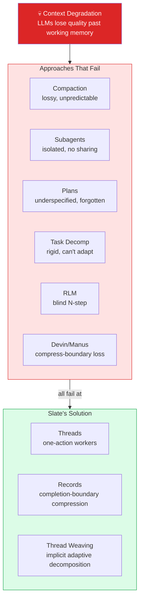
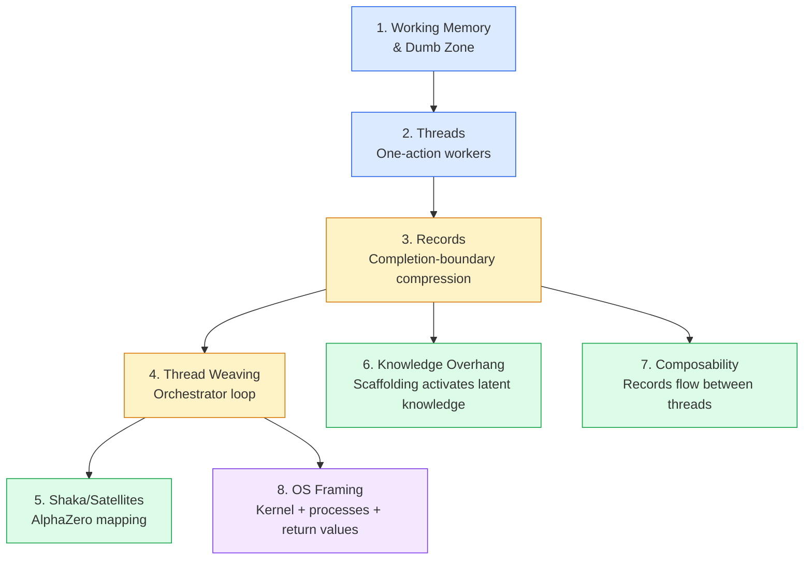
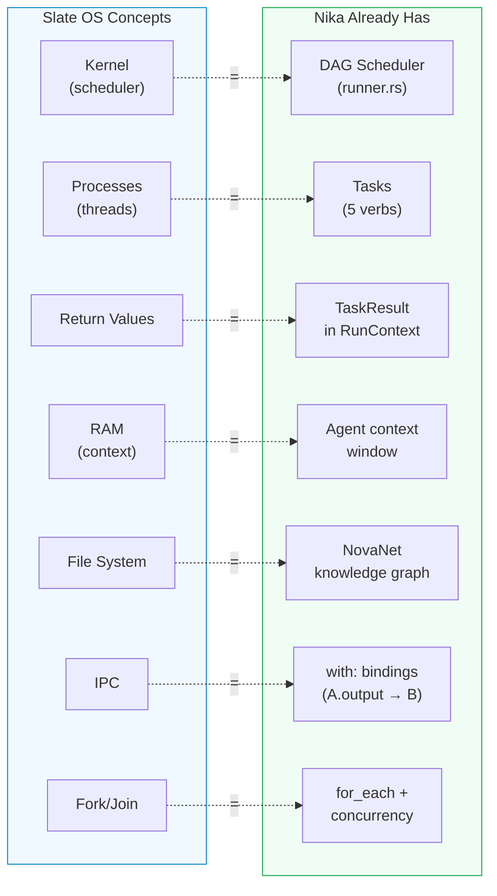
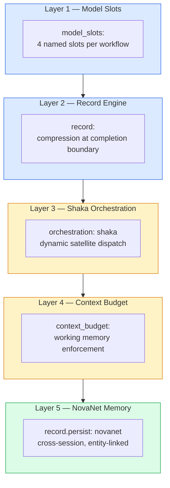
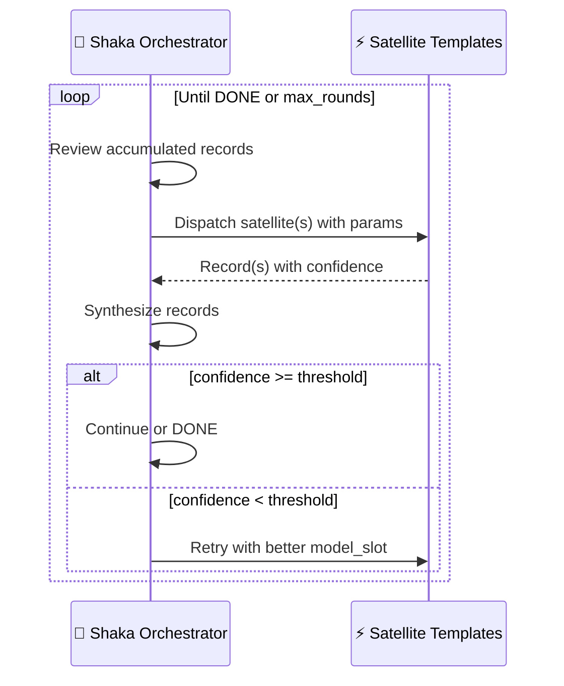
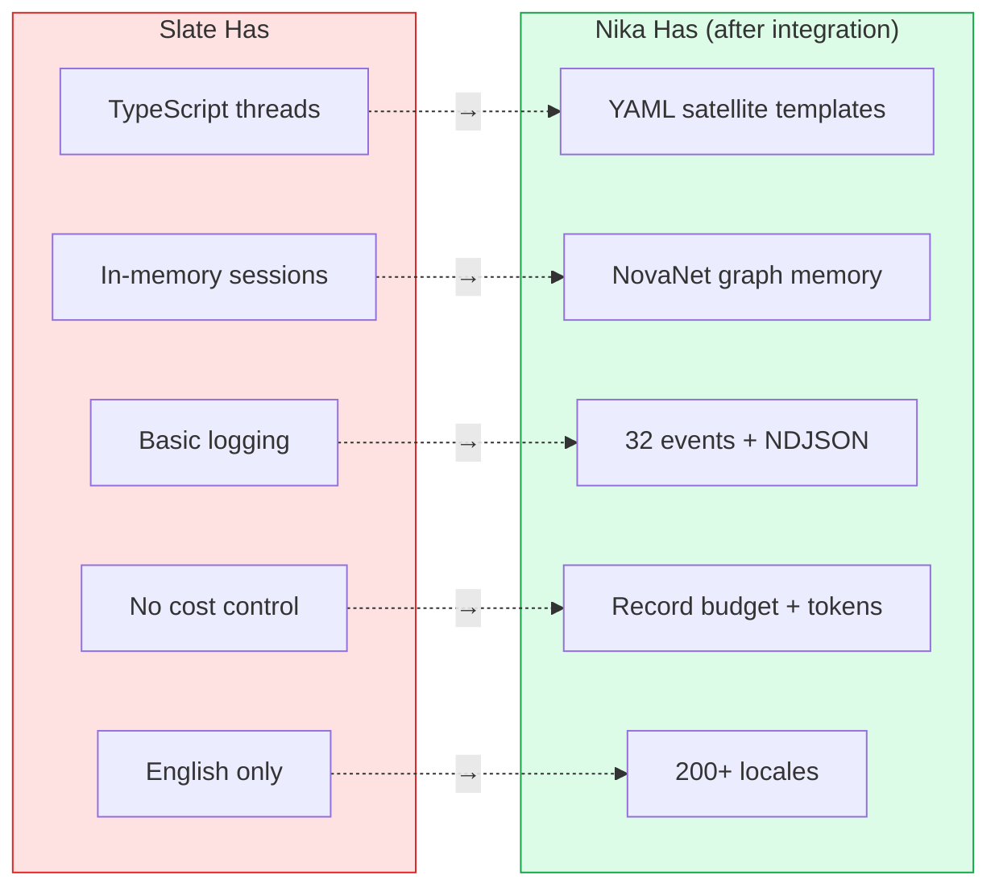
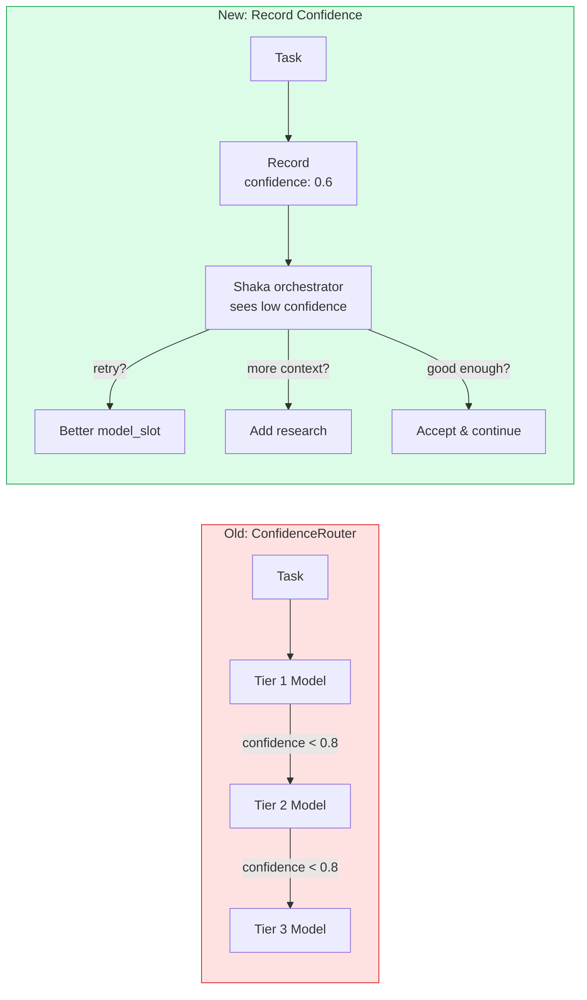
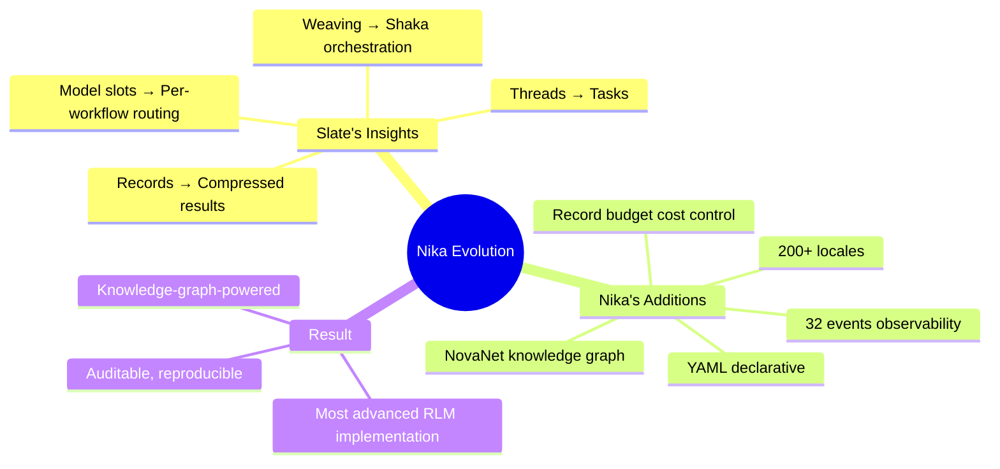

# 07 — Slate Deep Integration Strategy

> Copying Slate's thread/record architecture into Nika, then going beyond.
> Every concept mapped. Every claim verified. Every design grounded in existing code.

**Nika** v0.30.3 · **NovaNet** v0.20.0 · Updated 2026-03-14

---

## Why This Document Exists

Slate (Random Labs)[^1] introduced an architecture — threads, records, thread weaving, shaka/satellites — that solves the fundamental problems of long-running AI agents. This document maps every Slate concept to Nika's existing architecture, identifies what needs to change, and designs how Nika goes **beyond** Slate by leveraging the NovaNet knowledge graph, YAML declarative workflows, and full observability.

> [!IMPORTANT]
> **Guiding principle** — We are not building feature parity with Slate. We are taking Slate's **architectural insights** and implementing them in a way that is **declaratively superior** — auditable, reproducible, version-controlled, and knowledge-graph-powered.

---

## Slate's Core Architecture

### The Problem Slate Solves

LLM context windows are not uniformly useful. Performance degrades past a threshold — the "dumb zone" (Dex Horthy's term[^1]). Every existing approach fails in a specific way:



### The 8 Interconnected Concepts



<details>
<summary>📖 Concept Details</summary>

| # | Concept | Mechanism | Key Insight |
|---|---------|-----------|-------------|
| 1 | **Working Memory** | Context has a usable zone and a degraded "dumb zone" | Never exceed working memory threshold |
| 2 | **Threads** | Each thread executes ONE action, then pauses. NOT persistent subagents | Context isolated per thread |
| 3 | **Records** | Compressed representation at completion boundary (not mid-stream) | Only important results retained |
| 4 | **Thread Weaving** | Orchestrator: dispatch threads → collect records → synthesize → dispatch | Implicit adaptive decomposition |
| 5 | **Shaka/Satellites** | Shaka = open-ended planning. Satellites = learned action sequences | AlphaZero mapping (value + policy networks)[^2] |
| 6 | **Knowledge Overhang** | Models have knowledge they can't access without scaffolding | Records provide the scaffolding |
| 7 | **Composability** | Records flow between threads as handoff boundary | Cross-model composition |
| 8 | **OS Framing** | Orchestrator = kernel, Threads = processes, Records = return values | Karpathy's LLM OS framing |

</details>

> [!NOTE]
> **Slate's model configuration** — Slate supports cross-model composition (e.g., Sonnet + Codex for different cognitive tasks)[^1]. The "4 named slots" (edison/atlas/york/pythagoras) is our design, inspired by this capability.

---

## The Critical Realization: Nika IS Already an OS



> [!TIP]
> **What's missing is NOT the kernel** — it's 4 kernel upgrades: record compression, dynamic process creation (shaka), memory budgets, and model routing. The kernel itself (`Runner` + `TaskExecutor` + `RunContext`) already works.

---

## Concept-by-Concept Mapping

### Complete Mapping Table

| # | Slate Concept | Nika Existing | Nika Needed | Nika Goes Beyond |
|:-:|---------------|---------------|-------------|------------------|
| 1 | Working Memory | No awareness | Context budget per task | Budget is declarative YAML |
| 2 | Dumb Zone | N/A | Working memory boundary | Token budget in events |
| 3 | Threads | Tasks in DAG (partial) | Dynamic dispatch by shaka | Satellite TEMPLATES in YAML |
| 4 | Records | `TaskResult` (raw) | Record compression at boundary | NovaNet persistence |
| 5 | Thread Weaving | DAG execution (static) | Dynamic DAG + shaka loop | Real-time TUI visualization |
| 6 | Shaka/Satellites | Flat agent loop | `orchestration: shaka` | Declarative YAML shakas |
| 7 | Knowledge Overhang | NovaNet context + files | Record-based scaffolding | 200+ locale knowledge atoms |
| 8 | Episodic Memory | In-memory `RunContext` | NovaNet `Record` | Graph-queryable, entity-linked |
| 9 | Model Slots | Single provider | `model_slots:` in YAML | Per-workflow slots |
| 10 | Composability | `with:` bindings | Record-aware bindings | Structured output + records |
| 11 | Parallel Threads | `for_each` + concurrency | Shaka parallel dispatch | Token budget + cost tracking |
| 12 | Cross-model | Multi-provider (7+native) | Model slot per task | YAML-declared routing |
| 13 | OS Framing | DAG = kernel | Shaka = kernel upgrade | NovaNet = persistent storage |
| 14 | Permissions | Command blocklist + shell-free | Already better | 4-layer security model |
| 15 | build/plan agents | `agent:` verb | Shaka mode selection | Multiple shaka templates |
| 16 | Custom /commands | Skills via `include:` | Already exists | YAML skills merged via DAG |
| 17 | .env config | `.nika/config.toml` | Already exists | 3-level config merge |

---

## Design: The 5-Layer Architecture



### Layer 1: Model Slots

Per-workflow model slot definitions that route different cognitive tasks to different providers. See [05-evolution-roadmap.md § P-MODEL](./05-evolution-roadmap.md#p-model-4-slot-model-architecture) for full design.

```yaml
model_slots:
  edison:     { provider: anthropic, model: claude-sonnet-4-6 }
  atlas:      { provider: groq,     model: llama-3.3-70b-versatile }
  york:       { provider: deepseek, model: deepseek-chat }
  pythagoras: { provider: anthropic, model: claude-sonnet-4-6, extended_thinking: true }
```

### Layer 2: Record Engine

See [05-evolution-roadmap.md § P-RECORD](./05-evolution-roadmap.md#p-record-record-engine) for full design.

```yaml
record:
  compress: true           # LLM compression at completion boundary
  retain: [key_findings]   # Explicit key extraction
  max_tokens: 500          # Size limit
  confidence_threshold: 0.8
```

### Layer 3: Shaka Orchestration

The core upgrade. See [05-evolution-roadmap.md § P-SHAKA](./05-evolution-roadmap.md#p-shaka-shaka-orchestration) for full design.



### Layer 4: Context Budget

See [05-evolution-roadmap.md § P-CONTEXT](./05-evolution-roadmap.md#p-context-context-budget-management) for full design.

### Layer 5: NovaNet Episodic Memory

See [05-evolution-roadmap.md § P-MEMORY](./05-evolution-roadmap.md#p-memory-novanet-episodic-memory) for full design.

---

## Why Nika Goes Beyond Slate



| Dimension | Slate | Nika (after integration) |
|-----------|-------|--------------------------|
| Thread definition | TypeScript code | YAML satellite templates |
| Record storage | In-memory session | `RunContext` + NovaNet graph |
| Cross-session | Session files | Knowledge graph (queryable) |
| Observability | Basic logging | 32 EventKind variants[^3] + NDJSON |
| Cost control | None | Record budget + token tracking |
| Knowledge source | None | NovaNet atoms (200+ locales) |
| Reproducibility | Non-deterministic | DAG traces + replay |
| Multi-locale | English only | 200+ locales |
| Model routing | Global config | Per-workflow `model_slots:` |
| Orchestration | Imperative code | Declarative YAML |
| DAG visualization | None | Real-time TUI |
| Structured output | Not documented | 4-layer validation |
| Security | Not documented | Shell-free + blocklist |

> [!IMPORTANT]
> **Unique to Nika** (Slate has NO equivalent):
> - NovaNet knowledge graph (59 NodeClasses, 159 ArcClasses)
> - Entity-linked episodic memory with graph queries
> - Knowledge atoms (Expression, Pattern, CultureRef, Taboo) across 200+ locales
> - NDJSON trace files with full event sourcing (32 EventKind variants)
> - 4-layer structured output (parse → validate → retry → repair)
> - DAG visualization in TUI with real-time thread/record view
> - Record budget with per-workflow cost prediction

---

## Architecture Comparison Matrix

For each dimension in Slate's comparison table[^1], here's where Nika lands:

| Dimension | ReAct | Plan | Task Trees | RLM | Devin | Claude Code | Slate | **Nika** |
|-----------|:-----:|:----:|:----------:|:---:|:-----:|:-----------:|:-----:|:--------:|
| Planning | Implicit | Explicit | Explicit | None | Explicit | Implicit | Implicit | **Implicit** |
| Decomposition | None | Manual | Static | None | Static | None | Implicit | **Implicit** |
| Feedback | Per-step | End | End | None | Per-task | Per-step | Per-record | **Per-record** |
| Context isolation | None | None | Partial | None | Full | None | Per-thread | **Per-task** |
| Compression | Compact | Compact | None | None | Compress | Compact | Record | **Record+NovaNet** |
| Parallelism | None | None | None | None | Multi-agent | None | Native | **for_each+shaka** |
| Adaptability | Low | Low | Low | Low | Medium | High | High | **High** |
| **Reproducibility** | Low | Low | Low | Low | Low | Low | Low | **High** |
| **Observability** | Low | Low | Low | Low | Medium | Medium | Low | **High** |
| **Cost control** | None | None | None | None | None | None | None | **Record budget** |
| **Knowledge graph** | None | None | None | None | None | None | None | **NovaNet** |

---

## Complete Example

<details>
<summary>📋 Full Shaka Workflow — Landing Page Generation</summary>

```yaml
schema: nika/workflow@0.14
workflow: generate-landing-page

orchestration: shaka

model_slots:
  pythagoras:
    provider: anthropic
    model: claude-sonnet-4-6
    extended_thinking: true
    thinking_budget: 16384
  edison:
    provider: anthropic
    model: claude-sonnet-4-6
  york:
    provider: groq
    model: llama-3.3-70b-versatile
  atlas:
    provider: deepseek
    model: deepseek-chat

mcp:
  servers:
    novanet:
      command: cargo
      args: ["run", "--manifest-path", "/path/to/novanet/Cargo.toml"]

shaka:
  goal: |
    Generate a complete French landing page for QR Code AI.
    Use NovaNet for entity context and locale knowledge.
    Research current trends, write sections, review quality.
  model_slot: pythagoras
  max_rounds: 8
  record_budget: 15000

satellites:
  - id: get_context
    model_slot: atlas
    invoke:
      tool: novanet_generate
      server: novanet
      params:
        focus_key: "homepage"
        locale: "fr-FR"
        mode: page
    record:
      compress: true
      max_tokens: 500

  - id: research
    model_slot: york
    context_budget: 4000
    infer: "Research: {{with.topic}}"
    record:
      compress: true
      max_tokens: 300
      retain: [key_findings]

  - id: write_section
    model_slot: edison
    context_budget: 8000
    with:
      context: $get_context
    infer: |
      Write the {{with.section}} section for the landing page.
      Entity context: {{with.context}}
      Research: {{with.research_records}}
    record:
      compress: true
      retain: [content]
      max_tokens: 800

  - id: review
    model_slot: pythagoras
    infer: |
      Review the following draft sections for quality and coherence:
      {{with.drafts}}
      Check against QR Code AI brand guidelines and French locale conventions.
    record:
      compress: true
      retain: [issues, suggestions, score]
      confidence_threshold: 0.85

  - id: persist_records
    model_slot: atlas
    invoke:
      tool: novanet_write
      server: novanet
      params:
        class: Record
        key: "landing-page-{{date}}"
    record:
      persist: novanet
      entity_link: qr-code-ai
```

</details>

---

## Confidence → Natural Escalation

The old P3 ConfidenceRouter is absorbed into records. Confidence is a property, not a system:



> [!TIP]
> The Shaka orchestrator has **full context** to decide how to handle low confidence. A rigid router has fixed rules. This is simpler AND more powerful.

---

## Summary



> [!IMPORTANT]
> **The Golden Rule (extended):**
>
> | Concern | Owner | Why |
> |---------|-------|-----|
> | **KNOWING** things | NovaNet | Knowledge graph, entities, locales, semantics |
> | **DOING** things | Nika | Workflow execution, DAG, verbs, providers |
> | **CONNECTING** | MCP | Protocol boundary, zero Cypher in Nika |
> | **THINKING** | Records | Shaka orchestration, model routing, confidence |
> | **REMEMBERING** | Records → NovaNet | Cross-session memory, entity-linked persistence |

---

<div align="center">

[← 06 Research Synthesis](./06-research-synthesis-report.md) · [📋 Index](./00-README.md) · [08 v0.30 Guide →](./08-nika-030-complete-guide.md)

</div>

---

[^1]: Slate by Random Labs — [Technical blog post](https://randomlabs.ai/blog/slate) with 26 academic references. Thread-based episodic memory architecture. The "4 model slots" design is our proposal, inspired by Slate's cross-model composition (Sonnet + Codex).
[^2]: McGrath et al., "Acquisition of Chess Knowledge in AlphaZero" — [PNAS 2022](https://www.pnas.org/doi/10.1073/pnas.2206625119). Shaka/satellites separation cited in Slate blog.
[^3]: Verified via `src/event/log.rs` — 32 `EventKind` variants as of v0.30.3 (LimitReached and PartialCompletion removed).
