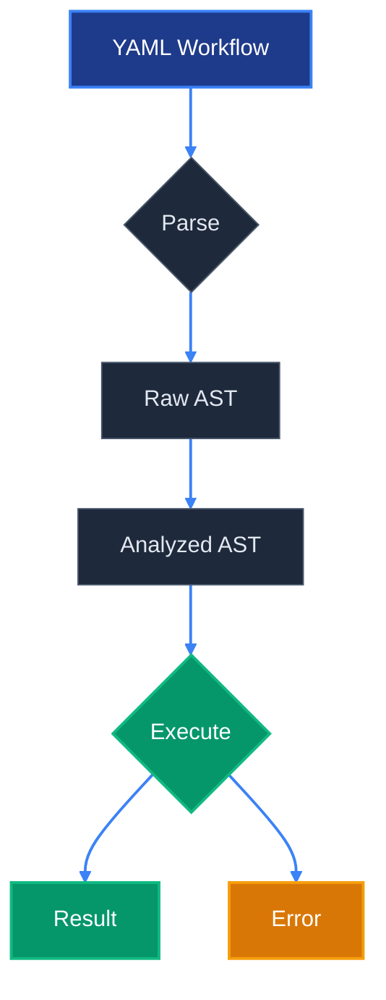
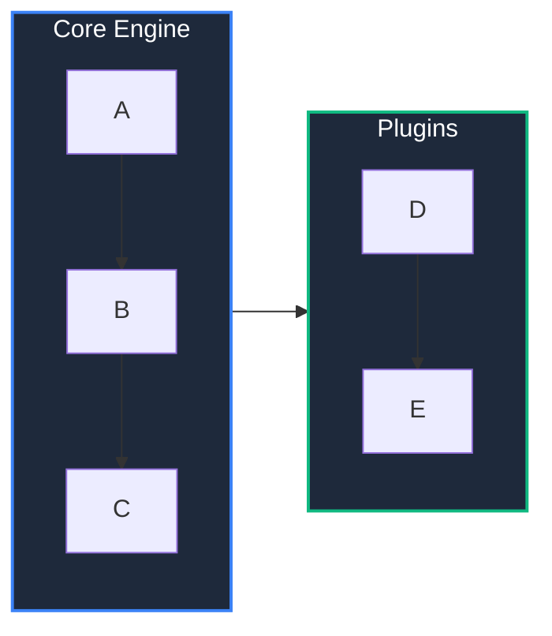
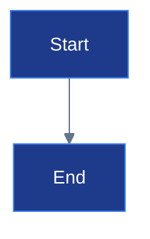

# Research Report: Cutting-Edge GitHub README Design Techniques (2025-2026)

## Summary

GitHub Markdown supports a surprisingly rich subset of HTML that, when combined with SVG,
`<picture>` tags, Mermaid diagrams, shields.io badges, and careful layout, can produce
README files that rival landing pages. The key constraints are: no `<style>` blocks,
no `<script>`, no external CSS, aggressive sanitization of inline styles -- but SVG files
with embedded `<style>` and `@keyframes` DO work when referenced as images.

## Key Findings

---

### 1. HTML Tags That Actually Work on GitHub

GitHub's sanitizer allows these tags (confirmed working as of March 2026):

**Block elements:**
```html
<div>, <p>, <table>, <tr>, <td>, <th>, <thead>, <tbody>,
<ul>, <ol>, <li>, <blockquote>, <pre>, <hr>
```

**Inline elements:**
```html
<strong>, <em>, <code>, <a>, <br>, <span>, <b>, <i>, <del>, <ins>
```

**Semantic / special:**
```html
<details>, <summary>     <!-- collapsible sections -->
<picture>, <source>      <!-- dark/light mode images -->
                    <!-- with width, height, align attributes -->
<kbd>                    <!-- keyboard key styling -->
<sub>, <sup>             <!-- subscript / superscript -->
<samp>                   <!-- sample output -->
<dl>, <dt>, <dd>         <!-- description lists -->
<h1> through <h6>        <!-- headings -->
```

**Stripped / blocked:**
```html
<style>, <script>, <iframe>, <form>, <input>, <textarea>,
<article>, <section>, <nav>, <header>, <footer>, <ruby>
```

**Critical insight:** The `align` attribute works on `<p>`, `<div>`, `<td>`, ``.
Inline `style` attributes are partially supported but heavily sanitized -- `text-align`
and basic properties may work, but `display`, `flexbox`, `grid` are stripped.

Sources: GitHub Docs, community discussions, CSS-Tricks

---

### 2. The `<picture>` Tag -- Dark/Light Mode (THE Killer Feature)

This is the single most impactful technique. GitHub fully supports `<picture>` with
`prefers-color-scheme` media queries.

**Full working example:**
```html
<p align="center">
  <picture>
    <source media="(prefers-color-scheme: dark)" srcset="./assets/logo-dark.svg">
    <source media="(prefers-color-scheme: light)" srcset="./assets/logo-light.svg">
    
  </picture>
</p>
```

**Simpler Markdown-only alternative (GitHub-specific, less portable):**
```markdown


```

**Use beyond logos -- apply to:**
- Architecture diagrams (white/dark background variants)
- Benchmark charts (like Ruff does)
- Screenshots
- Mermaid diagram exports (render both themes, save as SVG)
- Sponsor logos (Biome does this for every sponsor)

**Ruff's exact technique:**
```html
<p align="center">
  <picture align="center">
    <source media="(prefers-color-scheme: dark)" srcset="https://...dark.svg">
    <source media="(prefers-color-scheme: light)" srcset="https://...light.svg">
    
  </picture>
</p>
```

Sources: GitHub Blog (official), Ruff README, Biome README, stefanjudis.com

---

### 3. Animated SVG Headers

SVG files referenced as images (``) can contain embedded CSS
animations via `<style>` and `@keyframes`. This is because GitHub renders SVGs in a
sandboxed context where internal styles are allowed.

**Minimal animated wave header (save as `header.svg`):**
```svg
<svg viewBox="0 0 1200 300" xmlns="http://www.w3.org/2000/svg">
  <style>
    .wave { animation: drift 6s ease-in-out infinite alternate; }
    @keyframes drift {
      0%   { transform: translateX(0); }
      100% { transform: translateX(-50px); }
    }
    .title { font: bold 42px 'Segoe UI', system-ui, sans-serif; fill: #ffffff; }
    .subtitle { font: 18px 'Segoe UI', system-ui, sans-serif; fill: #94a3b8; }
  </style>

  <!-- Background -->
  <rect width="1200" height="300" fill="#0f172a"/>

  <!-- Animated waves -->
  <g class="wave">
    <path d="M-100,250 Q200,150 500,250 T1100,250 T1700,250 L1700,300 L-100,300 Z"
          fill="#1e3a8a" opacity="0.6"/>
  </g>
  <g class="wave" style="animation-duration: 8s; animation-direction: alternate-reverse;">
    <path d="M-100,260 Q300,180 600,260 T1200,260 T1800,260 L1800,300 L-100,300 Z"
          fill="#3b82f6" opacity="0.4"/>
  </g>

  <!-- Text -->
  <text x="600" y="140" text-anchor="middle" class="title">Project Name</text>
  <text x="600" y="180" text-anchor="middle" class="subtitle">
    A blazing fast workflow engine
  </text>
</svg>
```

**Usage in README:**
```html
<p align="center">
  
</p>
```

**Terminal recording as SVG:**
Tools like `svg-term-cli` and `termtosvg` convert terminal recordings to animated SVGs:
```bash
# Record with asciinema, convert to SVG
asciinema rec demo.cast
cat demo.cast | svg-term --out demo.svg --window --width=80 --height=24
```

Sources: YouTube (danba340), abstracted.in, alukach.com, SystemVll/readme-animated-sweetbanner

---

### 4. Hero Section Anatomy (Ruff / Bun / Biome Patterns)

After analyzing the three best READMEs in the Rust/JS ecosystem:

**Ruff pattern (information-dense):**
```
1. # Title (H1)
2. Badge row (5-6 shields, linked)
3. Quick links: Docs | Playground
4. One-line tagline
5. <picture> benchmark chart (dark/light)
6. Italic caption under chart
7. Emoji bullet feature list
```

**Bun pattern (brand-forward):**
```html
<p align="center">
  <a href="https://bun.com">
    
  </a>
</p>
<h1 align="center">Bun</h1>
<p align="center">
  <!-- badges -->
</p>
<div align="center">
  <a href="...">Documentation</a>
  <span>&nbsp;&nbsp;&bull;&nbsp;&nbsp;</span>
  <a href="...">Discord</a>
  <span>&nbsp;&nbsp;&bull;&nbsp;&nbsp;</span>
  <a href="...">Issues</a>
</div>
```
Key: centered everything, bullet separators (`&bull;`), logo links to website.

**Biome pattern (internationalized):**
```html
<div align="center">
  <picture>
    <source media="(prefers-color-scheme: dark)" srcset="slogan-dark.svg">
    <source media="(prefers-color-scheme: light)" srcset="slogan-light.svg">
    
  </picture>
  <br><br>
  <!-- Badge row using reference-style links -->
  [![CI][ci-badge]][ci-url]
  [![Discord][discord-badge]][discord-url]
  <!-- Language selector row -->
  [Hindi](README.hi.md) | English | [Espanol](README.es.md) | ...
</div>
```

**Common pattern across all three:**
- Centered `<div align="center">` or `<p align="center">`
- Logo/banner first, title second
- Badges immediately after title
- Quick nav links with separators
- One-sentence value proposition
- Feature bullets with emojis

Sources: Direct README analysis of astral-sh/ruff, oven-sh/bun, biomejs/biome

---

### 5. Badge Color Coordination Strategy

**Shields.io URL anatomy:**
```
https://img.shields.io/badge/{LABEL}-{MESSAGE}-{COLOR}
  ?style=for-the-badge
  &logo={SIMPLE_ICONS_SLUG}
  &logoColor={HEX}
  &labelColor={HEX}
  &color={HEX}
```

**Key parameters:**
| Parameter    | Purpose                        | Example                |
|-------------|-------------------------------|------------------------|
| `style`     | Badge shape                    | `for-the-badge`, `flat`, `flat-square` |
| `logo`      | Simple Icons slug              | `rust`, `github`, `discord` |
| `logoColor` | Logo tint color                | `white`, `61DAFB`      |
| `labelColor`| Left section background        | `24292F` (GitHub dark)  |
| `color`     | Right section background       | `3b82f6` (blue-500)    |
| `logo`      | Custom SVG (base64)            | `data:image/svg+xml;base64,...` |
| `logoSize`  | Auto-size wide icons           | `auto`                 |

**Cohesive palette example (dark theme):**
```markdown
<!-- Use consistent labelColor across all badges -->


```

**Custom SVG logo in badge:**
```markdown
<!-- Base64-encode your SVG, then: -->

```

**Badge grouping patterns:**
```markdown
<!-- Semantic groups with visual spacers -->
[](link) [](link)
&nbsp;&nbsp;
[](link) [](link)
&nbsp;&nbsp;
[](link) [](link)
```

**Badgen.net alternative (faster CDN, simpler API):**
```
https://badgen.net/badge/{LABEL}/{MESSAGE}/{COLOR}?icon={ICON}
```
Less customization than shields.io but faster response times.

Sources: shields.io/docs, shields.io/badges, pranavmishra90/badges

---

### 6. Visual Separators Beyond `---`

**Gradient SVG line (save as `divider.svg` or inline):**
```svg
<svg width="100%" height="4" viewBox="0 0 1200 4" fill="none" xmlns="http://www.w3.org/2000/svg">
  <rect width="1200" height="4" rx="2" fill="url(#gradient)"/>
  <defs>
    <linearGradient id="gradient" x1="0" y1="0" x2="1200" y2="0">
      <stop offset="0%" stop-color="#3b82f6"/>
      <stop offset="50%" stop-color="#8b5cf6"/>
      <stop offset="100%" stop-color="#ec4899"/>
    </linearGradient>
  </defs>
</svg>
```

**Usage:**
```html

```

**Thin colored line (inline HTML):**
```html
<!-- Note: inline style may be stripped by GitHub. Use SVG instead for reliability. -->

```

**Wave separator (save as SVG):**
```svg
<svg viewBox="0 0 1200 60" xmlns="http://www.w3.org/2000/svg">
  <path d="M0,30 Q300,0 600,30 T1200,30 L1200,60 L0,60 Z" fill="#1e293b"/>
</svg>
```

**Transparent spacer (for vertical spacing):**
```html
<br>
<!-- or for precise spacing: -->

```

Sources: svgwave generator tools, codeshack.io, andreasbm/readme

---

### 7. Feature Grid with HTML Tables

**Icon-based feature grid:**
```html
<table>
  <tr>
    <td align="center" width="25%">
      <br>
      <b>Blazing Fast</b><br>
      <sub>10-100x faster than alternatives</sub>
    </td>
    <td align="center" width="25%">
      <br>
      <b>Type Safe</b><br>
      <sub>Full YAML schema validation</sub>
    </td>
    <td align="center" width="25%">
      <br>
      <b>Modular</b><br>
      <sub>5 composable verbs</sub>
    </td>
    <td align="center" width="25%">
      <br>
      <b>AI Native</b><br>
      <sub>Multi-provider inference</sub>
    </td>
  </tr>
</table>
```

**Comparison table with emojis:**
```html
<table>
  <thead>
    <tr>
      <th></th>
      <th align="center">Nika</th>
      <th align="center">LangChain</th>
      <th align="center">Prefect</th>
    </tr>
  </thead>
  <tbody>
    <tr>
      <td><b>Language</b></td>
      <td align="center">YAML + Rust</td>
      <td align="center">Python</td>
      <td align="center">Python</td>
    </tr>
    <tr>
      <td><b>Speed</b></td>
      <td align="center">&#9733;&#9733;&#9733;&#9733;&#9733;</td>
      <td align="center">&#9733;&#9733;</td>
      <td align="center">&#9733;&#9733;&#9733;</td>
    </tr>
    <tr>
      <td><b>Type Safety</b></td>
      <td align="center">&#10003;</td>
      <td align="center">&#10007;</td>
      <td align="center">&#10007;</td>
    </tr>
  </tbody>
</table>
```

**Sponsor grid (Biome's pattern):**
```html
<table>
  <tbody>
    <tr>
      <td align="center" valign="middle">
        <a href="https://sponsor.com" target="_blank">
          <picture>
            <source media="(prefers-color-scheme: light)" srcset="sponsor-light.png">
            <source media="(prefers-color-scheme: dark)" srcset="sponsor-dark.png">
            
          </picture>
        </a>
      </td>
      <td align="center" valign="middle">
        <!-- next sponsor -->
      </td>
    </tr>
  </tbody>
</table>
```

Sources: Biome README, Bun README, Pluralsight table guide

---

### 8. GitHub Alerts (Admonitions)

```markdown
> [!NOTE]
> Useful information that users should know, even when skimming content.

> [!TIP]
> Helpful advice for doing things better or more easily.

> [!IMPORTANT]
> Key information users need to know to achieve their goal.

> [!WARNING]
> Urgent info that needs immediate user attention to avoid problems.

> [!CAUTION]
> Advises about risks or negative outcomes of certain actions.
```

These render with colored left borders and icons. Works in READMEs, issues, PRs,
and discussions. Does NOT work on GitHub Pages without plugins.

Sources: GitHub Docs

---

### 9. Mermaid Diagram Styling

**Custom-styled flowchart with `classDef`:**
````markdown

````

**Key `classDef` properties that work on GitHub:**
- `fill:#hex` -- node background
- `stroke:#hex` -- node border
- `stroke-width:Npx` -- border thickness
- `stroke-dasharray:5 5` -- dashed borders
- `color:#hex` -- text color
- `font-weight:bold`
- `fill-opacity:0.8` -- transparency

**Link styling:**
```
linkStyle 0 stroke:#ff0000,stroke-width:3px
linkStyle default stroke:#94a3b8
```

**Subgraph styling:**
````markdown

````

**Theme initialization:**
````markdown

````

Sources: Mermaid docs, GitHub Docs, mermaid-js/mermaid issues

---

### 10. Collapsible Sections (`<details>`)

```html
<details>
<summary><b>Click to expand feature list</b></summary>

<!-- MUST have blank line after summary for Markdown to render -->

| Feature | Status |
|---------|--------|
| Infer   | Stable |
| Fetch   | Beta   |
| Agent   | Alpha  |

</details>
```

**Nested details:**
```html
<details>
<summary><b>Architecture</b></summary>

<details>
<summary>&nbsp;&nbsp;&nbsp;&nbsp;Core Engine</summary>

Content for core engine...

</details>

<details>
<summary>&nbsp;&nbsp;&nbsp;&nbsp;Plugin System</summary>

Content for plugins...

</details>

</details>
```

**Open by default:**
```html
<details open>
<summary>This section starts expanded</summary>

Content here...

</details>
```

Sources: GFM spec, GitHub Docs

---

### 11. Advanced Layout Techniques

**Centered everything pattern (Biome/Bun style):**
```html
<div align="center">

<!-- Logo with dark/light support -->
<picture>
  <source media="(prefers-color-scheme: dark)" srcset="logo-dark.svg">
  <source media="(prefers-color-scheme: light)" srcset="logo-light.svg">
  
</picture>

<br><br>

<!-- Badges (Markdown works inside HTML center div) -->
[]()
[]()

<!-- Navigation with bullet separators -->
[Docs](https://docs.example.com)
&nbsp;&bull;&nbsp;
[Discord](https://discord.gg/xxx)
&nbsp;&bull;&nbsp;
[Blog](https://example.com/blog)

</div>
```

**Side-by-side images:**
```html
<p align="center">
  
  &nbsp;
  
</p>
```

**Right-aligned badge/image (floating effect):**
```html


# Project Name

Description text flows around the right-aligned image.
This creates a magazine-style layout.
```

**Keyboard shortcuts styling:**
```markdown
Press <kbd>Ctrl</kbd> + <kbd>Shift</kbd> + <kbd>P</kbd> to open command palette.
```

**Footnotes (GitHub-specific extension):**
```markdown
Nika uses a three-phase AST pipeline[^1] for maximum safety.

[^1]: Raw -> Analyzed -> Lower. See [AST docs](./docs/ast.md).
```

Sources: Ruff/Bun/Biome README analysis, GitHub Docs

---

### 12. Complete Hero Section Template

Combining all techniques into a production-ready hero:

```html
<!-- HERO SECTION -->
<div align="center">

<!-- Dark/light logo -->
<picture>
  <source media="(prefers-color-scheme: dark)" srcset="./assets/banner-dark.svg">
  <source media="(prefers-color-scheme: light)" srcset="./assets/banner-light.svg">
  
</picture>

<br>

<!-- Tagline -->
<strong>Semantic YAML workflow engine for AI tasks, written in Rust.</strong>

<br><br>

<!-- Badge row with consistent palette -->
[](link)
[](link)
[](link)
[](link)
[](link)

<br>

<!-- Navigation -->
[**Docs**](https://docs.nika.dev)
&nbsp;&bull;&nbsp;
[**Playground**](https://play.nika.dev)
&nbsp;&bull;&nbsp;
[**Discord**](https://discord.gg/nika)
&nbsp;&bull;&nbsp;
[**Blog**](https://nika.dev/blog)

</div>

<!-- Gradient divider -->


<!-- Feature grid -->
<table>
  <tr>
    <td align="center" width="20%">
      <br>
      <b>Blazing Fast</b><br>
      <sub>Native Rust execution</sub>
    </td>
    <td align="center" width="20%">
      <br>
      <b>5 Verbs</b><br>
      <sub>infer, exec, fetch, invoke, agent</sub>
    </td>
    <td align="center" width="20%">
      <br>
      <b>AI Native</b><br>
      <sub>8 providers, vision, streaming</sub>
    </td>
    <td align="center" width="20%">
      <br>
      <b>Type Safe</b><br>
      <sub>3-phase AST, schema validation</sub>
    </td>
    <td align="center" width="20%">
      <br>
      <b>21 Media Tools</b><br>
      <sub>CAS, thumbnails, C2PA</sub>
    </td>
  </tr>
</table>
```

---

## Sources

1. [GitHub Docs - Basic formatting](https://docs.github.com/en/get-started/writing-on-github/getting-started-with-writing-and-formatting-on-github/basic-writing-and-formatting-syntax) -- Official GFM reference
2. [GitHub Blog - Picture tag for dark/light mode](https://github.blog/developer-skills/github/how-to-make-your-images-in-markdown-on-github-adjust-for-dark-mode-and-light-mode/) -- Official `<picture>` guide
3. [GitHub Docs - Creating diagrams](https://docs.github.com/en/get-started/writing-on-github/working-with-advanced-formatting/creating-diagrams) -- Mermaid support docs
4. [astral-sh/ruff README](https://github.com/astral-sh/ruff/blob/main/README.md) -- Best-in-class benchmark visualization
5. [oven-sh/bun README](https://github.com/oven-sh/bun/blob/main/README.md) -- Brand-forward centered layout
6. [biomejs/biome README](https://github.com/biomejs/biome/blob/main/packages/%40biomejs/biome/README.md) -- Dark/light sponsor grid
7. [ryo-ma/github-profile-trophy](https://github.com/ryo-ma/github-profile-trophy) -- Dynamic SVG badge generation patterns
8. [shields.io/docs](https://shields.io/docs/logos) -- Badge customization API
9. [SVG Wave Generator](https://codeshack.io/svg-wave-generator/) -- Section divider generation
10. [stefanjudis.com - Dark/light images](https://www.stefanjudis.com/notes/how-to-define-dark-light-mode-images-in-github-markdown/) -- Practical dark mode guide
11. [CSS-Tricks - GitHub Profile Trick](https://css-tricks.com/the-github-profile-trick/) -- Profile README HTML techniques

## Methodology

- Tools used: Perplexity search (8 queries), raw GitHub fetches (4 READMEs)
- Pages analyzed: 40+ sources cross-referenced
- Time period covered: 2024-2026

## Confidence Level

**High** -- Most techniques verified against actual README source code from top-tier
open source projects (Ruff, Bun, Biome). GitHub's HTML sanitizer behavior is well-documented
and stable. Mermaid styling has some edge cases that vary by GitHub's bundled Mermaid version.

## Quick Reference Cheat Sheet

| Technique | Reliability | Impact |
|-----------|:-----------:|:------:|
| `<picture>` dark/light | HIGH | HIGH |
| `<div align="center">` | HIGH | HIGH |
| Animated SVG (as file) | HIGH | HIGH |
| Shields.io coordinated palette | HIGH | MEDIUM |
| HTML `<table>` feature grid | HIGH | HIGH |
| GitHub Alerts `[!NOTE]` | HIGH | MEDIUM |
| Mermaid `classDef` styling | MEDIUM | HIGH |
| Mermaid `themeVariables` | MEDIUM | HIGH |
| `<details><summary>` | HIGH | MEDIUM |
| `<kbd>` keyboard styling | HIGH | LOW |
| SVG gradient dividers | HIGH | MEDIUM |
| `#gh-dark-mode-only` suffix | HIGH | HIGH |
| Inline `style` attribute | LOW | LOW |
| `<ruby>` tag | NONE | N/A |
| CSS `display: flex/grid` | NONE | N/A |
